# GovAI 中期研发成果核心算法文档

> 文档版本：V1.0  
> 编制日期：2026-03-07  
> 适用范围：中期研发成果提交 / 阶段验收 / 技术汇报  
> 对应产品：智能公文、智能问答

---

## 1. 文档说明

本文档用于说明乙方在“智能公文”与“智能问答”两款产品中已完成的核心算法设计、关键技术路线、工程实现机制与阶段性成果。本文档面向甲方验收、项目管理及技术评审场景，重点回答以下问题：

1. 当前系统是否已形成完整、可运行、可扩展的核心算法框架；
2. 智能公文与智能问答两类产品的关键处理链路是否已打通；
3. 系统是否具备面向政务应用场景的规范性、可解释性、可追溯性与可控性；
4. 已完成的算法与工程实现是否具备中期验收条件。

本项目并非简单调用通用大模型接口，而是构建了“模型推理 + 规则约束 + 知识增强 + 结构化解析 + 高精度导出”的复合智能处理体系。其核心目标不是生成单次文本结果，而是建立可持续演进的政务智能处理平台底座。

---

## 2. 总体技术定位

### 2.1 产品定位

| 产品名称 | 产品定位                                 | 核心能力                               | 当前阶段成果   |
| -------- | ---------------------------------------- | -------------------------------------- | -------------- |
| 智能公文 | 面向政务公文全流程处理的智能协作系统     | 起草、审查、格式规范化、导出、版本留痕 | 已形成核心闭环 |
| 智能问答 | 面向政务知识检索与增强回答的智能服务系统 | RAG 检索、图谱增强、引用溯源、多轮对话 | 已形成核心闭环 |

### 2.2 技术目标

| 目标维度   | 目标说明                     | 对应实现机制                         |
| ---------- | ---------------------------- | ------------------------------------ |
| 结果质量   | 提升公文内容质量与问答准确度 | 多阶段推理、知识增强、规则校验       |
| 过程透明   | 让系统具备可解释、可观测能力 | SSE 流式事件、推理分离、进度事件     |
| 规范可控   | 限制大模型输出漂移           | 字体/字号/样式标准化、结构化解析     |
| 可追溯性   | 回答依据与处理过程可回溯     | citations、审计日志、版本记录        |
| 工程稳定性 | 适配真实业务场景的稳定运行   | 分布式锁、超时、重试、降级、异步架构 |

### 2.3 总体架构图

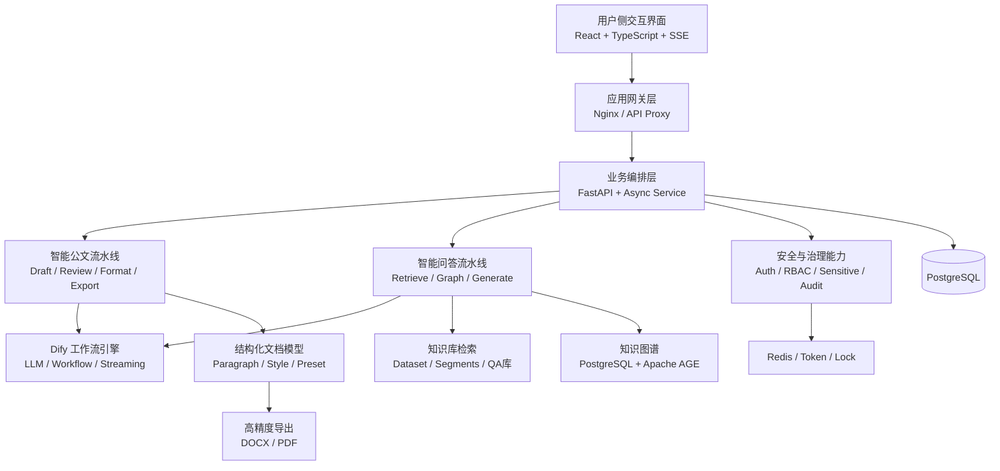

### 2.4 算法分层架构

| 层级   | 主要职责                     | 核心算法/机制                     |
| ------ | ---------------------------- | --------------------------------- |
| 交互层 | 承载用户输入输出与结果展示   | SSE 增量渲染、事件分发            |
| 编排层 | 组织任务、路由流程、统一接口 | 多阶段流水线、状态机、分布式锁    |
| 推理层 | 调用大模型工作流完成生成推理 | Dify Chatflow、流式解析、重试控制 |
| 知识层 | 提供外部事实依据             | QA 强命中、混合检索、图谱检索     |
| 约束层 | 抑制模型漂移、提高规范性     | 标准化映射、规则校验、格式诊断    |
| 输出层 | 生成结构化结果与高保真文件   | 段落模型、HTML/PDF、DOCX 原生导出 |

---

## 3. 核心算法总览

### 3.1 核心算法矩阵

| 所属产品 | 算法名称               | 算法作用                         | 主要输入                       | 主要输出                                 | 当前状态 |
| -------- | ---------------------- | -------------------------------- | ------------------------------ | ---------------------------------------- | -------- |
| 智能公文 | 五阶段流水线算法       | 将复杂公文处理拆解为稳定可控步骤 | 文档内容、用户指令、预设参数   | 草稿、建议、结构化排版、导出文件         | 已完成   |
| 智能公文 | SSE 流式推理编排算法   | 实现边生成边展示边解析           | 流式模型响应                   | text_chunk / reasoning / progress 等事件 | 已完成   |
| 智能公文 | 审查建议结构化抽取算法 | 将自然语言审查输出转为可采纳对象 | 流式 JSON 文本                 | review_suggestion 列表                   | 已完成   |
| 智能公文 | 段落级增量格式化算法   | 实现局部修改局部重排             | 原段落数组、变更段落、排版指令 | 更新后的结构化段落数组                   | 已完成   |
| 智能公文 | 排版规范标准化算法     | 统一字体/字号/颜色/样式表达      | 模型输出样式字段               | 标准化样式对象                           | 已完成   |
| 智能问答 | 多源增强问答算法       | 结合多类知识源提升回答质量       | 用户问题、会话上下文           | 有依据的生成式回答                       | 已完成   |
| 智能问答 | QA 强命中算法          | 对标准问答场景优先命中           | 问题文本、QA 库                | 高可信答案片段                           | 已完成   |
| 智能问答 | 知识库混合检索算法     | 综合语义与关键词检索证据         | 问题文本、数据集集合           | Top-K 检索结果                           | 已完成   |
| 智能问答 | 图谱增强检索算法       | 从实体关系角度补充上下文         | 问题关键词、图谱实体           | 图谱关系上下文                           | 已完成   |
| 公共能力 | 敏感检测算法           | 输入安全控制                     | 用户输入文本                   | 阻断/告警判定                            | 已完成   |
| 公共能力 | 权限审计控制算法       | 控制用户访问与行为留痕           | Token、角色、操作行为          | 权限结果、审计数据                       | 已完成   |

### 3.2 算法协同关系图

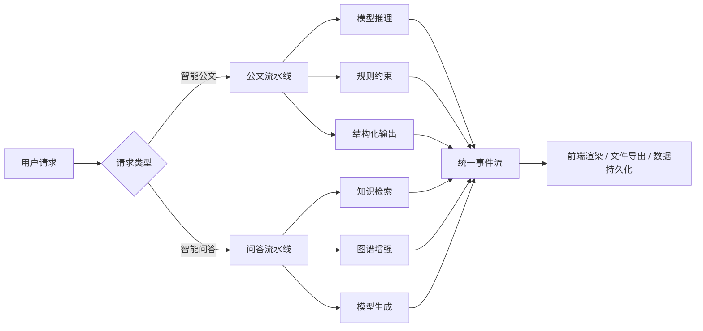

---

## 4. 智能公文核心算法设计

## 4.1 五阶段智能公文流水线算法

智能公文采用分阶段流水线架构，将原本耦合的文档处理任务拆分为五个阶段：`draft → review → format_suggest → format → export`。该设计的核心目标是将“内容生成”“问题发现”“排版规范”“交付输出”逐层解耦，从而获得更高的稳定性、可控性与可迭代性。

### 4.1.1 流程图

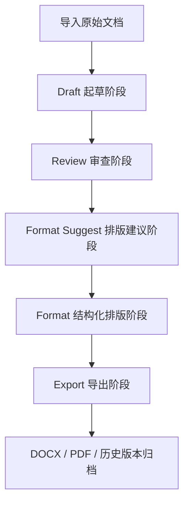

### 4.1.2 阶段说明

| 阶段           | 目标                   | 核心算法                             | 输出形态     | 关键价值                 |
| -------------- | ---------------------- | ------------------------------------ | ------------ | ------------------------ |
| Draft          | 根据材料与指令生成草稿 | 流式文本生成、附件融合、增量对象提取 | 文本草稿     | 快速形成可编辑底稿       |
| Review         | 对文稿进行多维审查     | 结构化建议抽取、分块审查             | 建议对象列表 | 让审查结果可采纳、可追踪 |
| Format Suggest | 生成样式建议与版式推断 | 规则+模型联合判断                    | 排版建议对象 | 提前形成版式决策依据     |
| Format         | 输出结构化段落与样式   | 增量格式化、样式标准化               | 段落数组     | 支撑预览、编辑与导出     |
| Export         | 形成最终交付文件       | HTML/PDF 渲染、DOCX 原生生成         | 正式文件     | 满足交付与归档要求       |

### 4.1.3 设计优势

| 优势项     | 说明                                           |
| ---------- | ---------------------------------------------- |
| 可控性更强 | 每个阶段输入输出清晰，可单独调优和验收         |
| 问题隔离   | 内容问题、格式问题、输出问题可以分层处理       |
| 成本可控   | 部分场景仅执行必要阶段，降低模型调用量         |
| 便于验收   | 每个阶段都能形成可展示的中间成果               |
| 易于扩展   | 后续可增加模板匹配、规范校核、发文场景特化能力 |

## 4.2 SSE 流式推理编排算法

系统在公文处理场景中采用 SSE 流式事件机制，对模型输出进行增量接收、增量解析、增量展示。该机制使系统从传统“请求—等待—返回”的同步模式升级为“持续推送—实时解析—分通道消费”的事件模式。

### 4.2.1 事件流时序图

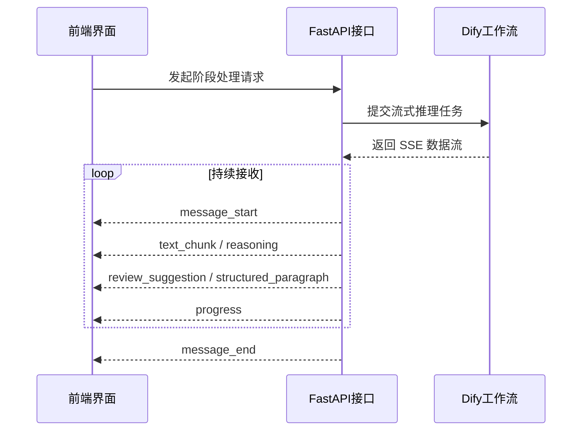

### 4.2.2 事件类型定义

| 事件类型               | 含义           | 使用阶段         | 前端作用         |
| ---------------------- | -------------- | ---------------- | ---------------- |
| `message_start`        | 当前任务开始   | 全阶段           | 初始化任务状态   |
| `text_chunk`           | 普通文本增量   | 起草、问答       | 正文流式展示     |
| `reasoning`            | 模型推理过程   | 起草、问答、排版 | 展示思考链路     |
| `reasoning_step`       | 处理步骤说明   | 审查、排版       | 展示阶段进度     |
| `review_suggestion`    | 单条审查建议   | 审查             | 列表化建议面板   |
| `structured_paragraph` | 结构化段落对象 | 排版             | 实时预览排版效果 |
| `citations`            | 引用来源       | 问答             | 呈现证据依据     |
| `knowledge_graph`      | 图谱三元组     | 图谱/问答        | 展示关系网络     |
| `progress`             | 后端进度提示   | 全阶段           | 提升可感知性     |
| `error`                | 异常信息       | 全阶段           | 统一错误提示     |
| `message_end`          | 当前任务结束   | 全阶段           | 收尾与持久化     |

### 4.2.3 算法特点

| 特点       | 说明                                                   |
| ---------- | ------------------------------------------------------ |
| 增量可视化 | 用户无需等待完整结果即可看到处理中间态                 |
| 多通道分发 | 同一模型流被拆分为正文、推理、建议、进度等多个逻辑通道 |
| 易于扩展   | 新事件类型可平滑接入现有前端展示框架                   |
| 工程可观测 | 处理过程和失败位置更容易定位                           |

## 4.3 推理内容分离算法

为解决大模型输出中“思考内容”和“正式内容”混杂的问题，系统设计了基于标签状态机的推理内容分离算法。其基本思想是在流式文本中追踪 `<think>` 与 `</think>` 边界，将推理内容从正式输出通道剥离，单独形成 `reasoning` 事件。

### 4.3.1 状态机示意图

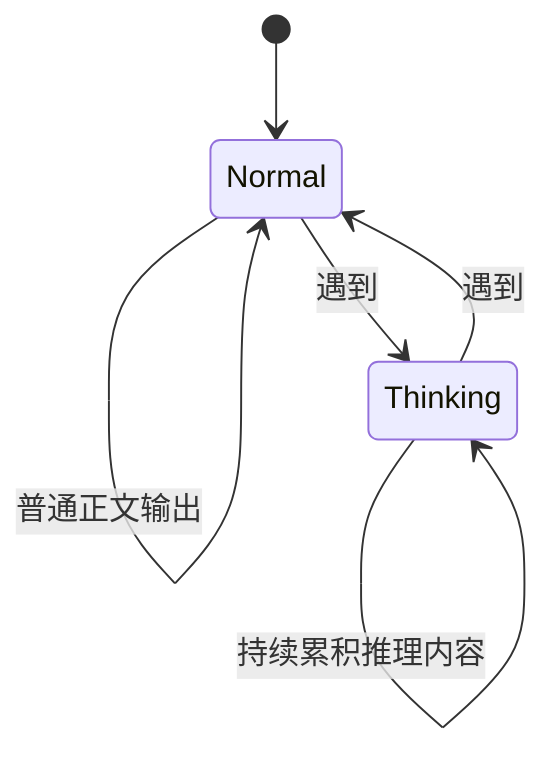

### 4.3.2 价值说明

| 价值点         | 说明                                   |
| -------------- | -------------------------------------- |
| 结果更正式     | 正式结果中不混入模型内部推理语言       |
| 过程可解释     | 模型思考内容可独立展示                 |
| 便于治理       | 推理内容可单独记录、审查或隐藏         |
| 更适合汇报演示 | 在验收场景中可展示系统“有过程、可解释” |

## 4.4 审查建议结构化抽取算法

审查模块要求输出可操作、可采纳、可留痕的结构化结果。因此系统没有将模型审查结果视为一段普通文本，而是采用“流式 JSON 增量识别算法”，在输出过程中持续寻找完整对象边界，并把单条建议实时推送前端。

### 4.4.1 算法逻辑

| 步骤 | 处理逻辑                              |
| ---- | ------------------------------------- |
| 1    | 接收模型连续输出文本流                |
| 2    | 在缓冲区内跟踪 JSON 花括号深度        |
| 3    | 识别完整对象闭合位置                  |
| 4    | 将对象解析为标准建议结构              |
| 5    | 作为 `review_suggestion` 事件实时推送 |
| 6    | 前端即时展示，并支持逐条采纳          |

### 4.4.2 建议对象结构

| 字段       | 含义     | 说明                         |
| ---------- | -------- | ---------------------------- |
| category   | 问题类别 | 如措辞、结构、标点、敏感性等 |
| severity   | 严重程度 | `error` / `warning` / `info` |
| original   | 原文内容 | 命中的原始片段               |
| suggestion | 修改建议 | 建议替换或改写方式           |
| reason     | 修改理由 | 解释为何需要修改             |

### 4.4.3 算法收益

| 收益     | 说明                                 |
| -------- | ------------------------------------ |
| 即时反馈 | 审查无需等待全部完成即可开始人工判断 |
| 可采纳   | 建议具备结构化字段，便于自动回填     |
| 可分级   | 严重程度支持风险优先排序             |
| 可审计   | 每条建议都是可留痕数据               |

## 4.5 长文档分块与并行处理算法

针对长篇公文，系统采用分块处理策略，将超长文本拆分为若干语义相对完整的块，在保证上下文可理解的前提下控制模型输入长度。该机制主要用于审查和排版阶段。

### 4.5.1 分块策略

| 分块原则           | 说明                             |
| ------------------ | -------------------------------- |
| 优先保留段落完整性 | 尽量不在段落中间截断             |
| 控制单块长度       | 保证单块位于模型稳定处理区间内   |
| 保留结构语义       | 标题、条目、段首段尾尽量保持完整 |
| 支持多块合并       | 后处理阶段统一聚合建议和结果     |

### 4.5.2 处理收益

| 收益项             | 说明                       |
| ------------------ | -------------------------- |
| 降低超长上下文风险 | 减少截断与遗漏             |
| 提升稳定性         | 单次推理更聚焦，结果更一致 |
| 控制成本           | 避免对整篇文档反复全量推理 |
| 便于增量处理       | 局部变化只需局部重算       |

## 4.6 段落级增量格式化算法

系统将排版结果表示为“结构化段落数组”，每个段落拥有独立的样式属性。基于此，系统可实现局部改动下的增量格式化，而非整篇全文重算。

### 4.6.1 数据模型示意

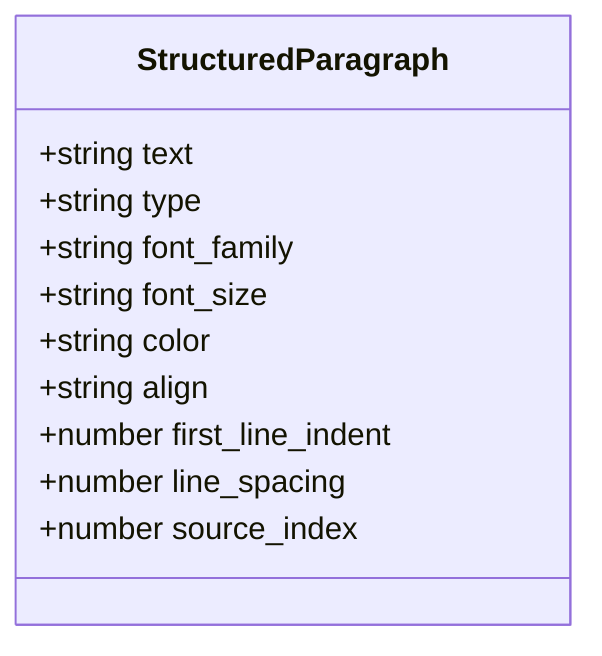

### 4.6.2 增量合并策略

| 场景                    | 处理方式             |
| ----------------------- | -------------------- |
| 模型返回 `source_index` | 按索引直接替换原段落 |
| 模型未返回索引          | 启用文本特征回退匹配 |
| 无改动段落              | 保持原样，不触发重算 |
| 长文档局部更新          | 只对变更块执行格式化 |

### 4.6.3 核心价值

| 价值点       | 说明                     |
| ------------ | ------------------------ |
| 保留稳定性   | 未修改内容不被重新扰动   |
| 优化体验     | 用户局部编辑后反馈更快   |
| 降低成本     | 避免重复全量调用模型     |
| 贴近真实办公 | 支持“边改边排”的使用模式 |

## 4.7 排版标准化与抗幻觉算法

大模型在排版类任务中容易产生表达漂移，例如字号写法不一致、字体别名混乱、样式标签不稳定、颜色格式多样等。系统为此构建了“版式输出标准化引擎”，用于在模型输出之后实施统一归一化。

### 4.7.1 标准化对象矩阵

| 标准化对象 | 常见问题                             | 治理方式              |
| ---------- | ------------------------------------ | --------------------- |
| 字号       | “1号”“一号字”“小 一”等表达混用       | 别名映射 + 白名单统一 |
| 字体       | “仿宋”“仿宋\_GB2312”“FangSong”等混用 | 多名称归并            |
| 样式类型   | 标题/heading1/一级标题混杂           | 中英映射 + 模糊匹配   |
| 颜色       | 中文色名、英文名、Hex 混用           | 统一映射为标准色值    |

### 4.7.2 算法定位

| 算法属性 | 说明                                 |
| -------- | ------------------------------------ |
| 算法类型 | 规则约束型后处理算法                 |
| 应用位置 | 大模型输出之后、渲染之前             |
| 主要作用 | 将不稳定自然语言属性转为稳定工程属性 |
| 业务价值 | 保证政务排版结果规范、一致、可导出   |

## 4.8 段落类型识别算法

为了自动生成符合公文规范的版式，系统会先识别段落语义类型，再应用对应样式模板。识别策略以规则匹配为主，综合考虑段首模式、长度、位置、标点特征与文本关键词。

### 4.8.1 识别对象

| 段落类型 | 典型特征                            |
| -------- | ----------------------------------- |
| 主标题   | 居中短句、常含“通知/报告/请示/函”等 |
| 一级标题 | “一、二、三……”                      |
| 二级标题 | “（一）（二）……”                    |
| 三级标题 | “1.”、“2.” 等编号                   |
| 主送机关 | 短行且以冒号结尾                    |
| 正文     | 非标题类主要内容段                  |
| 落款单位 | 文末机关名称                        |
| 落款日期 | 标准日期表达                        |

### 4.8.2 核心价值

| 价值点       | 说明                         |
| ------------ | ---------------------------- |
| 降低模型负担 | 常见结构无需每次依赖模型判断 |
| 提高一致性   | 同类段落自动应用同类样式     |
| 便于导出     | 样式模板应用更稳定           |
| 适配政务规范 | 符合公文常见层级结构表达     |

## 4.9 高保真导出算法

系统同时支持 DOCX 和 PDF 两种正式输出形式，并保证其尽量接近前端预览效果。其核心在于：采用结构化文档对象作为统一中间层，然后分别映射到 Word 原生结构与 HTML/CSS 渲染结构。

### 4.9.1 导出路径图


### 4.9.2 导出机制说明

| 导出方式 | 核心机制                                         | 特点                       |
| -------- | ------------------------------------------------ | -------------------------- |
| DOCX     | 基于 Word 原生结构写入字体、字号、间距、页边距等 | 可编辑、适合正式文稿流转   |
| PDF      | 基于 HTML/CSS 高保真渲染                         | 便于归档、打印与跨环境查看 |
| 字体映射 | 通过字体别名与注册名映射提高一致性               | 降低环境差异影响           |

---

## 5. 智能问答核心算法设计

## 5.1 多源增强问答总体框架

智能问答模块采用“检索增强生成 + 图谱增强 + 会话记忆 + 引用溯源”的复合架构。其目标不是给出单纯自然语言回复，而是构建“有依据、可追溯、可连续对话”的政务问答服务能力。

### 5.1.1 总体流程图

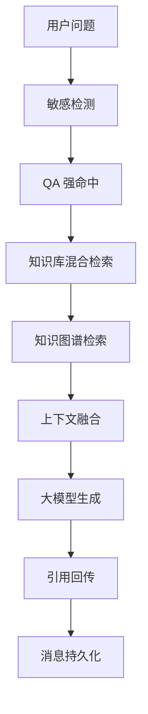

### 5.1.2 处理链路说明

| 步骤 | 名称           | 目标               |
| ---- | -------------- | ------------------ |
| 1    | 敏感检测       | 保障问答输入安全   |
| 2    | QA 强命中      | 优先回答标准问题   |
| 3    | 知识库混合检索 | 获取段落级文本证据 |
| 4    | 图谱检索       | 获取实体关系证据   |
| 5    | 上下文融合     | 形成统一知识上下文 |
| 6    | 大模型生成     | 输出自然语言答案   |
| 7    | 引用回传       | 给出回答依据       |
| 8    | 消息持久化     | 保留问答记录与证据 |

## 5.2 QA 强命中算法

对于高频标准问题，系统通过相似匹配和答案优先注入机制实现强命中处理。该算法的目标是保证政策口径、流程说明、固定问答等场景下输出一致性和稳定性。

### 5.2.1 处理逻辑

| 步骤 | 逻辑                                 |
| ---- | ------------------------------------ |
| 1    | 对用户问题与 QA 库标准问题做相似匹配 |
| 2    | 当命中分数达到阈值时，读取标准答案   |
| 3    | 将标准答案提升为高优先级上下文       |
| 4    | 交由模型进行组织、补全和润色         |

### 5.2.2 算法价值

| 价值         | 说明                         |
| ------------ | ---------------------------- |
| 统一答复口径 | 保持高频问题答案一致         |
| 降低幻觉风险 | 先给定高可信答案再生成       |
| 提升效率     | 高频问题可快速获得稳定答复   |
| 有利验收     | 便于向甲方演示标准化问答能力 |

## 5.3 知识库混合检索算法

系统使用混合检索策略，从知识库中检索与问题最相关的证据段落。该机制综合关键词匹配与语义相似能力，并通过重排序提高最终上下文质量。

### 5.3.1 检索流程图

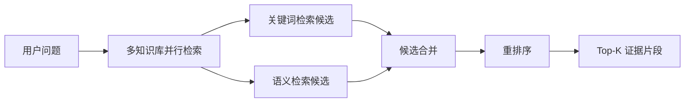

### 5.3.2 检索策略说明

| 机制       | 作用                           |
| ---------- | ------------------------------ |
| 关键词检索 | 保证术语、专名、固定表述命中   |
| 语义检索   | 提升近义表达和语义相关问题召回 |
| 并行检索   | 对多个知识集合同时发起查询     |
| 重排序     | 对候选结果进行二次筛选与排序   |
| 长度裁剪   | 控制注入上下文的有效长度       |

## 5.4 知识图谱增强检索算法

为补足文本检索在实体关系场景下的不足，系统引入知识图谱增强机制。该机制通过实体抽取、关系建模与子图查询，将图结构知识转化为可供模型消费的事实链条。

### 5.4.1 图谱构建流程图

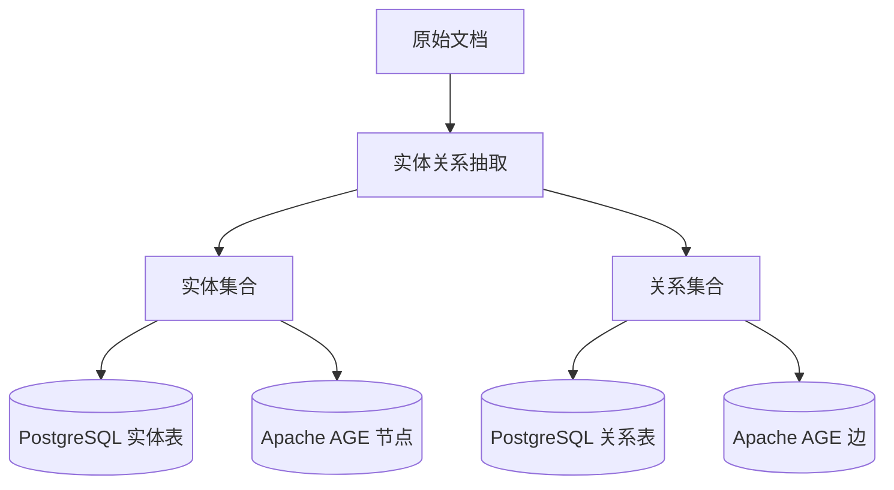

### 5.4.2 图谱查询流程

| 步骤 | 逻辑                       |
| ---- | -------------------------- |
| 1    | 从用户问题中提取中文关键词 |
| 2    | 匹配候选实体               |
| 3    | 扩展一跳或多跳关系         |
| 4    | 补全节点类型与关系语义     |
| 5    | 转写为模型可读上下文       |

### 5.4.3 图谱增强价值

| 价值点           | 说明                                         |
| ---------------- | -------------------------------------------- |
| 适合实体关系问题 | 比文本段落检索更适合关系型问答               |
| 提升回答结构性   | 让答案更具组织性和逻辑性                     |
| 有助后续扩展     | 可继续扩展成图谱问答、关系发现、政策关联分析 |
| 更显技术深度     | 在验收汇报中体现知识网络能力                 |

## 5.5 引用溯源算法

系统将来自 QA 库、知识库和图谱的数据统一转换为引用对象，并在回答展示时同步呈现证据来源。该机制使问答系统具备“结论有依据”的可信特征。

### 5.5.1 引用对象结构

| 字段          | 说明                         |
| ------------- | ---------------------------- |
| type          | 来源类型，如 QA / KB / Graph |
| score         | 相关度分数                   |
| quote         | 引用片段                     |
| document_id   | 来源文档标识                 |
| segment_id    | 来源分段标识                 |
| collection_id | 来源知识集合标识             |
| file_id       | 来源文件标识                 |

### 5.5.2 引用价值

| 价值   | 说明                         |
| ------ | ---------------------------- |
| 可追溯 | 回答可回溯到具体数据来源     |
| 可审查 | 便于人工复核回答依据         |
| 可汇报 | 体现系统不是“无依据自由回答” |
| 可积累 | 后续可用于知识质量评估       |

## 5.6 多轮会话记忆算法

系统通过会话级上下文标识维持多轮对话连续性，使后续问题能够继承前文语境，支持追问、省略与上下文延续。

### 5.6.1 时序图

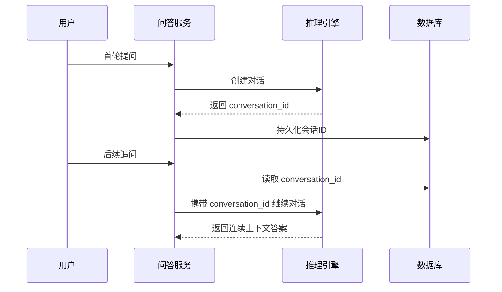

### 5.6.2 核心价值

| 价值点       | 说明                   |
| ------------ | ---------------------- |
| 连续理解     | 支持追问与上下文承接   |
| 降低重复输入 | 用户不需反复重复背景   |
| 提升可用性   | 更贴近真实办公咨询场景 |
| 便于留痕     | 会话级别可完整回看     |

---

## 6. 公共治理与支撑算法

## 6.1 敏感检测算法

系统在关键输入入口增加敏感词检测能力，对风险内容执行阻断或告警。该机制属于安全治理前置环节，是政务场景中不可或缺的保障能力。

### 6.1.1 策略说明

| 命中类型 | 处理方式           | 适用场景     |
| -------- | ------------------ | ------------ |
| 阻断型   | 直接拒绝继续执行   | 高风险内容   |
| 告警型   | 给出警示但允许继续 | 中低风险内容 |

## 6.2 权限控制与审计算法

系统采用基于角色的权限控制模型，将权限抽象为“模块-资源-动作”的组合键，所有核心接口均基于 JWT 鉴权与权限判定进行访问控制，并对关键操作写入审计记录。

### 6.2.1 权限机制说明

| 机制       | 说明                |
| ---------- | ------------------- |
| JWT 认证   | 保证用户身份可信    |
| RBAC 授权  | 按角色控制功能边界  |
| 黑名单机制 | 支持 Token 失效控制 |
| 审计留痕   | 记录关键业务操作    |

## 6.3 并发控制与容错算法

对于长耗时任务，系统采用分布式锁防止同一文档同一阶段被重复执行；对外部模型调用建立超时、重试与退避控制，以提升整体稳定性。

### 6.3.1 容错机制矩阵

| 机制         | 作用                   |
| ------------ | ---------------------- |
| 分布式锁     | 防止重复处理           |
| 超时控制     | 避免请求长期悬挂       |
| 指数退避     | 降低瞬时故障影响       |
| 错误事件返回 | 保证前端可感知失败原因 |
| 降级策略     | 局部失败不拖垮全部链路 |

---

## 7. 技术创新点与阶段成果

## 7.1 阶段性创新点

| 创新点             | 说明                           | 体现价值             |
| ------------------ | ------------------------------ | -------------------- |
| 五阶段公文流水线   | 将复杂公文任务拆解为可控处理链 | 适配政务文稿处理特点 |
| 推理内容分离机制   | 把模型思考与正式输出解耦       | 提升可解释性与正式性 |
| 审查结果结构化     | 审查结果可逐条采纳和追踪       | 形成可运营能力       |
| 段落级增量排版     | 支持局部修改局部重排           | 更接近真实办公场景   |
| 样式归一化引擎     | 抑制大模型版式漂移             | 提升导出一致性       |
| 双通道知识增强问答 | 文本检索与图谱检索协同         | 回答更可信、逻辑更强 |
| 引用溯源体系       | 结果与依据同步输出             | 满足政务可信要求     |

## 7.2 中期成果成熟度说明

| 成果项       | 当前成熟度 | 说明                           |
| ------------ | ---------- | ------------------------------ |
| 核心处理链路 | 已打通     | 智能公文、智能问答主链路可运行 |
| 核心算法框架 | 已形成     | 具备完整分层结构               |
| 产品原型能力 | 已具备     | 支持核心功能演示与操作         |
| 初步测试基础 | 已具备     | 可开展阶段性测试与验收         |
| 后续扩展空间 | 明确       | 可继续补强性能、策略与场景适配 |

---

## 8. 甲方验收视角说明

### 8.1 建议验收关注点

| 验收维度 | 建议观察点                               |
| -------- | ---------------------------------------- |
| 智能公文 | 是否完成起草、审查、格式化、导出主链路   |
| 智能问答 | 是否完成检索、生成、引用、会话主链路     |
| 可解释性 | 是否可展示推理过程与处理进度             |
| 可追溯性 | 是否可查看回答依据、审查建议和版本记录   |
| 规范性   | 是否具备版式约束与安全治理能力           |
| 工程性   | 是否具备权限控制、并发控制、异常处理能力 |

### 8.2 中期结论

综上，乙方已完成“智能公文”“智能问答”两款产品的核心算法研发与主要功能链路贯通，已形成面向政务业务场景的复合智能处理能力。当前成果已经具备以下中期验收特征：

1. 已具备清晰、完整的核心算法架构；
2. 已完成两款产品的关键业务闭环；
3. 已具备产品原型级交互与可演示能力；
4. 已建立规范化、可解释、可追溯、可治理的核心技术机制；
5. 已满足“提交中期研发成果并经甲方验收”的技术说明要求。

---

## 9. 附：核心算法与业务价值映射表

| 核心算法           | 直接支撑功能               | 对甲方的业务价值         |
| ------------------ | -------------------------- | ------------------------ |
| 五阶段公文流水线   | 智能起草、审查、排版、导出 | 提高公文处理效率与规范性 |
| 审查建议结构化抽取 | 审查问题发现与一键采纳     | 降低人工复核成本         |
| 段落级增量格式化   | 局部修改快速回写           | 提升编辑效率与稳定性     |
| 样式归一化引擎     | 规范排版与高保真导出       | 保障正式文稿质量         |
| 混合检索问答       | 知识问答与政策咨询         | 提高知识获取效率         |
| 图谱增强检索       | 实体关系分析问答           | 提升复杂问题解释能力     |
| 引用溯源机制       | 回答依据展示               | 提升系统可信度           |
| 敏感检测与权限审计 | 安全治理                   | 降低使用风险             |

---

## 10. 建议在中期汇报中重点呈现的内容

| 汇报板块     | 建议呈现方式                           |
| ------------ | -------------------------------------- |
| 产品原型     | 现场演示智能公文与智能问答主流程       |
| 核心算法     | 重点展示本文件第 3、4、5、7 章         |
| 初步测试报告 | 展示核心链路测试覆盖与典型结果         |
| 阶段结论     | 突出“核心能力已完成、具备中期验收条件” |

> 建议在正式提交材料中，将本文档作为《中期研发成果说明》的“核心算法章节”或独立附件使用。

---

## 11. 核心数据结构与状态模型

为了保证系统在“生成—审查—排版—导出—追溯”全链路上的一致性，本项目并未直接以原始字符串作为唯一处理对象，而是构建了若干核心中间数据结构。中间结构的引入，使系统具备以下能力：一是可在不同算法阶段之间传递语义化对象；二是可对模型输出执行强约束后处理；三是可将中间结果长期持久化，支撑版本回退、审计复盘与多终端复用。

### 11.1 结构化段落对象模型

在智能公文模块中，段落是最关键的中间粒度。系统采用“段落对象数组”而非纯文本大串作为排版与导出的统一输入。段落对象的本质，是将文本内容与样式属性绑定，从而实现“内容层”和“表现层”的结构化管理。

| 字段名            | 类型   | 含义         | 使用阶段           | 备注                     |
| ----------------- | ------ | ------------ | ------------------ | ------------------------ |
| text              | string | 段落文本内容 | 起草后、排版、导出 | 核心正文载体             |
| type              | string | 段落语义类型 | 排版、导出         | 如 title、heading1、body |
| font_family       | string | 字体族       | 排版、导出         | 经标准化处理后存储       |
| font_size         | string | 字号         | 排版、导出         | 以规范字号枚举保存       |
| color             | string | 字体颜色     | 排版、导出         | 存储为标准 Hex 值        |
| align             | string | 对齐方式     | 排版、导出         | left / center / justify  |
| first_line_indent | number | 首行缩进     | 排版、导出         | 以字符宽度或 pt 表示     |
| line_spacing      | number | 行距         | 排版、导出         | 统一用于 HTML / DOCX     |
| source_index      | number | 原始段落索引 | 增量更新           | 用于局部替换合并         |
| metadata          | object | 附加元数据   | 预留扩展           | 可承载来源、置信度等     |

### 11.2 审查建议对象模型

审查模块中的建议对象是后续“逐条采纳”“统计分析”“问题闭环”的基础数据单元。若无结构化建议对象，审查结果只能停留在说明性文本层面，无法形成可执行能力。

| 字段名       | 类型   | 含义             | 业务作用                 |
| ------------ | ------ | ---------------- | ------------------------ |
| category     | string | 问题类别         | 用于统计、筛选和策略分流 |
| severity     | string | 风险级别         | 支持优先级排序与风险提醒 |
| original     | string | 原始片段         | 方便用户快速定位原文     |
| suggestion   | string | 建议修改方案     | 支持一键替换或参考修改   |
| reason       | string | 审查理由         | 提升建议可解释性         |
| span_start   | number | 起始位置（可选） | 便于精确高亮             |
| span_end     | number | 结束位置（可选） | 便于精确高亮             |
| source_chunk | number | 来源分块（可选） | 长文档场景下追踪来源     |

### 11.3 引用对象模型

问答模块中的引用对象承担“证据链”角色，其关键作用在于将回答结论与知识来源绑定，形成可追溯回答体系。

| 字段名        | 类型   | 含义       | 来源场景           |
| ------------- | ------ | ---------- | ------------------ |
| type          | string | 来源类型   | QA / KB / Graph    |
| score         | number | 相关度得分 | 检索阶段生成       |
| quote         | string | 引用片段   | 用于前端依据展示   |
| document_id   | string | 文档标识   | 知识库、文档来源   |
| segment_id    | string | 分段标识   | RAG 检索结果       |
| collection_id | string | 集合标识   | 多知识库场景       |
| file_id       | string | 文件标识   | 文件级追踪         |
| extra         | object | 扩展字段   | 可包含图谱节点信息 |

### 11.4 会话状态对象模型

为了支持多轮问答与长流程处理，系统在服务端维护显式会话状态。会话状态的意义在于让“上下文延续”从隐式行为变成可管理对象。

| 状态字段        | 含义             | 使用产品   |
| --------------- | ---------------- | ---------- |
| user_id         | 当前用户标识     | 公文、问答 |
| session_id      | 会话标识         | 问答       |
| conversation_id | 外部推理会话标识 | 问答       |
| current_stage   | 当前处理阶段     | 公文       |
| doc_id          | 当前文档标识     | 公文       |
| lock_key        | 分布式锁键       | 公文       |
| created_at      | 创建时间         | 全局       |
| updated_at      | 最后更新时间     | 全局       |

### 11.5 状态转换关系图

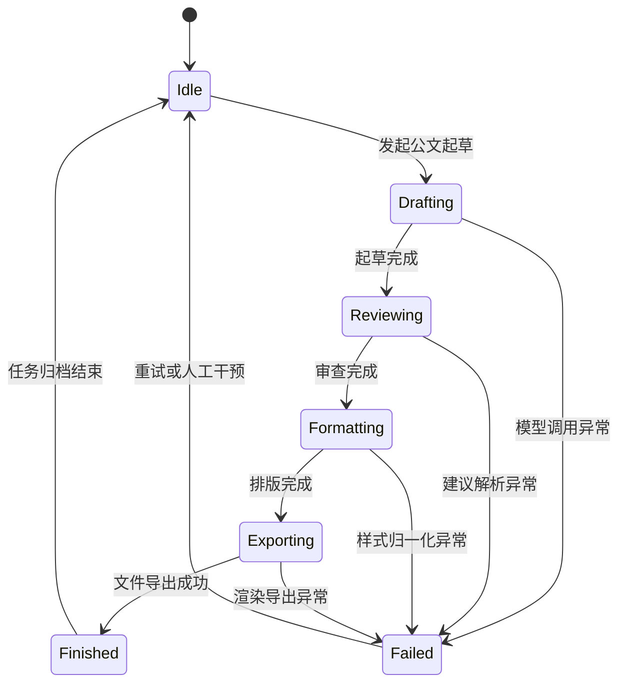

### 11.6 中间层设计价值

| 设计目标   | 说明                                                   |
| ---------- | ------------------------------------------------------ |
| 统一表示   | 不同模块通过统一对象传递数据，降低耦合                 |
| 易于校验   | 可在对象层执行字段约束、枚举限制和空值检查             |
| 支撑增量   | source_index、stage 状态等字段使局部处理成为可能       |
| 便于持久化 | 结构化数据天然适合数据库存储与审计                     |
| 便于导出   | 文档导出不再依赖临时字符串拼接，而是依赖结构化对象渲染 |

---

## 12. 形式化算法描述与复杂度分析

本章对前述核心算法进行更偏理论与工程结合的形式化表达，以体现系统设计的科学性与可分析性。需要说明的是，项目中的核心算法属于“规则驱动 + 模型驱动 + 工程驱动”的复合算法体系，不宜简单视为传统单一算法，但仍可从状态转移、复杂度、评分函数与约束映射四个角度进行刻画。

### 12.1 流式事件解析的形式化描述

设模型输出序列为 $C = \{c_1, c_2, \dots, c_n\}$，其中每个 $c_i$ 为按时间到达的字符块或行块。系统定义状态集合：

$$
S = \{\text{Normal}, \text{Thinking}, \text{JsonBuffering}, \text{Error}\}
$$

对每一时刻 $t$，系统根据当前输入块 $c_t$ 与状态 $s_t$ 计算下一状态：

$$
s_{t+1} = \delta(s_t, c_t)
$$

其中，转移函数 $\delta$ 主要考虑以下条件：

1. 是否命中 `<think>` 起始标记；
2. 是否命中 `</think>` 结束标记；
3. 当前 JSON 花括号嵌套深度是否归零；
4. 当前块是否可被解析为合法事件。

该模型的关键价值在于，它将“流式文本处理”抽象为有限状态自动机问题，使得系统可在不等待全部文本到达的前提下，持续输出可消费结果。

### 12.2 JSON 增量提取算法的括号深度模型

设缓冲区字符串为 $B = b_1 b_2 ... b_m$，定义括号深度函数：

$$
d(i) = \sum_{k=1}^{i} I(b_k = \{) - \sum_{k=1}^{i} I(b_k = \})
$$

当存在某个位置 $i$ 使得：

1. 缓冲区从某一合法起始 `{` 开始；
2. $d(i)=0$；
3. 且该位置不处于字符串字面量转义上下文；

则可认为区间内形成一个完整 JSON 对象。系统将该对象解析为审查建议、排版对象或结构化事件。

该算法相较于简单正则匹配更稳健，因为它能够正确处理对象嵌套与局部中断问题。

### 12.3 混合检索评分函数

对于问答场景，单一关键词匹配不足以覆盖语义相近问题，单一向量匹配又可能丢失专有名词与政策术语。因此系统采用混合检索思路。设候选片段 $x$ 的综合得分为：

$$
Score(x) = \alpha \cdot K(x, q) + \beta \cdot V(x, q) + \gamma \cdot R(x)
$$

其中：

- $K(x, q)$ 表示关键词匹配相关度；
- $V(x, q)$ 表示语义向量相似度；
- $R(x)$ 表示重排序模型得分；
- $\alpha, \beta, \gamma$ 为权重系数，满足 $\alpha + \beta + \gamma = 1$。

在工程上，系统并不要求显式暴露所有权重细节给最终用户，但在设计层面该评分模型说明：问答结果并非由单一相似度决定，而是由多重证据共同决定。

### 12.4 图谱扩展检索的图论描述

设知识图谱表示为有向图：

$$
G = (V, E)
$$

其中 $V$ 为实体节点集合，$E$ 为关系边集合。对于用户问题抽取到的实体子集 $V_q \subseteq V$，系统执行以 $V_q$ 为起点的受限广度优先搜索，得到深度不超过 $k$ 的邻接子图：

$$
G_q^{(k)} = BFS(G, V_q, k)
$$

在当前阶段实现中，系统主要采用 $k=1$ 的一跳扩展策略，以保证结果精确、成本可控和语义稳定。后续若甲方需要更强图推理能力，可进一步引入多跳路径约束和关系路径排序。

### 12.5 样式标准化函数

对于大模型输出的任一排版属性 $x$，系统定义标准化函数：

$$
N(x) = Canonical(Alias(Clean(x)))
$$

其中：

- $Clean(x)$ 负责去空格、去后缀、统一大小写；
- $Alias(x)$ 负责将别名映射到标准候选；
- $Canonical(x)$ 负责映射到唯一规范枚举值。

例如，当输入为“方正小标宋”“方正小标宋简”“FZXiaoBiaoSong-B05”时，最终可统一映射为同一标准样式标识，从而降低模型输出漂移对后续渲染的影响。

### 12.6 时间复杂度分析

下表给出若干核心算法的时间复杂度估计。由于系统包含外部模型调用与网络 I/O，实际总耗时通常以远程推理耗时为主；但从本地算法视角看，依然可以对处理复杂度做静态分析。

| 算法          | 核心过程           | 理论复杂度         | 说明                           |
| ------------- | ------------------ | ------------------ | ------------------------------ | --- | --- | --- | ------------------ |
| 流式事件解析  | 单次扫描字符流     | $O(n)$             | 每个字符至多处理一次           |
| JSON 增量识别 | 花括号深度追踪     | $O(n)$             | 与缓冲区长度线性相关           |
| 段落类型识别  | 正则与规则匹配     | $O(p \cdot r)$     | $p$ 为段落数，$r$ 为规则数     |
| 增量合并      | 索引替换或回退匹配 | $O(p)$ 或 $O(p^2)$ | 索引模式更优，回退模式成本更高 |
| 混合检索排序  | 候选排序           | $O(k \log k)$      | $k$ 为候选数                   |
| 图谱一跳扩展  | 邻接关系扫描       | $O(                | V_q                            | +   | E_q | )$  | 取决于局部子图规模 |

### 12.7 空间复杂度分析

| 算法           | 主要缓存对象            | 空间复杂度 |
| -------------- | ----------------------- | ---------- |
| SSE 流式解析   | 当前缓冲区 + 事件对象   | $O(n)$     |
| 审查建议抽取   | suggestion 列表         | $O(s)$     |
| 结构化段落排版 | paragraph 数组          | $O(p)$     |
| 引用聚合       | citation 列表           | $O(c)$     |
| 图谱子图查询   | visited 集合 + frontier | $O(v + e)$ |

### 12.8 算法正确性保障思路

由于项目属于工程型智能系统，所谓“正确性”并不完全等价于传统确定性算法中的严格数理证明，而更接近“在约束、数据和业务规则下保持稳定、可接受、可解释输出”的工程正确性。其保障机制主要包括：

| 保障维度   | 机制说明                            |
| ---------- | ----------------------------------- |
| 输入正确性 | 参数校验、权限校验、敏感检测        |
| 状态正确性 | 分布式锁、防重复执行、会话状态管理  |
| 结构正确性 | JSON 清洗、对象字段校验、标准化映射 |
| 结果正确性 | 引用回传、审查建议、版本留痕        |
| 导出正确性 | 结构化模型渲染、字体映射、模板约束  |

---

## 13. 智能公文算法的深化说明

### 13.1 公文输入预处理算法

在进入起草与审查流程前，系统会首先对输入文档进行预处理。预处理的核心目标不是“美化文本”，而是将异构文档来源转化为统一、稳定、可推理的输入表示。

| 预处理环节   | 处理目标                      | 对后续算法的价值 |
| ------------ | ----------------------------- | ---------------- |
| 文本抽取     | 从 docx/pdf/txt/md 中提取正文 | 统一输入载体     |
| 空白清洗     | 去除冗余空行、非法字符        | 降低模型噪声     |
| 段落切分     | 按语义边界划分段落            | 支撑结构化处理   |
| 元数据挂载   | 记录来源文档、阶段、用户信息  | 支撑追溯与审计   |
| 敏感内容预检 | 在必要环节提前发现风险内容    | 降低后续风险     |

### 13.2 起草阶段的上下文组织算法

起草不是简单把“指令 + 原文”扔给模型，而是以任务目标为中心构造多层上下文。上下文组织一般包括：

1. 用户指令层：明确用户意图与改写目标；
2. 原始材料层：承载源事实与原始内容；
3. 阶段约束层：明确当前仅处于起草，不做最终排版决策；
4. 输出约束层：要求结果适合继续进入审查与排版阶段。

这种多层上下文构造，使模型输出更倾向于“可继续加工的中间结果”，而不是一次性不可控终稿。

### 13.3 审查阶段的风险分层算法

审查模块不仅输出问题，而且对问题进行风险分层。其意义在于：让用户优先处理高风险问题，提升人工复核效率。

| 风险级别 | 判定方向             | 典型问题                           |
| -------- | -------------------- | ---------------------------------- |
| error    | 明显错误或高风险问题 | 政策口径错误、严重敏感词、结构缺失 |
| warning  | 建议优先修正的问题   | 用语不规范、逻辑跳跃、表达歧义     |
| info     | 提升质量的优化建议   | 语言润色、格式更优建议             |

### 13.4 审查输出的工程化消费路径

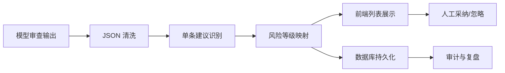

### 13.5 排版阶段的决策树算法

系统在排版阶段并非始终采用同一策略，而是根据文档规模、当前是否有历史结构结果、是否处于局部更新模式等因素进行路径选择。

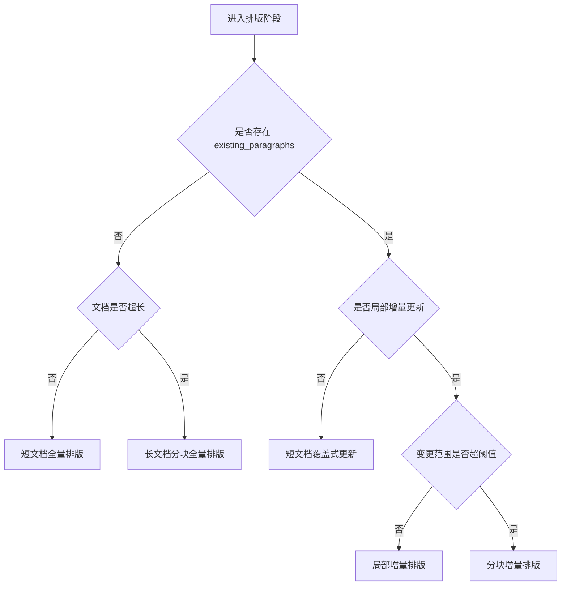

### 13.6 排版一致性保障算法

排版阶段的一个关键难点在于：前端实时预览、PDF 导出与 DOCX 导出三者必须尽量一致。为实现这一目标，系统引入“单一结构模型 + 多渲染后端”架构。

| 层次        | 说明                                 |
| ----------- | ------------------------------------ |
| 统一内容层  | 所有渠道共享同一段落数组             |
| 统一样式层  | 共享归一化后的字体、字号、间距、对齐 |
| 前端渲染层  | 用于交互预览                         |
| HTML 导出层 | 用于 PDF 生成                        |
| DOCX 导出层 | 用于正式可编辑文稿                   |

### 13.7 公文版本化算法

为了保证修改过程可回看、可撤销、可追溯，系统在文档处理链路中引入了版本化机制。版本化不只是简单快照，而是围绕阶段节点与人工操作形成可追踪历史。

| 版本节点    | 触发条件     | 保存内容             |
| ----------- | ------------ | -------------------- |
| Draft 版本  | 起草完成     | 草稿正文             |
| Review 版本 | 审查结果确认 | 建议集合             |
| Format 版本 | 排版结果确认 | 段落数组             |
| Export 版本 | 文件导出     | 导出参数与文件元数据 |
| Manual 版本 | 人工关键修改 | 修改后的内容快照     |

### 13.8 公文算法链路的业务意义

| 算法能力   | 对业务的直接价值       |
| ---------- | ---------------------- |
| 流式起草   | 缩短首稿形成时间       |
| 结构化审查 | 降低人工审查负担       |
| 增量排版   | 提升反复修改场景效率   |
| 高保真导出 | 满足正式发文与归档需求 |
| 版本留痕   | 满足政务流程留痕要求   |

---

## 14. 智能问答算法的深化说明

### 14.1 问答输入理解与问题路由

问答系统首先需要判断用户问题应当优先走何种知识路径。虽然当前实现对用户透明，但从算法设计上，实际上存在隐式问题路由机制：

| 问题类型     | 优先处理路径   | 典型示例                     |
| ------------ | -------------- | ---------------------------- |
| 标准口径问题 | QA 强命中优先  | “管理员默认账号是什么”       |
| 事实说明问题 | 知识库检索优先 | “某模块的功能有哪些”         |
| 实体关系问题 | 图谱检索优先   | “某部门与某事项的关系是什么” |
| 连续追问问题 | 会话上下文优先 | “那它的下一步呢”             |

### 14.2 上下文融合算法

在多源检索结果返回后，系统不会直接将所有结果无差别拼接，而是进行上下文融合。融合的核心目标，是在有限上下文窗口中优先放入高价值证据，并避免信息冗余与冲突。

| 融合策略     | 说明                             |
| ------------ | -------------------------------- |
| 强证据优先   | 高分 QA / 高相关 KB 结果优先放置 |
| 互补证据拼接 | 文本证据与图谱证据共同注入       |
| 去冗余       | 相似片段不重复放入               |
| 长度控制     | 截断低价值长文本，保留核心证据   |
| 可追溯映射   | 注入时同步记录引用对象           |

### 14.3 问答证据融合图

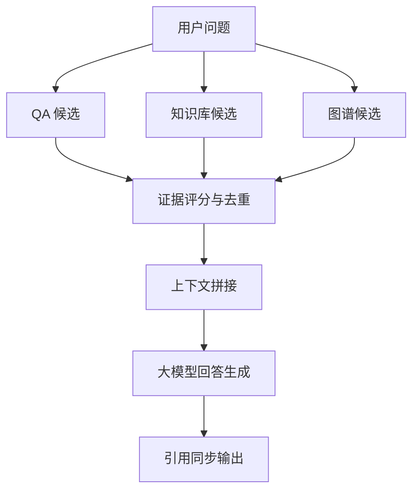

### 14.4 图谱文本协同算法

文本知识与图谱知识的优势不同：文本擅长承载政策说明与长段背景，图谱擅长承载实体关系与结构信息。系统采用“图谱补短板、文本保细节”的协同思路。

| 知识类型   | 优势               | 局限         | 协同作用         |
| ---------- | ------------------ | ------------ | ---------------- |
| QA 库      | 稳定、口径统一     | 覆盖面有限   | 解决高频标准问题 |
| 文本知识库 | 细节丰富、原文充分 | 关系结构较弱 | 提供详细证据段落 |
| 知识图谱   | 关系清晰、结构明确 | 文本细节有限 | 强化实体关系理解 |

### 14.5 引用一致性保障算法

为了避免“回答中提到了依据，但前端看不到来源”这一常见问题，系统采用回答与引用并行生成机制。即在模型输出答案的同时，后端已经完成了引用对象汇总，并在结束前统一推送。

| 保障点   | 说明                                |
| -------- | ----------------------------------- |
| 来源同步 | 所有检索结果进入统一 citations 列表 |
| 格式统一 | 统一字段结构，便于前端渲染          |
| 答案解耦 | 回答文本和引用对象分通道返回        |
| 可回看   | 引用对象可随消息持久化              |

### 14.6 问答可信度的工程化表达

严格意义上，生成式问答很难以传统单一准确率度量。因此，项目采用“可信度构成项”的工程化描述方式。一个回答的可信度主要由以下因素组成：

| 可信度因子      | 说明                         |
| --------------- | ---------------------------- |
| 是否命中标准 QA | 若命中，则可信度显著提高     |
| 引用数量与质量  | 有高相关引用时可信度更高     |
| 图谱关系支持    | 有结构化关系证据时可信度更高 |
| 上下文连续性    | 会话上下文连续时回答更稳定   |
| 敏感内容校验    | 通过安全规则校验后风险更低   |

### 14.7 问答算法的应用价值

| 算法能力       | 对业务的直接价值             |
| -------------- | ---------------------------- |
| 强命中标准回答 | 保证对外口径一致             |
| 混合检索       | 提升复杂问题召回能力         |
| 图谱增强       | 更适合结构关系型问题         |
| 引用溯源       | 结果更可信、更适合政务场景   |
| 多轮会话       | 提升交互自然度和连续咨询效率 |

---

## 15. 工程稳健性与异常治理机制

### 15.1 超时治理策略

在外部模型、知识检索和导出服务都可能出现延迟波动的情况下，系统必须采用明确的超时控制策略，以防止请求长期悬挂和前端无感知等待。

| 模块       | 风险             | 治理方式              |
| ---------- | ---------------- | --------------------- |
| 模型调用   | 响应过慢         | 连接超时 + 读取超时   |
| 检索调用   | 数据集接口抖动   | 单请求超时 + 全局超时 |
| 导出服务   | 渲染时间不可预期 | 分阶段超时与错误返回  |
| 数据库操作 | 慢查询或锁等待   | 会话控制与异常捕获    |

### 15.2 重试与退避机制

系统在网络抖动、限流和暂时性 5xx 场景中采用重试机制，但重试并非无条件执行，而是区分异常类型实施。

| 异常类型     | 是否重试 | 原因                   |
| ------------ | -------- | ---------------------- |
| 429 限流     | 是       | 等待后重试通常有效     |
| 5xx 服务异常 | 是       | 多为暂时性故障         |
| 网络中断     | 视情况   | 需防止无意义放大流量   |
| 参数错误 4xx | 否       | 业务输入错误重试无意义 |
| 权限错误     | 否       | 需人工或系统修正配置   |

### 15.3 幂等与重复提交控制

在长流程任务中，若用户重复点击按钮，可能导致同一文档同一阶段被同时触发。为此系统设计幂等与互斥控制机制。

| 机制         | 说明                             |
| ------------ | -------------------------------- |
| 分布式锁     | 同一文档同一阶段只允许单实例处理 |
| 状态检查     | 若已在处理中，则拒绝重复请求     |
| 任务结束释放 | 任务完成或异常后释放锁           |
| 错误回传     | 明确告知用户当前状态而非静默失败 |

### 15.4 降级策略说明

复杂智能系统不能假设所有依赖永远可用，因此需要具备局部降级能力。

| 依赖异常场景     | 降级方式                           |
| ---------------- | ---------------------------------- |
| 图谱暂不可用     | 保留文本检索问答能力               |
| 部分知识库不可用 | 仅使用可用集合继续检索             |
| PDF 渲染失败     | 可退回 DOCX 导出路径               |
| 某阶段局部失败   | 支持停留在上一阶段结果继续人工处理 |

### 15.5 观测与诊断机制

系统为了支持问题定位与验收汇报，建立了基础观测与诊断能力。

| 观测维度 | 观测内容                             |
| -------- | ------------------------------------ |
| 处理阶段 | 当前所处阶段、阶段耗时               |
| 事件流   | message_start、progress、message_end |
| 检索结果 | 命中数量、最高得分、引用对象         |
| 导出结果 | 文件格式、渲染是否成功               |
| 异常信息 | 错误类型、触发阶段、用户感知错误提示 |

### 15.6 失败路径分析图

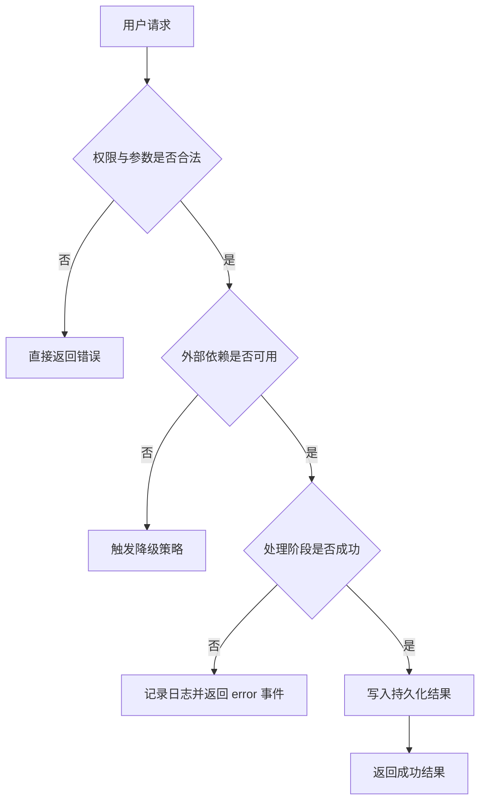

### 15.7 工程稳健性价值

| 价值         | 说明                                     |
| ------------ | ---------------------------------------- |
| 提升可用性   | 单点故障不致使全链路瘫痪                 |
| 提升可维护性 | 问题定位路径更清晰                       |
| 提升可验收性 | 可向甲方展示“稳定运行机制”而非只展示效果 |
| 降低运营风险 | 明确超时、重试、降级和错误提示路径       |

---

## 16. 质量评估体系与阶段性指标建议

中期验收阶段，甲方通常不仅关注“有没有功能”，还关注“功能是否稳定、是否可靠、是否具备持续演进价值”。因此，本项目建议从功能正确性、结果质量、性能体验、可解释性、安全性五个维度构建阶段性指标体系。

### 16.1 智能公文质量指标

| 指标维度   | 指标说明                           | 建议观察方式        |
| ---------- | ---------------------------------- | ------------------- |
| 起草可用性 | 是否能稳定形成可编辑首稿           | 多轮样例测试        |
| 审查有效性 | 是否能识别明显问题并给出结构化建议 | 人工抽样比对        |
| 排版规范性 | 是否基本符合预设格式要求           | 样式对照检查        |
| 导出一致性 | 预览、PDF、DOCX 是否基本一致       | 视觉比对 + 文件检查 |
| 过程可见性 | 是否可实时看到进度与阶段状态       | 前端交互测试        |

### 16.2 智能问答质量指标

| 指标维度     | 指标说明                   | 建议观察方式     |
| ------------ | -------------------------- | ---------------- |
| 命中准确性   | 高频标准问答是否能稳定命中 | 标准问集验证     |
| 检索相关性   | Top-K 结果是否与问题相关   | 人工抽样与打分   |
| 回答可追溯性 | 是否能提供引用依据         | 前端引用展示验证 |
| 多轮连续性   | 追问场景是否保持上下文     | 连续对话测试     |
| 结构关系理解 | 是否能从图谱中补充关系信息 | 图谱问答样例验证 |

### 16.3 工程性指标

| 指标维度         | 指标说明                     | 意义             |
| ---------------- | ---------------------------- | ---------------- |
| 首次响应时间     | 从请求发起到首个事件到达时间 | 影响用户等待感受 |
| 完整处理时间     | 从开始到结束的总耗时         | 影响可用性       |
| 错误可感知率     | 出错时是否能返回明确提示     | 影响可维护性     |
| 成功完成率       | 请求完成且结果可用的比例     | 影响稳定性       |
| 重复提交抑制能力 | 并发重复操作是否被正确拦截   | 影响系统可靠性   |

### 16.4 评估方法建议

| 方法           | 适用对象       | 说明                 |
| -------------- | -------------- | -------------------- |
| 人工验收样例   | 公文、问答     | 最适合中期阶段       |
| 专家主观评分   | 公文质量       | 适合审查和排版评价   |
| 流程打点统计   | 工程性能       | 适合记录耗时与失败率 |
| 对照测试       | 标准答案型问答 | 适合验证强命中能力   |
| 文件一致性检查 | 导出模块       | 适合评估高保真程度   |

### 16.5 中期阶段建议验收口径

为便于甲方进行阶段验收，建议采用“功能完成度 + 算法合理性 + 结果可展示性 + 工程可运行性”四维口径：

| 验收口径     | 判断重点                                 |
| ------------ | ---------------------------------------- |
| 功能完成度   | 是否打通两款产品核心链路                 |
| 算法合理性   | 是否具备清晰、严谨、可解释的核心算法设计 |
| 结果可展示性 | 是否能稳定演示关键场景与输出结果         |
| 工程可运行性 | 是否具备权限、异常、导出、留痕等支撑能力 |

### 16.6 质量闭环机制


### 16.7 阶段性结论深化

综合上述分析，可以将本项目中期成果概括为以下结论：

1. 在智能公文方向，乙方已经完成从内容生成、结构化审查、增量排版到高保真导出的关键算法链路建设；
2. 在智能问答方向，乙方已经完成从标准问答命中、混合检索、图谱增强、引用溯源到多轮连续对话的关键算法链路建设；
3. 在公共能力方向，乙方已经完成权限治理、敏感检测、分布式锁、超时重试、错误可感知、版本留痕等支撑能力建设；
4. 从技术形态看，当前系统已具备“复合智能引擎”的典型特征，而非简单的大模型接口封装；
5. 从甲方验收视角看，当前成果已经具备“可演示、可说明、可验收、可持续演进”的中期成果条件。

---

## 17. 后续可扩展方向（可作为甲方沟通储备）

虽然本次文档主要服务于中期验收，但为了体现项目的可持续演进能力，有必要补充说明后续可拓展方向。这些方向不影响当前中期验收结论，但可以帮助甲方理解系统具备继续深化的技术潜力。

### 17.1 智能公文方向可扩展点

| 方向         | 可扩展内容                       |
| ------------ | -------------------------------- |
| 模板智能匹配 | 针对不同发文场景自动推荐模板     |
| 规范自动校核 | 引入更细粒度的公文规范规则库     |
| 批注协同     | 支持多人审查建议汇总与冲突处理   |
| 风格迁移     | 支持按单位既有风格进行公文化改写 |
| 质量评分     | 对公文结果给出综合质量分值       |

### 17.2 智能问答方向可扩展点

| 方向         | 可扩展内容                       |
| ------------ | -------------------------------- |
| 多跳图谱问答 | 从一跳扩展到路径级推理           |
| 证据冲突检测 | 当不同知识源冲突时提示用户       |
| 答案置信分级 | 为回答增加高/中/低置信标签       |
| 主动推荐     | 基于问题上下文推荐相关政策或材料 |
| 反馈学习     | 将人工纠正结果沉淀为后续优化样本 |

### 17.3 平台治理方向可扩展点

| 方向         | 可扩展内容                         |
| ------------ | ---------------------------------- |
| 更细粒度审计 | 记录更完整的事件级追踪数据         |
| 策略中心     | 将规则、阈值和限流策略统一配置化   |
| 可观测增强   | 对耗时、错误率、命中率做仪表盘展示 |
| 灰度实验     | 支持不同模型、策略、提示词灰度试验 |
| 质量运营     | 建立样例库、评测集和版本对比机制   |

### 17.4 对甲方的长期价值说明

| 价值维度     | 说明                                     |
| ------------ | ---------------------------------------- |
| 持续迭代空间 | 当前架构适合持续叠加规则、知识与模型能力 |
| 成本收益平衡 | 通过分阶段与增量处理控制整体调用成本     |
| 业务沉淀能力 | 知识库、图谱、审计、版本将形成长期资产   |
| 平台化潜力   | 可从单场景产品发展为统一政务智能平台     |

---

## 18. 结语

从中期成果视角看，本项目已经完成两款产品核心算法框架的实质性建设，并在关键业务场景中形成了可运行、可展示、可解释、可追溯的智能处理能力。无论从算法链路完整性、工程实现严谨性，还是从政务场景适配度来看，当前阶段成果均已达到中期验收所需的技术说明深度。

本项目的技术核心不在于“调用了哪个模型”，而在于乙方围绕政务文档与政务知识场景，构建了由事件流编排、规则约束、结构化解析、知识增强、导出一致性与治理机制共同组成的复合算法体系。这一体系已经具备继续扩展和持续优化的坚实基础，也具备面向后续正式验收与上线应用深化的可行性。

---

## 19. 典型业务场景与算法落地示例（下）

为进一步增强文档的业务可理解性，本章继续补充典型使用场景。与第 25 章不同，本章更强调“智能问答场景”“跨模块协同场景”“复杂异常场景”和“管理者关心的可视化成果场景”。

### 19.1 场景六：通过智能问答快速查询制度口径

| 项目     | 说明                                |
| -------- | ----------------------------------- |
| 场景描述 | 用户询问某项制度是否适用于特定场景  |
| 调用能力 | QA 强命中、知识库混合检索、引用回传 |
| 核心价值 | 让制度查询从人工翻文档变成即时问答  |

#### 19.1.1 场景流程

| 步骤 | 动作                       |
| ---- | -------------------------- |
| 1    | 用户输入制度问题           |
| 2    | 系统做敏感检测             |
| 3    | 判断是否命中标准 QA        |
| 4    | 如未命中则执行混合检索     |
| 5    | 组装上下文后调用问答工作流 |
| 6    | 返回答案与引用依据         |

#### 19.1.2 价值表达

| 价值点       | 表达方式                   |
| ------------ | -------------------------- |
| 查询效率提升 | 无需人工逐篇翻阅制度文件   |
| 口径更统一   | 高标准问题优先走 QA 强命中 |
| 回答可追溯   | 引用对象可直接查看出处     |

### 19.2 场景七：连续追问型知识咨询

| 项目     | 说明                           |
| -------- | ------------------------------ |
| 场景描述 | 用户先问总体问题，再追问细节   |
| 调用能力 | 多轮会话、上下文融合、引用溯源 |
| 核心价值 | 减少重复输入，提升交互自然度   |

#### 19.2.1 典型对话结构

| 轮次    | 问题形态           | 系统能力       |
| ------- | ------------------ | -------------- |
| 第 1 轮 | “某模块是什么”     | 主题介绍       |
| 第 2 轮 | “它适用于哪些情况” | 会话上下文延续 |
| 第 3 轮 | “那审批流程呢”     | 追问与指代解析 |
| 第 4 轮 | “有没有依据”       | 引用与证据展示 |

### 19.3 场景八：图谱关系型问题查询

| 项目     | 说明                               |
| -------- | ---------------------------------- |
| 场景描述 | 用户询问部门、事项、政策之间的关系 |
| 调用能力 | 实体抽取、图谱检索、关系转写       |
| 核心价值 | 更适合结构性问题而非纯段落问答     |

#### 19.3.1 场景流程

| 步骤 | 动作                       |
| ---- | -------------------------- |
| 1    | 从问题中提取候选实体       |
| 2    | 查询图谱节点与一跳关系     |
| 3    | 将关系链转写为文字上下文   |
| 4    | 与文本知识共同送入模型     |
| 5    | 返回结构更清晰的解释性答案 |

### 19.4 场景九：公文处理过程中的人工复核协同

| 项目     | 说明                                                  |
| -------- | ----------------------------------------------------- |
| 场景描述 | AI 给出草稿、建议和排版结果后，人工进行复核和局部修改 |
| 调用能力 | 审查建议结构化、增量排版、版本留痕                    |
| 核心价值 | 符合真实办公中“AI 辅助 + 人工把关”的模式              |

#### 19.4.1 协同点说明

| 协同点           | 说明               |
| ---------------- | ------------------ |
| AI 先给出底稿    | 缩短起步时间       |
| AI 先暴露风险    | 减少人工通读压力   |
| 人工决定采纳与否 | 保持业务控制权     |
| 修改后局部重排   | 避免重复劳动       |
| 所有结果可留痕   | 满足管理与审计要求 |

### 19.5 场景十：验收演示场景

| 项目     | 说明                                       |
| -------- | ------------------------------------------ |
| 场景描述 | 在甲方验收会上现场演示核心能力             |
| 调用能力 | 流式输出、结构化建议、排版预览、问答引用   |
| 核心价值 | 快速体现系统“不是静态 PPT，而是可运行产品” |

#### 19.5.1 建议演示顺序

| 顺序 | 演示点                           |
| ---- | -------------------------------- |
| 1    | 上传材料并进行智能起草           |
| 2    | 对草稿执行审查，展示问题列表     |
| 3    | 进行规范排版并展示结构化预览     |
| 4    | 导出 PDF / DOCX                  |
| 5    | 切换至智能问答，查询一组制度问题 |
| 6    | 展示引用依据与多轮追问效果       |

### 19.6 场景十一：知识库资料更新后的即时问答

| 项目     | 说明                                       |
| -------- | ------------------------------------------ |
| 场景描述 | 新资料入库后，用户立即在问答中查询相关内容 |
| 调用能力 | 知识库生命周期、混合检索、引用回传         |
| 核心价值 | 体现知识更新对问答效果的即时影响           |

### 19.7 场景十二：导出失败后的回退保障

| 项目     | 说明                                           |
| -------- | ---------------------------------------------- |
| 场景描述 | PDF 渲染失败时，系统仍需保证用户能拿到可用文件 |
| 调用能力 | 降级策略、结构化导出、错误可感知               |
| 核心价值 | 避免关键业务流程因单点故障中断                 |

### 19.8 场景十三：长文档审查的稳定处理

| 项目     | 说明                                 |
| -------- | ------------------------------------ |
| 场景描述 | 用户上传较长请示或报告，需要完整审查 |
| 调用能力 | 文档分块、审查建议聚合、风险分层     |
| 核心价值 | 解决长文档模型不稳定问题             |

### 19.9 场景十四：高频标准问答的低成本运行

| 项目     | 说明                                     |
| -------- | ---------------------------------------- |
| 场景描述 | 某些常见问题频繁出现，需要低成本稳定回答 |
| 调用能力 | QA 强命中、标准答案注入                  |
| 核心价值 | 控制算力成本并提高统一性                 |

### 19.10 场景十五：图谱与文本知识同时命中的复杂问题

| 项目     | 说明                                 |
| -------- | ------------------------------------ |
| 场景描述 | 问题既涉及政策内容，又涉及部门关系   |
| 调用能力 | 混合检索、图谱增强、上下文融合       |
| 核心价值 | 体现复合智能系统区别于单纯聊天机器人 |

---

## 20. 核心算法伪代码附录

为进一步体现技术严谨性，本章以偏工程实现的伪代码形式描述若干关键算法。伪代码并不等于源码复制，而是用更抽象、更可审阅的方式呈现算法思路、输入输出、边界条件与主控制流。

### 20.1 流式事件解析伪代码

```text
Algorithm ParseStreamEvents
Input:
    stream_lines        // Dify 返回的逐行流式响应
    enable_reasoning    // 是否输出 reasoning 事件
    enable_text         // 是否输出 text_chunk 事件
Output:
    event_sequence

State:
    buffer = ""
    reasoning_buffer = ""
    in_thinking = false

For each line in stream_lines:
    If line is empty:
        Continue

    If line starts with "data: ":
        payload = strip_prefix(line)

        If payload == "[DONE]":
            Emit(message_end)
            Break

        parsed = try_parse_json(payload)

        If parsed is invalid:
            Continue

        chunk = extract_text(parsed)

        While chunk is not empty:
            If not in_thinking:
                pos = find("<think>", chunk)
                If pos == -1:
                    If enable_text:
                        Emit(text_chunk, chunk)
                    chunk = ""
                Else:
                    prefix = chunk before pos
                    suffix = chunk after "<think>"
                    If prefix is not empty and enable_text:
                        Emit(text_chunk, prefix)
                    in_thinking = true
                    chunk = suffix
            Else:
                pos = find("</think>", chunk)
                If pos == -1:
                    reasoning_buffer += chunk
                    chunk = ""
                Else:
                    thinking_part = chunk before pos
                    reasoning_buffer += thinking_part
                    If enable_reasoning and reasoning_buffer not empty:
                        Emit(reasoning, reasoning_buffer)
                    reasoning_buffer = ""
                    in_thinking = false
                    chunk = chunk after "</think>"

Return event_sequence
```

### 20.2 JSON 增量对象识别伪代码

```text
Algorithm ExtractJsonObjectsIncrementally
Input:
    incoming_text_chunks
Output:
    object_list

State:
    buffer = ""
    start_index = -1
    depth = 0
    in_string = false
    escaped = false

For each chunk in incoming_text_chunks:
    buffer += chunk

    For i from 0 to len(buffer)-1:
        ch = buffer[i]

        If escaped:
            escaped = false
            Continue

        If ch == '\\':
            escaped = true
            Continue

        If ch == '"':
            in_string = not in_string
            Continue

        If in_string:
            Continue

        If ch == '{':
            If depth == 0:
                start_index = i
            depth += 1

        Else if ch == '}':
            depth -= 1
            If depth == 0 and start_index != -1:
                candidate = buffer[start_index : i+1]
                If candidate is valid json:
                    Emit(candidate)
                buffer = buffer[i+1:]
                Restart scanning from beginning

Return object_list
```

### 20.3 审查建议生成与消费伪代码

```text
Algorithm ReviewDocument
Input:
    document_text
    review_rules
Output:
    suggestions

If length(document_text) > LONG_DOC_THRESHOLD:
    chunks = SplitDocument(document_text)
Else:
    chunks = [document_text]

all_suggestions = []

For each chunk in chunks:
    stream = CallReviewWorkflow(chunk, review_rules)
    json_objects = ExtractJsonObjectsIncrementally(stream)

    For each obj in json_objects:
        suggestion = NormalizeSuggestion(obj)
        Emit(review_suggestion, suggestion)
        all_suggestions.append(suggestion)

Persist(all_suggestions)
Return all_suggestions
```

### 20.4 文档分块伪代码

```text
Algorithm SplitDocument
Input:
    document_text
Output:
    chunks

paragraphs = SplitByParagraph(document_text)
chunks = []
current = []
current_len = 0

For each paragraph in paragraphs:
    para_len = length(paragraph)

    If current_len + para_len > MAX_CHUNK_LENGTH and current is not empty:
        chunks.append(join(current))
        current = []
        current_len = 0

    current.append(paragraph)
    current_len += para_len

If current is not empty:
    chunks.append(join(current))

Return chunks
```

### 20.5 段落类型识别伪代码

```text
Algorithm DetectParagraphType
Input:
    paragraph_text
Output:
    paragraph_type

If MatchMainTitle(paragraph_text):
    Return "title"

If MatchHeading1(paragraph_text):
    Return "heading1"

If MatchHeading2(paragraph_text):
    Return "heading2"

If MatchHeading3(paragraph_text):
    Return "heading3"

If MatchReceiver(paragraph_text):
    Return "receiver"

If MatchSignatureUnit(paragraph_text):
    Return "signature_unit"

If MatchSignatureDate(paragraph_text):
    Return "signature_date"

Return "body"
```

### 20.6 样式标准化伪代码

```text
Algorithm NormalizeStyle
Input:
    raw_style
Output:
    canonical_style

font = NormalizeFontFamily(raw_style.font_family)
size = NormalizeFontSize(raw_style.font_size)
color = NormalizeColor(raw_style.color)
style_type = NormalizeStyleType(raw_style.type)

If font is invalid:
    font = DEFAULT_FONT

If size is invalid:
    size = DEFAULT_SIZE

If color is invalid:
    color = DEFAULT_COLOR

Return {
    font_family: font,
    font_size: size,
    color: color,
    type: style_type,
    align: raw_style.align or DEFAULT_ALIGN,
    first_line_indent: raw_style.first_line_indent or DEFAULT_INDENT,
    line_spacing: raw_style.line_spacing or DEFAULT_SPACING,
}
```

### 20.7 增量段落合并伪代码

```text
Algorithm MergeIncrementalParagraphs
Input:
    original_paragraphs
    updated_paragraphs
Output:
    merged_paragraphs

merged = copy(original_paragraphs)

For each para in updated_paragraphs:
    If para.source_index is valid:
        merged[para.source_index] = para
    Else:
        idx = FallbackMatch(merged, para)
        If idx is valid:
            merged[idx] = para
        Else:
            merged.append(para)

Return merged
```

### 20.8 混合检索伪代码

```text
Algorithm HybridRetrieve
Input:
    query
    collections
Output:
    top_results

all_candidates = []

For each collection in collections parallel:
    keyword_candidates = KeywordSearch(collection, query)
    semantic_candidates = VectorSearch(collection, query)
    merged_candidates = MergeCandidates(keyword_candidates, semantic_candidates)
    all_candidates.extend(merged_candidates)

deduped = Deduplicate(all_candidates)
reranked = Rerank(deduped, query)
top_results = TakeTopK(reranked, K)

Return top_results
```

### 20.9 图谱扩展检索伪代码

```text
Algorithm QueryGraphContext
Input:
    query_text
    graph
Output:
    graph_context

keywords = ExtractKeywords(query_text)
seed_entities = MatchEntities(graph, keywords)
visited = set()
edges = []

For each entity in seed_entities:
    neighbors = OneHopExpand(graph, entity)
    For each edge in neighbors:
        If edge not in visited:
            visited.add(edge)
            edges.append(edge)

graph_context = RenderEdgesAsText(edges)
Return graph_context
```

### 20.10 引用聚合伪代码

```text
Algorithm BuildCitations
Input:
    qa_hits
    kb_hits
    graph_hits
Output:
    citations

citations = []

For each qa in qa_hits:
    citations.append(ToCitation("qa", qa))

For each kb in kb_hits:
    citations.append(ToCitation("kb", kb))

For each graph_item in graph_hits:
    citations.append(ToCitation("graph", graph_item))

citations = SortByScore(citations)
Return citations
```

### 20.11 多轮会话持久化伪代码

```text
Algorithm PersistChatTurn
Input:
    session
    user_message
    assistant_message
    citations
    reasoning
Output:
    saved_record

If session.conversation_id is empty:
    session.conversation_id = assistant_message.conversation_id

record = {
    session_id: session.id,
    user_id: session.user_id,
    question: user_message,
    answer: assistant_message.content,
    citations: citations,
    reasoning: reasoning,
    created_at: now(),
}

Save(record)
Return record
```

### 20.12 DOCX 导出伪代码

```text
Algorithm ExportDocx
Input:
    structured_paragraphs
    preset
Output:
    docx_bytes

doc = CreateWordDocument()
ApplyPageSettings(doc, preset)

For each para in structured_paragraphs:
    style = ResolveStyle(preset, para)
    word_para = doc.add_paragraph()
    ApplyWordParagraphStyle(word_para, style)
    word_para.add_run(para.text)

docx_bytes = SaveToBytes(doc)
Return docx_bytes
```

### 20.13 PDF 导出伪代码

```text
Algorithm ExportPdf
Input:
    structured_paragraphs
    preset
Output:
    pdf_bytes

html = RenderExportHtml(structured_paragraphs, preset)
pdf_bytes = ConvertHtmlToPdf(html)
Return pdf_bytes
```

### 20.14 敏感词检测伪代码

```text
Algorithm CheckSensitive
Input:
    text
    active_rules
Output:
    result

hits = []
has_block = false

For each rule in active_rules:
    If rule.keyword in text:
        hits.append(rule)
        If rule.action == "block":
            has_block = true

Return {
    passed: not has_block,
    hits: hits,
}
```

### 20.15 权限校验伪代码

```text
Algorithm RequirePermission
Input:
    token
    permission_key
Output:
    allow_or_deny

user = DecodeAndVerifyToken(token)

If user is invalid:
    Deny

If user.role is system_role:
    Allow

permissions = LoadRolePermissions(user.role)

If permission_key in permissions:
    Allow
Else:
    Deny
```

### 20.16 伪代码附录的阅读价值

| 价值               | 说明                                 |
| ------------------ | ------------------------------------ |
| 有助技术评审       | 评审人员无需逐行看源码即可理解主流程 |
| 有助甲方感知严谨性 | 体现系统不是“拍脑袋式实现”           |
| 有助后续培训       | 新成员更易理解系统关键控制流         |

---

## 21. 参数字典、阈值设计与配置项说明

算法系统要稳定运行，除了流程设计之外，阈值和参数也非常关键。本章对若干重要阈值的设计目的、影响面和调优方向做说明，以体现系统具备“可治理、可调节、可优化”的工程特征。

### 21.1 公文模块关键参数

| 参数项                       | 含义           | 影响                 |
| ---------------------------- | -------------- | -------------------- |
| LONG_DOC_THRESHOLD           | 长文档判定阈值 | 决定是否走分块处理   |
| MAX_CHUNK_LENGTH             | 单块最大长度   | 影响分块稳定性与成本 |
| INCREMENTAL_UPDATE_THRESHOLD | 增量更新阈值   | 决定是否局部排版     |
| DEFAULT_FONT                 | 默认字体       | 影响样式回退         |
| DEFAULT_SIZE                 | 默认字号       | 影响异常样式修复     |
| DEFAULT_SPACING              | 默认行距       | 影响导出一致性       |

### 21.2 问答模块关键参数

| 参数项             | 含义             | 影响                   |
| ------------------ | ---------------- | ---------------------- |
| QA_HIT_THRESHOLD   | QA 强命中阈值    | 决定是否走标准答案优先 |
| KB_TOP_K           | 检索结果保留数量 | 影响上下文长度         |
| GRAPH_DEPTH        | 图谱扩展深度     | 影响图谱上下文规模     |
| CONTEXT_MAX_LENGTH | 上下文最大长度   | 影响模型输入窗口       |
| CITATION_TOP_K     | 引用展示数量     | 影响前端依据展示       |

### 21.3 容错治理关键参数

| 参数项          | 含义           | 影响                 |
| --------------- | -------------- | -------------------- |
| CONNECT_TIMEOUT | 建连超时       | 防止请求长时间卡住   |
| READ_TIMEOUT    | 流读取超时     | 适配长流程推理       |
| RETRY_COUNT     | 最大重试次数   | 影响故障恢复能力     |
| BACKOFF_BASE    | 退避基数       | 影响重试节奏         |
| LOCK_TTL        | 分布式锁有效期 | 防止重复处理和锁泄漏 |

### 21.4 样式标准化参数

| 参数项          | 含义           |
| --------------- | -------------- |
| FONT_ALIAS_MAP  | 字体别名映射表 |
| SIZE_ALIAS_MAP  | 字号别名映射表 |
| COLOR_ALIAS_MAP | 颜色别名映射表 |
| STYLE_TYPE_MAP  | 样式类型映射表 |
| ALLOWED_COLORS  | 合法颜色白名单 |
| ALLOWED_SIZES   | 合法字号白名单 |

### 21.5 参数设计原则

| 原则     | 说明                               |
| -------- | ---------------------------------- |
| 稳定优先 | 先保证结果稳定，再追求极致性能     |
| 可观测   | 参数变更应能观察到对结果的影响     |
| 可回退   | 参数调优失败时可快速恢复           |
| 分类治理 | 不同模块参数分开管理，避免互相干扰 |

### 21.6 参数调优建议

| 调优目标         | 可调参数                       | 风险               |
| ---------------- | ------------------------------ | ------------------ |
| 提升长文档稳定性 | 降低单块长度上限               | 可能增加调用次数   |
| 提升回答准确性   | 提高 QA 强命中阈值或重排序权重 | 可能降低召回       |
| 提升导出一致性   | 收紧样式白名单                 | 可能降低样式灵活性 |
| 提升响应速度     | 减少上下文长度和 top-k         | 可能降低证据充分性 |

### 21.7 参数治理的验收表达

| 表达点 | 说明                       |
| ------ | -------------------------- |
| 可调节 | 系统并非硬编码一刀切       |
| 可运营 | 后续可根据真实使用情况优化 |
| 可治理 | 参数有明确业务含义与边界   |

---

## 22. 边界条件、异常案例与风险矩阵

为体现系统设计的工程完整性，本章列举关键边界条件和异常案例。甲方技术评审通常会关注系统是否只考虑了“最理想情况”，还是已经考虑到真实环境中的噪声、错误和极端情形。

### 22.1 公文模块边界条件

| 边界场景     | 风险               | 处理策略             |
| ------------ | ------------------ | -------------------- |
| 空白文档     | 无内容可处理       | 提示先输入或导入文本 |
| 超长文档     | 模型稳定性下降     | 自动分块             |
| 多层复杂标题 | 段落识别困难       | 规则 + 模型联合判断  |
| 样式字段异常 | 导出失败或样式错乱 | 标准化回退           |
| 用户重复点击 | 任务并发冲突       | 分布式锁             |

### 22.2 问答模块边界条件

| 边界场景         | 风险         | 处理策略                   |
| ---------------- | ------------ | -------------------------- |
| 极短问题         | 语义不足     | 利用上下文和强命中         |
| 极长问题         | 检索噪声增加 | 做长度控制与规整           |
| 无知识命中       | 容易幻觉     | 提示依据不足或输出保守回答 |
| 多源冲突         | 回答不稳定   | 引用回传 + 后续冲突治理    |
| 连续追问跳转过大 | 上下文误继承 | 结合新问题内容重新检索     |

### 22.3 导出模块边界条件

| 边界场景      | 风险         | 处理策略               |
| ------------- | ------------ | ---------------------- |
| 字体不存在    | 版式偏差     | 字体映射与默认字体回退 |
| HTML 渲染失败 | 无法导出 PDF | 降级回 DOCX 路径       |
| 超大文件导出  | 时间过长     | 超时控制和阶段反馈     |

### 22.4 安全治理边界条件

| 边界场景     | 风险               | 处理策略         |
| ------------ | ------------------ | ---------------- |
| Token 过期   | 用户误以为系统失效 | 明确提示重新登录 |
| 权限不足     | 非法访问功能       | 统一拒绝并提示   |
| 敏感内容命中 | 输出风险内容       | 阻断或告警       |

### 22.5 风险矩阵总表

| 风险项           | 概率 | 影响 | 综合等级 | 控制措施           |
| ---------------- | ---- | ---- | -------- | ------------------ |
| 模型接口波动     | 中   | 高   | 高       | 超时、重试、降级   |
| 长文档输出不稳定 | 中   | 中   | 中       | 分块处理、增量策略 |
| 检索结果不相关   | 中   | 中   | 中       | 混合检索、重排序   |
| 样式漂移         | 中   | 中   | 中       | 标准化与白名单     |
| 图谱数据噪声     | 低   | 中   | 中       | 图谱治理与来源绑定 |
| 权限误配         | 低   | 高   | 中       | RBAC 和审计        |

### 22.6 典型异常案例库（公文）

| 案例编号  | 场景            | 异常表现     | 建议处置           |
| --------- | --------------- | ------------ | ------------------ |
| DOC-EX-01 | 导入文档为空    | 起草无法开始 | 提示用户重新上传   |
| DOC-EX-02 | 审查输出非 JSON | 建议列表为空 | 启用缓冲清洗或重试 |
| DOC-EX-03 | 样式值非法      | 排版错乱     | 回退默认样式       |
| DOC-EX-04 | PDF 渲染失败    | 下载失败     | 回退 DOCX 导出     |
| DOC-EX-05 | 重复点击排版    | 出现任务冲突 | 锁机制拒绝重复提交 |

### 22.7 典型异常案例库（问答）

| 案例编号 | 场景                 | 异常表现       | 建议处置             |
| -------- | -------------------- | -------------- | -------------------- |
| QA-EX-01 | 没有知识命中         | 回答较空泛     | 提示依据不足         |
| QA-EX-02 | 标准问答与知识库冲突 | 回答摇摆       | 优先强命中并保留引用 |
| QA-EX-03 | 图谱不可用           | 关系解释缺失   | 降级到文本问答       |
| QA-EX-04 | 会话 ID 丢失         | 多轮上下文断裂 | 重新建立会话         |
| QA-EX-05 | 敏感词命中           | 请求被阻断     | 返回告警或阻断信息   |

### 22.8 风险管理闭环图


### 22.9 风险章节的验收意义

| 意义           | 说明                       |
| -------------- | -------------------------- |
| 体现成熟度     | 说明系统考虑了真实运行环境 |
| 体现治理能力   | 不是只展示成功路径         |
| 体现可上线潜力 | 异常可控是上线前提之一     |

---

## 23. 安全、权限、审计与合规深化说明

在政务场景中，系统不仅要“能回答”“能生成”，还必须满足最基本的访问控制、内容治理和行为留痕要求。本章从安全与治理视角对系统能力进行进一步展开。

### 23.1 认证机制说明

| 能力点     | 说明                         |
| ---------- | ---------------------------- |
| 登录认证   | 通过用户名密码换取 JWT       |
| Token 校验 | 每次请求校验合法性与过期时间 |
| 黑名单机制 | 支持令牌主动失效             |
| 状态校验   | 用户禁用时拒绝访问           |

### 23.2 权限模型说明

| 维度     | 说明                           |
| -------- | ------------------------------ |
| 模块维度 | 如系统管理、资源管理、应用功能 |
| 资源维度 | 如用户、知识库、公文、问答     |
| 动作维度 | 如查看、编辑、导出、管理       |
| 角色维度 | 不同角色具备不同权限集合       |

### 23.3 权限矩阵示例

| 功能     | 管理员 | 普通用户 | 审核用户 |
| -------- | ------ | -------- | -------- |
| 查看文档 | 是     | 是       | 是       |
| 编辑文档 | 是     | 是       | 否       |
| 导出文档 | 是     | 是       | 是       |
| 查看审计 | 是     | 否       | 部分     |
| 管理用户 | 是     | 否       | 否       |
| 配置规则 | 是     | 否       | 否       |

### 23.4 敏感词治理逻辑

| 命中级别 | 系统动作               |
| -------- | ---------------------- |
| 高风险   | 阻断流程               |
| 中风险   | 告警并提示用户确认     |
| 低风险   | 留作提醒，不阻断主链路 |

### 23.5 审计留痕对象

| 审计对象 | 记录内容                     |
| -------- | ---------------------------- |
| 登录行为 | 用户、时间、来源             |
| 文档处理 | 哪个文档、哪个阶段、是否成功 |
| 导出行为 | 导出格式、时间、用户         |
| 问答行为 | 问题、回答、引用、时间       |
| 管理行为 | 用户与权限配置变更           |

### 23.6 合规视角下的系统价值

| 合规关注点 | 系统机制           |
| ---------- | ------------------ |
| 身份可信   | JWT 与用户状态校验 |
| 权限受控   | RBAC 模型          |
| 内容安全   | 敏感词规则         |
| 行为可追溯 | 审计日志           |
| 错误可感知 | 统一错误事件反馈   |

### 23.7 安全场景示例

| 场景             | 系统反应     |
| ---------------- | ------------ |
| 用户 Token 过期  | 提示重新登录 |
| 用户无权限导出   | 返回权限不足 |
| 输入含高危敏感词 | 拒绝继续执行 |
| 管理员调整规则   | 写入审计日志 |

### 23.8 安全治理的验收表述

| 表述方向     | 表述内容                         |
| ------------ | -------------------------------- |
| 不是裸奔系统 | 已具备认证、授权、审计、内容治理 |
| 不是黑箱系统 | 可留痕、可追踪、可复盘           |
| 适合政务场景 | 基础治理能力已具备               |

---

## 24. 性能、容量与成本模型说明

甲方在中后期通常会进一步关心系统是否能够承载真实业务量，因此有必要从性能和容量视角说明系统当前架构的可扩展性。该部分不要求给出极其精确的生产级压测数据，但需要体现系统已经具备明确的性能思维和扩容思路。

### 24.1 性能关注点总览

| 关注点         | 说明                             |
| -------------- | -------------------------------- |
| 首屏可感知时间 | 用户发起任务后多久看到第一个结果 |
| 全流程耗时     | 从开始到结束总共需要多久         |
| 并发冲突控制   | 多用户或重复提交是否稳定         |
| 导出耗时       | PDF/DOCX 是否在可接受时间内完成  |
| 问答响应速度   | 回答是否具备可用的交互体验       |

### 24.2 性能影响因素

| 因素         | 对公文影响 | 对问答影响 |
| ------------ | ---------- | ---------- |
| 文档长度     | 高         | 低至中     |
| 检索集合数量 | 低         | 高         |
| 图谱节点规模 | 低         | 中         |
| 模型响应速度 | 高         | 高         |
| 导出目标格式 | 高         | 无         |

### 24.3 成本构成说明

| 成本项       | 说明                         |
| ------------ | ---------------------------- |
| 模型调用成本 | 按阶段或按 token 消耗        |
| 检索成本     | 与知识集合大小、调用次数有关 |
| 导出成本     | HTML/PDF 渲染和文档生成消耗  |
| 存储成本     | 文档版本、消息记录、知识数据 |
| 运维成本     | 容器、数据库、日志与监控     |

### 24.4 成本控制策略

| 策略       | 作用                   |
| ---------- | ---------------------- |
| 五阶段拆分 | 避免不必要的整链路调用 |
| 增量排版   | 减少重复计算           |
| QA 强命中  | 降低高频问题成本       |
| 长度裁剪   | 限制上下文膨胀         |
| 分块处理   | 稳定长文档而非粗暴重跑 |

### 24.5 容量扩展思路

| 扩展方向       | 说明                         |
| -------------- | ---------------------------- |
| 接口层水平扩容 | API 无状态化便于扩容         |
| 检索层扩容     | 数据集和索引可分库分集合治理 |
| 图谱层扩容     | 图数据库可逐步优化查询策略   |
| 导出层独立扩容 | 导出服务可作为独立资源池     |
| 缓存层扩容     | Redis 可支持更多锁和会话场景 |

### 24.6 性能优化优先级建议

| 优先级 | 优化方向             | 原因                   |
| ------ | -------------------- | ---------------------- |
| 高     | 控制模型调用次数     | 收益最大               |
| 高     | 提升首个事件返回时间 | 用户感知明显           |
| 中     | 优化检索召回与重排   | 影响问答质量           |
| 中     | 优化导出链路         | 影响最终交付体验       |
| 低     | 过度微观优化代码路径 | 对当前中期阶段收益有限 |

### 24.7 性能与验收关系说明

| 验收关注点           | 合理口径                             |
| -------------------- | ------------------------------------ |
| 是否秒级完成全部流程 | 不应做绝对要求，长文档本身是复杂任务 |
| 是否有反馈           | 应强调流式首响和进度反馈             |
| 是否稳定             | 应强调超时、重试、降级和锁机制       |
| 是否可扩容           | 应强调架构具备扩展空间               |

---

## 25. 事件字典、接口语义与状态码说明

为了让文档具备更强的工程交付属性，本章对核心事件类型、接口语义与常见状态码进行统一定义。这一部分有利于前后端协作、验收演示及后续运维诊断。

### 25.1 SSE 事件字典

| 事件名               | 含义       | 典型载荷                       |
| -------------------- | ---------- | ------------------------------ |
| message_start        | 任务开始   | message_id、stage              |
| text_chunk           | 文本增量   | content                        |
| reasoning            | 推理内容   | content                        |
| reasoning_step       | 推理步骤   | step、message                  |
| review_suggestion    | 审查建议   | category、severity、suggestion |
| structured_paragraph | 结构化段落 | text、type、font_size 等       |
| citations            | 引用信息   | citation 列表                  |
| knowledge_graph      | 图谱结果   | nodes、edges 或三元组          |
| progress             | 进度提示   | current_step、message          |
| error                | 错误信息   | code、message                  |
| message_end          | 任务完成   | usage、message_id              |

### 25.2 文档处理阶段状态字典

| 状态名     | 含义   |
| ---------- | ------ |
| idle       | 空闲   |
| drafting   | 起草中 |
| reviewing  | 审查中 |
| formatting | 排版中 |
| exporting  | 导出中 |
| finished   | 完成   |
| failed     | 失败   |

### 25.3 问答会话状态字典

| 状态名  | 含义         |
| ------- | ------------ |
| new     | 新会话       |
| active  | 会话活跃     |
| waiting | 等待模型结果 |
| closed  | 会话关闭     |

### 25.4 常见错误语义说明

| 错误类别 | 含义               | 建议前端处理           |
| -------- | ------------------ | ---------------------- |
| 权限错误 | 用户无权访问       | Toast + 跳转或停留     |
| 参数错误 | 输入不合法         | 提示用户修改输入       |
| 模型错误 | 工作流异常         | 显示失败原因并允许重试 |
| 导出错误 | 文件生成失败       | 提供替代导出方案       |
| 锁冲突   | 当前已有任务执行中 | 告知稍后重试           |

### 25.5 返回数据统一口径

| 字段    | 含义         |
| ------- | ------------ |
| code    | 业务状态码   |
| message | 业务说明     |
| data    | 返回数据主体 |
| extra   | 可选扩展信息 |

### 25.6 事件驱动界面联动说明

| 事件                 | 前端联动行为           |
| -------------------- | ---------------------- |
| text_chunk           | 刷新文本显示区域       |
| review_suggestion    | 插入建议列表           |
| structured_paragraph | 更新排版预览           |
| citations            | 刷新依据展示区         |
| progress             | 更新状态提示           |
| error                | 显示错误并终止当前流程 |

### 25.7 接口语义治理价值

| 价值         | 说明                       |
| ------------ | -------------------------- |
| 降低沟通成本 | 前后端对事件意义统一理解   |
| 降低演示风险 | 知道每一步界面为什么会变化 |
| 降低运维难度 | 错误类别更易归因           |

---

## 26. 甲方验收清单与汇报话术建议

为了进一步提升文档实用性，本章提供可直接用于中期汇报和甲方验收场景的核对清单与口径建议。该部分非常适合项目经理、汇报人和验收配合人员直接使用。

### 26.1 甲方验收清单（功能）

| 序号 | 验收项                   | 核对方式 |
| ---- | ------------------------ | -------- |
| 1    | 智能公文是否能完成起草   | 现场演示 |
| 2    | 是否能输出结构化审查建议 | 现场演示 |
| 3    | 是否能完成规范化排版     | 现场演示 |
| 4    | 是否能导出 Word / PDF    | 现场演示 |
| 5    | 智能问答是否可用         | 现场演示 |
| 6    | 是否能展示引用来源       | 现场演示 |
| 7    | 是否支持连续追问         | 现场演示 |

### 26.2 甲方验收清单（技术）

| 序号 | 验收项               | 核对方式                 |
| ---- | -------------------- | ------------------------ |
| 1    | 是否具备清晰技术架构 | 查看文档第 2 章          |
| 2    | 是否形成核心算法体系 | 查看文档第 3-5、11-16 章 |
| 3    | 是否具备安全治理机制 | 查看文档第 6、30 章      |
| 4    | 是否考虑异常与风险   | 查看文档第 15、29 章     |
| 5    | 是否具备后续可扩展性 | 查看文档第 17、31 章     |

### 26.3 汇报开场建议话术

| 场景         | 建议话术                                                                         |
| ------------ | -------------------------------------------------------------------------------- |
| 开场         | 本次中期成果重点不是单点模型效果，而是已完成两款产品核心算法与关键流程闭环建设。 |
| 强调技术深度 | 我们目前已形成从流式推理编排、结构化解析、知识增强到高保真导出的完整技术体系。   |
| 强调验收基础 | 因此本次提交的不只是原型页面，而是具备明确核心算法和工程治理能力的阶段性成果。   |

### 26.4 汇报中段建议话术

| 场景       | 建议话术                                                                         |
| ---------- | -------------------------------------------------------------------------------- |
| 讲智能公文 | 智能公文已完成从起草、审查、排版到导出的主链路，且具备结构化建议和增量排版能力。 |
| 讲智能问答 | 智能问答不是简单聊天，而是结合 QA、知识库和知识图谱形成有依据回答。              |
| 讲治理能力 | 系统已具备权限、敏感词、锁机制、超时重试和留痕审计等基础治理能力。               |

### 26.5 汇报收尾建议话术

| 场景       | 建议话术                                                             |
| ---------- | -------------------------------------------------------------------- |
| 收尾       | 当前阶段成果已满足中期研发成果提交和验收所需的技术深度与演示完整度。 |
| 强调下一步 | 后续阶段将在现有核心算法底座上继续完善测试、优化性能并深化业务适配。 |

### 26.6 可能被问到的问题及建议回答

| 可能问题                   | 建议回答                                                                                         |
| -------------------------- | ------------------------------------------------------------------------------------------------ |
| 这是不是只是调用了大模型？ | 不是。系统关键价值在于围绕政务场景构建了工作流编排、知识增强、结构化解析、导出一致性和治理机制。 |
| 为什么说具备核心算法？     | 因为系统已形成多阶段处理链、增量解析、混合检索、图谱增强、样式归一化等可复用算法体系。           |
| 现在能做什么？             | 已能完成智能公文主链路和智能问答主链路，并可现场演示。                                           |
| 后面还有什么可做？         | 可继续加强测试、冲突治理、多跳图谱、质量评分和性能优化等。                                       |

### 26.7 验收材料组合建议

| 材料         | 作用                 |
| ------------ | -------------------- |
| 产品原型演示 | 展示可运行成果       |
| 核心算法文档 | 展示技术严谨性       |
| 初步测试报告 | 展示质量控制         |
| 汇报 PPT     | 展示面向管理层的表达 |

---

## 27. 常见问题 FAQ（验收版）

### 27.1 为什么文档中既有模型描述，也有规则和治理描述？

因为在政务场景中，单纯依赖模型输出是不够的。模型擅长生成和理解，但规范性、可控性、可追溯性和工程稳定性仍然需要规则、结构化对象、权限控制和日志治理共同支撑。因此，核心算法必须被理解为“模型 + 规则 + 工程治理”的复合体系。

### 27.2 为什么要把公文流程拆成多个阶段，而不是一次生成到底？

一次性生成虽然表面上流程更短，但在真实业务中往往难以兼顾内容质量、问题发现、格式规范和最终交付。拆分阶段的优势在于每一步都更可控、更可解释、更容易被人工接管，也更便于后续持续优化。

### 27.3 为什么智能问答需要引用依据？

因为政务场景对回答可信度要求高。用户不仅关心“答案是什么”，也关心“答案依据在哪里”。引用机制可以显著提升系统可信度，并便于人工复核和责任划分。

### 27.4 知识图谱是不是可有可无？

不是。对于政策说明类问题，文本知识库已经很有价值；但对于实体关系、部门职责、事项链条等结构性问题，图谱可以补足文本检索的短板。两者结合，才能形成更完整的知识增强问答能力。

### 27.5 样式标准化为什么要做得这么细？

因为排版类任务最容易暴露大模型的表达漂移问题。如果不做标准化，前端预览、PDF 导出和 DOCX 导出可能出现风格不一致、字体错乱、字号不规范等问题。样式标准化是保证结果可交付的重要环节。

### 27.6 为什么要做分布式锁和重复提交控制？

公文处理和导出通常是长耗时任务，用户在等待过程中容易重复点击。如果没有互斥控制，系统可能出现任务冲突、结果覆盖和资源浪费。分布式锁保证同一文档同一阶段不会被重复处理。

### 27.7 为什么说当前成果已经具备中期验收条件？

因为两款产品的核心链路已经打通，产品原型可演示，核心算法架构已形成，治理机制也已具备基础能力。中期验收关注的是“核心功能和核心技术是否到位”，而不是要求终局性完成全部优化工作。

### 27.8 后续阶段最值得继续投入的方向是什么？

建议重点继续推进三类工作：一是初步测试向系统化测试升级；二是问答与公文结果的质量度量进一步细化；三是围绕真实业务场景持续优化知识质量、规则库和性能表现。

### 27.9 如果甲方只关心一句话概括系统价值，应该怎么说？

可以概括为：本项目已经完成面向政务场景的“智能公文 + 智能问答”双产品核心算法底座建设，具备可生成、可审查、可排版、可问答、可追溯、可治理的阶段性成果。

### 27.10 如果甲方问“高大上”体现在哪里，怎么回答更合适？

建议从四个维度回答：

1. 不是单一模型调用，而是多阶段工作流编排；
2. 不是黑箱输出，而是流式推理、结构化解析和引用回传；
3. 不是单一文本系统，而是知识库与知识图谱协同增强；
4. 不是简单 Demo，而是具备权限、安全、审计、导出与版本化治理能力的工程化平台。

### 27.11 FAQ 对验收的价值

| 价值         | 说明                       |
| ------------ | -------------------------- |
| 提前准备口径 | 减少现场临时组织语言的压力 |
| 突出重点     | 让甲方快速抓住成果核心     |
| 统一表达     | 保证项目组成员对外说法一致 |

---

## 28. 附录：检查清单、示例模板与建议页眉页脚文本

为方便你直接交差，本章给出若干可以直接拿去拼接到其他材料中的模板化内容。

### 28.1 文档首页可用说明文字

> 本文档为 GovAI 项目中期研发成果之《核心算法文档》，用于说明“智能公文”“智能问答”两款产品的核心算法体系、关键技术路径、工程化实现机制及阶段性创新成果，可作为项目中期验收、技术评审和成果归档的正式材料之一。

### 28.2 页眉可用文本建议

| 场景       | 文本建议                              |
| ---------- | ------------------------------------- |
| 正式提交版 | GovAI 中期研发成果——核心算法文档      |
| 评审会版   | GovAI 项目中期技术评审材料            |
| 内部归档版 | GovAI Core Algorithm Midterm Document |

### 28.3 页脚可用文本建议

| 场景       | 文本建议                             |
| ---------- | ------------------------------------ |
| 正式提交版 | 乙方提交材料，仅用于项目验收与评审   |
| 内部版     | GovAI 项目组内部技术文档             |
| 汇报版     | 阶段性成果，后续将继续完善测试与优化 |

### 28.4 中期验收总结模板

> 截至当前阶段，乙方已完成两款产品核心功能研发，并形成可运行的产品原型、完整的核心算法体系说明及相应的阶段性质量保障能力。智能公文已完成起草、审查、排版、导出主链路，智能问答已完成检索增强、图谱增强、引用溯源、多轮会话主链路，系统同时具备权限控制、敏感检测、超时重试、分布式锁、版本留痕与审计治理等支撑能力，已具备中期验收条件。

### 28.5 汇报 PPT 可直接引用的四条要点

| 序号 | 要点                                                            |
| ---- | --------------------------------------------------------------- |
| 1    | 已完成“智能公文 + 智能问答”双产品核心技术底座建设               |
| 2    | 已形成“模型推理 + 知识增强 + 规则治理 + 高保真导出”复合算法体系 |
| 3    | 已具备产品原型演示能力与阶段性验收基础                          |
| 4    | 已具备后续继续优化和扩展的工程化能力                            |

### 28.6 面向甲方的一段总结陈述

> 本次提交的核心算法文档，重点说明乙方并非仅完成界面开发或模型接入，而是已围绕政务文档与政务知识场景，完成一套具备流程编排、结构化解析、知识增强、格式控制、结果追溯及安全治理能力的复合智能处理体系建设。这一成果已经能够有效支撑项目中期验收，并为下一阶段的测试强化、性能优化和业务深化奠定基础。

---

## 29. 术语定义、缩略语与符号约定

为了保证甲方、乙方、项目管理人员及技术评审人员在阅读本文档时对关键概念保持一致理解，本章对项目中使用的核心术语、缩略语及数学符号进行统一说明。该部分虽然不直接构成业务算法，但对于理解系统设计边界、避免沟通歧义具有重要作用。

### 29.1 业务术语定义

| 术语       | 定义                             | 在本项目中的含义                   |
| ---------- | -------------------------------- | ---------------------------------- |
| 智能公文   | 面向政务文稿处理的 AI 协作系统   | 覆盖起草、审查、排版、导出等全流程 |
| 智能问答   | 面向政务知识使用场景的问答系统   | 覆盖检索、生成、图谱增强、引用溯源 |
| 公文草稿   | 经模型起草后形成的中间文本结果   | 可继续进入审查与排版阶段           |
| 审查建议   | 对公文内容提出的问题项和修改建议 | 以结构化对象存储和展示             |
| 结构化段落 | 带有语义类型与样式属性的段落对象 | 是排版与导出的核心输入             |
| 引用对象   | 回答或结果所绑定的证据记录       | 用于问答依据展示与追溯             |
| 阶段       | 公文流程中的一个处理节点         | 如 Draft、Review、Format           |
| 版本       | 文档在某个时间点或阶段的快照     | 支持回退、对比与审计               |

### 29.2 技术缩略语表

| 缩略语 | 全称                              | 说明                    |
| ------ | --------------------------------- | ----------------------- |
| LLM    | Large Language Model              | 大语言模型              |
| SSE    | Server-Sent Events                | 服务端事件推送机制      |
| RAG    | Retrieval-Augmented Generation    | 检索增强生成            |
| RBAC   | Role-Based Access Control         | 基于角色的访问控制      |
| AGE    | Apache AGE                        | PostgreSQL 图数据库扩展 |
| JWT    | JSON Web Token                    | 认证令牌机制            |
| DSL    | Domain Specific Language          | 领域专用流程定义语言    |
| OCR    | Optical Character Recognition     | 光学字符识别            |
| HMR    | Hot Module Replacement            | 热更新机制              |
| API    | Application Programming Interface | 应用编程接口            |

### 29.3 数学与算法符号约定

| 符号                  | 含义                 | 适用章节         |
| --------------------- | -------------------- | ---------------- |
| $q$                   | 用户问题或查询输入   | 问答与检索章节   |
| $x$                   | 候选片段或样式属性项 | 检索与标准化章节 |
| $C$                   | 流式输出块序列       | SSE 解析章节     |
| $G=(V,E)$             | 知识图谱             | 图谱检索章节     |
| $p$                   | 段落数量             | 排版与复杂度分析 |
| $k$                   | 候选数量或图扩展深度 | 检索与图谱分析   |
| $\alpha,\beta,\gamma$ | 检索评分权重         | 混合检索评分函数 |
| $N(x)$                | 样式标准化函数       | 样式归一化章节   |

### 29.4 文档阅读建议

| 阅读角色     | 建议优先阅读章节             |
| ------------ | ---------------------------- |
| 甲方管理人员 | 第 1、2、3、7、8、16、18 章  |
| 甲方技术评审 | 第 4、5、11、12、15、16 章   |
| 乙方研发人员 | 第 11、12、13、14、15、17 章 |
| 汇报演示人员 | 第 2、3、4、5、7、10、16 章  |

### 29.5 文档范围边界说明

| 范围项           | 是否包含 | 说明                                 |
| ---------------- | -------- | ------------------------------------ |
| 核心算法设计     | 是       | 为本文档重点                         |
| 业务场景说明     | 是       | 用于辅助验收理解                     |
| 全部代码逐行解释 | 否       | 本文档定位为技术说明，不替代源码阅读 |
| 全量测试结果明细 | 否       | 由测试报告承担                       |
| 部署脚本细节     | 部分     | 仅涉及与算法链路相关部分             |

---

## 30. 系统模块剖解与职责分工

本章从平台工程视角，对系统模块进行分解，目的是说明各个模块在整套核心算法体系中的角色边界与协作关系。甲方在验收时往往关心系统是否具有清晰架构、是否具备可维护性与可扩展性，因此模块分工本身也是技术成熟度的重要体现。

### 30.1 顶层模块划分

| 模块层 | 主要组件                       | 职责                             |
| ------ | ------------------------------ | -------------------------------- |
| 表现层 | React 前端、页面组件、SSE 渲染 | 负责交互、可视化与操作反馈       |
| 接口层 | FastAPI API 路由               | 负责统一接口、参数校验、权限控制 |
| 服务层 | Dify 服务、图谱服务、格式服务  | 负责核心业务逻辑与外部依赖整合   |
| 数据层 | PostgreSQL、Redis、AGE         | 负责持久化、缓存、图关系存储     |
| 导出层 | HTML 导出、DOCX 导出、PDF 转换 | 负责交付文件生成                 |
| 治理层 | JWT、RBAC、敏感词、审计        | 负责安全与运维治理               |

### 30.2 前端模块职责剖解

| 前端模块              | 主要职责                    | 与算法的关系                   |
| --------------------- | --------------------------- | ------------------------------ |
| SmartDocView          | 智能公文主页面              | 承接五阶段流程、展示结构化结果 |
| SmartQAView           | 智能问答页面                | 展示问答对话、引用、推理过程   |
| StructuredDocRenderer | 结构化文档渲染器            | 将段落数组映射为可视化排版结果 |
| API 层                | 封装文档、问答、知识库接口  | 负责把事件流转成前端状态       |
| UI 基础组件           | Toast、Modal、EmptyState 等 | 提供统一交互与错误提示         |

### 30.3 后端 API 层职责剖解

| 后端 API 模块  | 主要职责                     | 说明                   |
| -------------- | ---------------------------- | ---------------------- |
| documents API  | 公文处理与流式任务编排       | 智能公文核心入口       |
| chat API       | 智能问答编排与知识融合       | 智能问答核心入口       |
| graph API      | 知识图谱查询与可视化数据输出 | 提供图谱子图能力       |
| auth/users API | 登录、用户、权限             | 提供访问控制与管理能力 |
| kb API         | 知识库资源管理               | 支持 RAG 数据维护      |

### 30.4 服务层职责剖解

| 服务模块            | 职责                   | 对应价值             |
| ------------------- | ---------------------- | -------------------- |
| Dify Client         | 统一调用外部工作流引擎 | 让模型能力标准化接入 |
| Graph Service       | 实体关系存储与查询     | 支撑图谱增强问答     |
| DocFormat Service   | 排版规则与文档规范处理 | 支撑结构化排版       |
| HTML Export Service | 高保真 HTML 导出       | 支撑 PDF 渲染        |
| Sensitive Service   | 敏感词检测             | 支撑安全治理         |

### 30.5 数据层职责剖解

| 数据组件   | 存储对象                                 | 使用模块           |
| ---------- | ---------------------------------------- | ------------------ |
| PostgreSQL | 用户、文档、消息、建议、版本、知识元数据 | 全系统             |
| Redis      | Token 黑名单、分布式锁、临时状态         | 安全治理、公文流程 |
| Apache AGE | 实体节点、关系边、图查询结果             | 图谱与问答增强     |
| 文件存储   | 上传文档、导出文件、中间资源             | 公文与知识库       |

### 30.6 模块协作视图

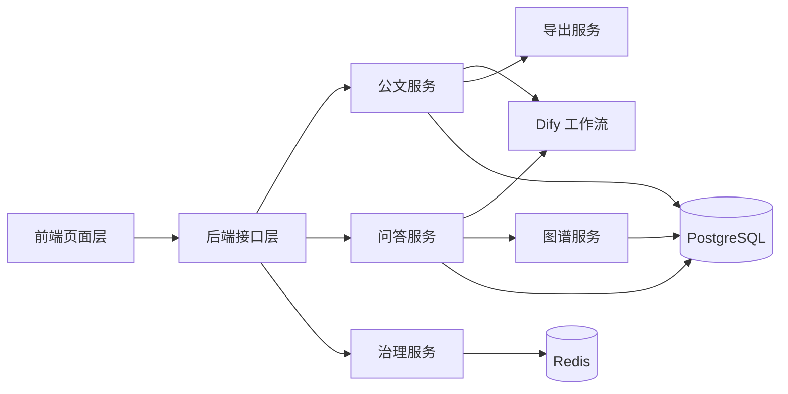

### 30.7 模块边界的工程价值

| 工程价值     | 说明                                           |
| ------------ | ---------------------------------------------- |
| 解耦清晰     | 便于分工开发与后续维护                         |
| 易于扩展     | 可按模块新增能力而不破坏主链路                 |
| 易于定位问题 | 错误可以快速定位到页面、接口、服务或数据层     |
| 便于汇报     | 甲方更容易理解系统不是临时拼接，而是体系化设计 |

---

## 31. 智能公文五阶段处理链的逐阶段深化说明

本章将第 4 章中概括描述的五阶段流水线进一步拆解为输入、处理、输出、失败点、约束条件、可验收结果六个维度，以体现每个阶段都具有清晰的工程边界与验收口径。

### 31.1 Draft 阶段详细说明

#### 31.1.1 阶段目标

Draft 阶段的核心任务是根据用户指令、原始文稿、上传材料和上下文约束快速形成一份可继续加工的初稿。该阶段并不追求最终格式严谨性，而是优先保证主题完整、材料吸收充分、逻辑主线成立。

#### 31.1.2 输入输出表

| 项     | 说明                 |
| ------ | -------------------- |
| 输入 1 | 用户自然语言指令     |
| 输入 2 | 原始文档或空白文本   |
| 输入 3 | 上传材料或附件引用   |
| 输入 4 | 文档元数据、用户信息 |
| 输出 1 | 草稿文本             |
| 输出 2 | 流式 text_chunk 事件 |
| 输出 3 | 可选 reasoning 事件  |

#### 31.1.3 处理步骤

| 步骤序号 | 步骤说明                     |
| -------- | ---------------------------- |
| 1        | 校验用户权限与文档存在性     |
| 2        | 抽取文档文本和附件摘要       |
| 3        | 组织 Prompt 输入结构         |
| 4        | 发起 Dify 起草工作流         |
| 5        | 解析流式输出并持续推送前端   |
| 6        | 草稿完成后存储结果并形成版本 |

#### 31.1.4 失败点与处理方式

| 失败点       | 影响           | 处理方式                  |
| ------------ | -------------- | ------------------------- |
| 文档文本为空 | 无法起草       | 提示先导入文档或填写内容  |
| 附件抽取失败 | 材料利用不完整 | 允许忽略附件继续起草      |
| 模型调用失败 | 阶段中止       | 返回 error 事件并保留原文 |
| SSE 中断     | 前端结果不完整 | 后端尽量持久化已完成内容  |

#### 31.1.5 验收观察点

| 观察点         | 判断标准                   |
| -------------- | -------------------------- |
| 是否可用       | 能否形成可编辑草稿         |
| 是否实时       | 是否看到流式输出           |
| 是否可继续加工 | 草稿是否适合进入审查和排版 |
| 是否有留痕     | 起草结果是否能保存         |

### 31.2 Review 阶段详细说明

#### 31.2.1 阶段目标

Review 阶段的目标是将“文稿存在的问题”从自然语言描述转为可结构化消费的建议集合。换言之，该阶段的核心产出不是一个新版本文档，而是一个问题清单。

#### 31.2.2 输入输出表

| 项     | 说明                     |
| ------ | ------------------------ |
| 输入 1 | 当前草稿全文             |
| 输入 2 | 审查策略与规则说明       |
| 输入 3 | 文档结构信息（可选）     |
| 输出 1 | 审查建议对象列表         |
| 输出 2 | review_suggestion 事件流 |
| 输出 3 | 审查阶段日志与持久化记录 |

#### 31.2.3 处理步骤

| 步骤序号 | 步骤说明                     |
| -------- | ---------------------------- |
| 1        | 判断文档长度，决定是否分块   |
| 2        | 构造审查 Prompt 与规则约束   |
| 3        | 调用审查工作流               |
| 4        | 对流式 JSON 文本执行对象识别 |
| 5        | 将建议推送前端并缓存         |
| 6        | 审查结束后统一写入数据库     |

#### 31.2.4 建议分类表示例

| 类别        | 典型问题               |
| ----------- | ---------------------- |
| wording     | 表述不规范或措辞不严谨 |
| structure   | 结构层级不清或逻辑断裂 |
| punctuation | 标点不规范             |
| sensitive   | 涉及敏感表述           |
| grammar     | 句法不通顺或语义不完整 |
| style       | 不符合政务表达风格     |

#### 31.2.5 风险管理逻辑

| 等级    | 优先级 | 建议动作         |
| ------- | ------ | ---------------- |
| error   | 高     | 优先修正         |
| warning | 中     | 视情况采纳       |
| info    | 低     | 作为优化建议参考 |

### 31.3 Format Suggest 阶段详细说明

#### 31.3.1 阶段目标

Format Suggest 阶段处于审查与最终结构化排版之间，其主要作用是提前形成版式判断依据，避免排版阶段完全无先验地重新判断全部结构。

#### 31.3.2 典型输出内容

| 输出项       | 含义                           |
| ------------ | ------------------------------ |
| 推荐预设     | official / legal / academic 等 |
| 标题类型判断 | 主标题、一级标题、二级标题     |
| 主体段落建议 | 正文、附注、落款等             |
| 特殊样式建议 | 对齐、颜色、缩进、间距         |

#### 31.3.3 阶段价值

| 价值         | 说明                       |
| ------------ | -------------------------- |
| 让排版更稳   | 减少排版阶段的全量自由判断 |
| 让规则更强   | 可以在排版前做一次结构预判 |
| 让结果更规范 | 更贴近公文版式要求         |

### 31.4 Format 阶段详细说明

#### 31.4.1 阶段目标

Format 阶段是将文本结果变成结构化文档对象的关键节点。该阶段的真正产出不是“看起来排好了的文本”，而是一个足以驱动预览、导出、增量更新与版本化管理的段落对象数组。

#### 31.4.2 输入输出表

| 项     | 说明                       |
| ------ | -------------------------- |
| 输入 1 | 审查后的正文或当前文档正文 |
| 输入 2 | 排版预设                   |
| 输入 3 | 样式建议与已有段落结果     |
| 输出 1 | 结构化段落数组             |
| 输出 2 | structured_paragraph 事件  |
| 输出 3 | 可供导出的标准对象         |

#### 31.4.3 处理路径矩阵

| 文档规模 | 是否已有 existing_paragraphs | 执行策略       |
| -------- | ---------------------------- | -------------- |
| 短文档   | 否                           | 全量结构化排版 |
| 短文档   | 是                           | 局部增量排版   |
| 长文档   | 否                           | 分块全量排版   |
| 长文档   | 是                           | 分块增量排版   |

#### 31.4.4 样式归一化的执行顺序

| 顺序 | 操作                 |
| ---- | -------------------- |
| 1    | 清洗原始样式文本     |
| 2    | 执行别名映射         |
| 3    | 校验是否命中合法枚举 |
| 4    | 未命中则回退默认值   |
| 5    | 写入结构化段落对象   |

#### 31.4.5 失败点与处理方式

| 失败点            | 处理方式                 |
| ----------------- | ------------------------ |
| 样式字段异常      | 回退默认预设样式         |
| source_index 缺失 | 启用回退文本匹配         |
| 部分段落无法解析  | 仅保留可解析段落并提示   |
| 流式对象不完整    | 缓冲等待补齐或丢弃异常块 |

### 31.5 Export 阶段详细说明

#### 31.5.1 阶段目标

Export 阶段负责将结构化段落结果转化为正式交付文件。其本质是“渲染与封装”，而不是再次让模型参与内容决策。

#### 31.5.2 导出流程拆解

| 步骤 | 内容                              |
| ---- | --------------------------------- |
| 1    | 读取结构化段落和样式对象          |
| 2    | 根据导出目标选择 DOCX 或 PDF 路径 |
| 3    | 执行模板映射与样式落盘            |
| 4    | 生成文件字节流                    |
| 5    | 返回前端下载并写入导出日志        |

#### 31.5.3 文件一致性保障点

| 一致性项 | 保障方式                     |
| -------- | ---------------------------- |
| 字体一致 | 字体映射与统一注册名         |
| 字号一致 | 标准字号枚举转换             |
| 间距一致 | 统一样式对象驱动             |
| 结构一致 | 相同段落数组用于不同导出后端 |

### 31.6 公文五阶段总览图


### 31.7 各阶段可交付成果汇总

| 阶段           | 中间成果           | 是否适合现场验收演示 |
| -------------- | ------------------ | -------------------- |
| Draft          | 实时生成草稿       | 是                   |
| Review         | 建议列表与严重程度 | 是                   |
| Format Suggest | 样式建议           | 是                   |
| Format         | 结构化排版结果     | 是                   |
| Export         | 下载文件           | 是                   |

---

## 32. 智能问答处理链的逐阶段深化说明

与智能公文相似，智能问答同样不是单一“大模型回答”动作，而是由多个前置判断、检索、融合与生成步骤构成的复合链路。其价值在于通过检索与证据融合，使回答具备更高的可信度和更强的业务可用性。

### 32.1 问答总链路拆解

| 步骤 | 阶段名称       | 核心目标         |
| ---- | -------------- | ---------------- |
| 1    | 输入预处理     | 规范问题文本     |
| 2    | 敏感检测       | 过滤风险输入     |
| 3    | QA 强命中      | 优先回答标准问题 |
| 4    | 知识库混合检索 | 获取文本证据     |
| 5    | 图谱检索       | 获取结构化证据   |
| 6    | 上下文融合     | 组装统一上下文   |
| 7    | 模型生成       | 输出答案文本     |
| 8    | 引用回传       | 输出依据列表     |
| 9    | 会话持久化     | 支撑多轮连续对话 |

### 32.2 输入预处理与问题规整

| 处理项         | 作用                       |
| -------------- | -------------------------- |
| 去除多余空白   | 提升检索与匹配稳定性       |
| 统一标点形式   | 避免检索分词受噪声影响     |
| 保留关键信息   | 保留机构名、事项名、时间词 |
| 附带会话上下文 | 提供连续对话能力           |

### 32.3 QA 强命中阶段深化

| 要点     | 说明                                   |
| -------- | -------------------------------------- |
| 目标     | 优先解决高频、标准、固定口径问题       |
| 优势     | 成本低、稳定性高、口径统一             |
| 风险     | 覆盖面有限，不能替代广义检索           |
| 工程价值 | 在政务场景中可显著提升“标准回答一致性” |

### 32.4 知识库检索阶段深化

#### 32.4.1 检索候选生命周期

```mermaid
flowchart LR
    A[用户问题] --> B[多库召回]
    B --> C[关键词候选]
    B --> D[语义候选]
    C --> E[候选汇总]
    D --> E
    E --> F[重排序]
    F --> G[截断与去重]
    G --> H[证据上下文]
```

#### 32.4.2 候选结果处理原则

| 原则       | 说明                   |
| ---------- | ---------------------- |
| 相关性优先 | 高分片段优先保留       |
| 去重优先   | 相似片段只保留代表项   |
| 多样性适中 | 避免同一知识点重复堆叠 |
| 长度受控   | 控制上下文窗口占用     |

### 32.5 图谱检索阶段深化

| 处理项     | 说明                   |
| ---------- | ---------------------- |
| 关键词抽取 | 从问题中提取潜在实体   |
| 实体匹配   | 关联图谱节点           |
| 一跳扩展   | 查找直接关系边         |
| 关系转写   | 转为自然语言可读上下文 |

### 32.6 上下文融合阶段深化

| 融合来源   | 融合原则           |
| ---------- | ------------------ |
| QA 答案    | 作为强证据前置     |
| 知识库片段 | 提供细节和制度依据 |
| 图谱上下文 | 提供结构与关系     |
| 会话上下文 | 保证问题连续理解   |

### 32.7 模型生成阶段深化

| 生成目标 | 说明                             |
| -------- | -------------------------------- |
| 准确性   | 回答必须尽量依托证据而非自由发挥 |
| 可读性   | 回答应便于办公人员理解           |
| 结构性   | 应尽量具备分点、分层逻辑         |
| 可追溯性 | 回答后可展示依据来源             |

### 32.8 引用回传阶段深化

| 功能     | 作用                         |
| -------- | ---------------------------- |
| 依据展示 | 告知回答来源                 |
| 风险降低 | 降低“无依据回答”的质疑       |
| 人工复核 | 便于甲方或使用者自行查看证据 |
| 运营沉淀 | 后续可分析哪些知识更常被引用 |

### 32.9 会话持久化阶段深化

| 存储项          | 用途                   |
| --------------- | ---------------------- |
| 用户问题        | 保留历史查询           |
| 模型回答        | 保留历史结果           |
| 引用对象        | 保留依据链             |
| reasoning       | 保留推理摘要或处理过程 |
| dify_message_id | 关联外部工作流消息     |

### 32.10 问答链路的验收价值

| 验收项   | 观察重点             |
| -------- | -------------------- |
| 标准问题 | 是否能稳定命中       |
| 复杂问题 | 是否能提供依据型回答 |
| 多轮追问 | 是否具备上下文承接   |
| 图谱问答 | 是否能体现关系链价值 |
| 引用展示 | 是否清晰可查         |

---

## 33. Dify 工作流交互与流式通信机制深化说明

本项目中的模型能力统一通过 Dify 工作流引擎接入。之所以采用统一工作流接入，而非在多个业务模块中散落调用各类模型接口，主要是为了实现工作流治理、调用标准化、阶段职责分离与后续替换能力。

### 33.1 工作流映射关系

| 工作流类型      | 业务场景     | 典型输入               | 典型输出       |
| --------------- | ------------ | ---------------------- | -------------- |
| Draft Workflow  | 公文起草     | 指令、原文、材料       | 草稿文本       |
| Review Workflow | 公文审查     | 草稿、规则             | 审查建议对象   |
| Format Workflow | 公文排版     | 正文、预设、段落上下文 | 结构化段落     |
| Chat Workflow   | 智能问答     | 问题、上下文、引用信息 | 问答回答       |
| Entity Workflow | 实体关系抽取 | 原始文本               | 实体、关系集合 |

### 33.2 统一接入的工程意义

| 意义           | 说明                               |
| -------------- | ---------------------------------- |
| 解耦模型供应商 | 后续可替换工作流后端而不破坏业务层 |
| 统一超时重试   | 各模块复用同一套容错机制           |
| 统一事件流解析 | 所有流式结果采用统一解析器         |
| 统一安全边界   | API Key 与策略集中管理             |

### 33.3 SSE 消息生命周期

```mermaid
sequenceDiagram
    participant Front as 前端
    participant API as 后端API
    participant Dify as 工作流引擎
    Front->>API: 发起处理请求
    API->>Dify: HTTP Stream 请求
    Dify-->>API: data: {...}
    API-->>Front: 解析后事件
    Dify-->>API: data: {...}
    API-->>Front: text_chunk / reasoning / progress
    Dify-->>API: [DONE]
    API-->>Front: message_end
```

### 33.4 `<think>` 推理标签的治理逻辑

| 场景            | 行为                  |
| --------------- | --------------------- |
| 标签外文本      | 作为正式可见文本处理  |
| `<think>` 开始  | 切入 Thinking 状态    |
| 标签内文本      | 输出到 reasoning 通道 |
| `</think>` 结束 | 退出 Thinking 状态    |

### 33.5 流式解析中的关键设计点

| 设计点       | 说明                               |
| ------------ | ---------------------------------- |
| 单次顺序扫描 | 避免重复处理内容                   |
| 缓冲区保留   | 支持跨块 JSON 对象识别             |
| 事件分通道   | 不同类型结果分发到不同前端区域     |
| 错误隔离     | 局部解析异常不应立即导致全链路崩溃 |

### 33.6 超时与重试策略表

| 场景       | 策略                         |
| ---------- | ---------------------------- |
| 连接超时   | 快速失败，避免长时间悬挂     |
| 读取超时   | 允许适度延长，适应长文本处理 |
| 429 限流   | 遵循等待后再重试             |
| 5xx 故障   | 指数退避重试                 |
| 非重试异常 | 直接抛出并反馈前端           |

### 33.7 工厂模式与环境切换意义

| 模式        | 作用                           |
| ----------- | ------------------------------ |
| Mock 模式   | 便于本地开发与界面联调         |
| Hybrid 模式 | 便于不同功能按配置切换真实能力 |
| Full 模式   | 便于真实环境端到端验证         |

### 33.8 工作流治理的验收表达

| 验收表达点 | 说明                                     |
| ---------- | ---------------------------------------- |
| 调用统一   | 不是多个散乱接口拼接，而是统一工作流治理 |
| 过程透明   | 可展示事件级推送能力                     |
| 可替换     | 后续模型替换对业务层冲击较小             |
| 可诊断     | 出错时可定位到阶段与依赖                 |

---

## 34. 数据治理、知识治理与图谱治理机制

对于政务智能系统而言，算法效果不仅取决于模型，还取决于输入知识是否干净、结构是否合理、生命周期是否可治理。因此，数据治理是核心算法可长期稳定发挥作用的前提条件。

### 34.1 文档数据生命周期

| 生命周期阶段 | 含义                       |
| ------------ | -------------------------- |
| 导入         | 文档进入系统               |
| 抽取         | 文本与附件内容被结构化处理 |
| 处理         | 进入起草、审查、排版流程   |
| 版本化       | 每个关键阶段留存版本       |
| 导出         | 生成正式交付文件           |
| 归档         | 供后续审计、追溯和知识沉淀 |

### 34.2 知识库数据生命周期

| 生命周期阶段 | 含义                         |
| ------------ | ---------------------------- |
| 上传         | 文档被加入知识集合           |
| 切分         | 按分段形成检索片段           |
| 索引         | 进入关键词和语义检索体系     |
| 被检索       | 在问答中作为证据被调用       |
| 被引用       | 出现在回答 citations 中      |
| 优化         | 根据使用情况不断调整知识质量 |

### 34.3 图谱数据生命周期

| 生命周期阶段 | 含义                       |
| ------------ | -------------------------- |
| 抽取         | 从文本中识别实体与关系     |
| 清洗         | 去除噪声和重复项           |
| 存储         | 双写到 PostgreSQL 与 AGE   |
| 查询         | 被图谱问答和可视化模块调用 |
| 更新         | 随文档与知识变化而刷新     |

### 34.4 数据一致性治理点

| 一致性维度           | 治理方式                      |
| -------------------- | ----------------------------- |
| 文档与版本一致性     | 每个版本绑定文档主键与阶段    |
| 问答与引用一致性     | 回答消息与 citations 同步写入 |
| 图谱与源文档一致性   | 三元组带来源标识              |
| 导出与结构结果一致性 | 导出基于结构化段落结果        |

### 34.5 知识污染风险与防护点

| 风险类型 | 说明                 | 防护方式               |
| -------- | -------------------- | ---------------------- |
| 重复知识 | 同一内容重复收录     | 检索时去重与重排序     |
| 噪声知识 | 无关内容被切入知识库 | 数据清洗与人工筛查     |
| 冲突知识 | 不同来源口径冲突     | 引用回传与后续冲突检测 |
| 过时知识 | 历史资料未更新       | 生命周期治理与重新导入 |

### 34.6 图谱治理中的实体规范化

| 规范化对象 | 说明                   |
| ---------- | ---------------------- |
| 实体名称   | 统一同义实体的名称表达 |
| 实体类型   | 限制实体分类集合       |
| 关系名称   | 统一关系标签命名       |
| 来源记录   | 保留实体、关系来源文档 |

### 34.7 数据治理价值

| 价值           | 说明                                 |
| -------------- | ------------------------------------ |
| 提升长期可用性 | 让系统越用越稳而非越用越乱           |
| 便于持续优化   | 可以识别哪些数据质量影响结果         |
| 便于审计       | 结果可追溯到数据来源                 |
| 便于验收       | 说明系统不仅有算法，还有数据治理能力 |

---

## 35. 典型业务场景与算法落地示例（上）

本章通过典型场景示例说明核心算法如何在实际业务中发挥作用。该部分非常适合甲方演示与汇报时使用，因为它把抽象算法能力映射为可理解的办公场景价值。

### 35.1 场景一：根据来文快速起草通知

| 项目         | 说明                               |
| ------------ | ---------------------------------- |
| 场景描述     | 用户上传来文材料，要求生成通知初稿 |
| 主要调用能力 | 文本抽取、Draft、SSE 流式输出      |
| 关键价值     | 缩短首稿形成时间                   |

#### 35.1.1 处理过程

| 步骤 | 动作                         |
| ---- | ---------------------------- |
| 1    | 用户上传材料并输入起草指令   |
| 2    | 系统抽取正文与附件内容       |
| 3    | 调用起草工作流               |
| 4    | 流式返回草稿片段             |
| 5    | 用户在页面上实时看到初稿生成 |

#### 35.1.2 算法体现点

| 算法点     | 体现方式                     |
| ---------- | ---------------------------- |
| 上下文组织 | 指令、材料、阶段约束共同输入 |
| 流式编排   | 草稿边生成边可见             |
| 版本留痕   | 起草结果可形成后续版本       |

### 35.2 场景二：对现有请示稿进行风险审查

| 项目         | 说明                                   |
| ------------ | -------------------------------------- |
| 场景描述     | 用户已完成初稿，需要识别问题项         |
| 主要调用能力 | Review、结构化建议抽取                 |
| 关键价值     | 让审查从“看一大段说明”变成“看问题清单” |

#### 35.2.1 处理过程

| 步骤 | 动作                   |
| ---- | ---------------------- |
| 1    | 用户触发审查           |
| 2    | 系统判断是否需要分块   |
| 3    | 调用审查工作流         |
| 4    | 持续解析 JSON 建议对象 |
| 5    | 前端逐条显示问题清单   |

#### 35.2.2 算法体现点

| 算法点        | 体现方式             |
| ------------- | -------------------- |
| 长文档分块    | 超长文本保持稳定处理 |
| JSON 增量识别 | 审查结果可实时展示   |
| 风险分层      | 错误项优先处理       |

### 35.3 场景三：根据公文规范自动完成排版

| 项目         | 说明                               |
| ------------ | ---------------------------------- |
| 场景描述     | 用户希望将内容自动排版为公文格式   |
| 主要调用能力 | Format Suggest、Format、样式标准化 |
| 关键价值     | 将文本成果快速转为正式文稿         |

#### 35.3.1 处理过程

| 步骤 | 动作                       |
| ---- | -------------------------- |
| 1    | 用户选择排版预设           |
| 2    | 系统识别标题层级与段落类型 |
| 3    | 模型生成结构化样式结果     |
| 4    | 后端执行样式归一化         |
| 5    | 前端渲染结构化排版结果     |

#### 35.3.2 算法体现点

| 算法点       | 体现方式           |
| ------------ | ------------------ |
| 段落类型识别 | 自动区分标题与正文 |
| 样式标准化   | 防止字号字体漂移   |
| 统一结构模型 | 支撑预览与导出     |

### 35.4 场景四：对局部修改后的文稿重新排版

| 项目         | 说明                                   |
| ------------ | -------------------------------------- |
| 场景描述     | 用户只修改了某几个段落，不希望整篇重排 |
| 主要调用能力 | 段落级增量排版                         |
| 关键价值     | 降低成本并提升编辑体验                 |

#### 35.4.1 处理过程

| 步骤 | 动作                                 |
| ---- | ------------------------------------ |
| 1    | 前端识别当前已有结构化段落           |
| 2    | 将局部修改段落和原段落上下文送入后端 |
| 3    | 模型返回带 source_index 的新段落     |
| 4    | 后端按索引合并                       |
| 5    | 前端只刷新变更区域                   |

#### 35.4.2 算法体现点

| 算法点   | 体现方式               |
| -------- | ---------------------- |
| 增量合并 | 保留未修改段落         |
| 回退匹配 | 索引缺失时仍可完成更新 |
| 稳定渲染 | 减少整篇波动           |

### 35.5 场景五：导出正式发文文件

| 项目         | 说明                                 |
| ------------ | ------------------------------------ |
| 场景描述     | 用户将排版后的结果导出为 Word 或 PDF |
| 主要调用能力 | DOCX 导出、PDF 渲染、字体映射        |
| 关键价值     | 满足正式交付和归档需要               |

#### 35.5.1 算法体现点

| 算法点        | 体现方式               |
| ------------- | ---------------------- |
| 统一结构对象  | 预览与导出结果同源     |
| 字体映射      | 保证字体名称跨环境一致 |
| HTML/PDF 渲染 | 满足高保真输出         |
