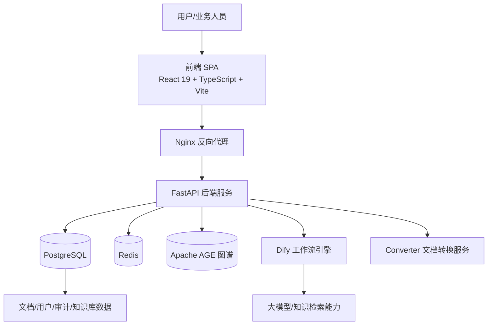
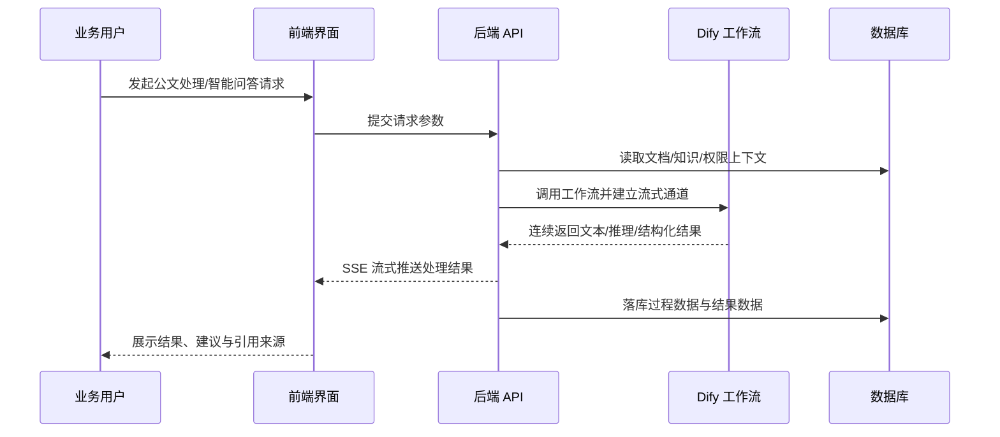
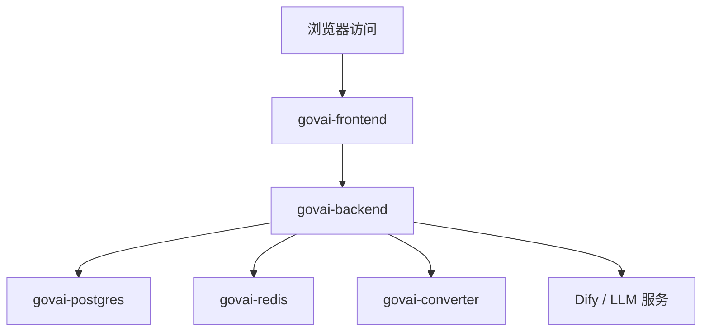
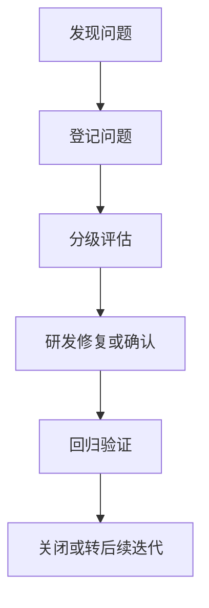
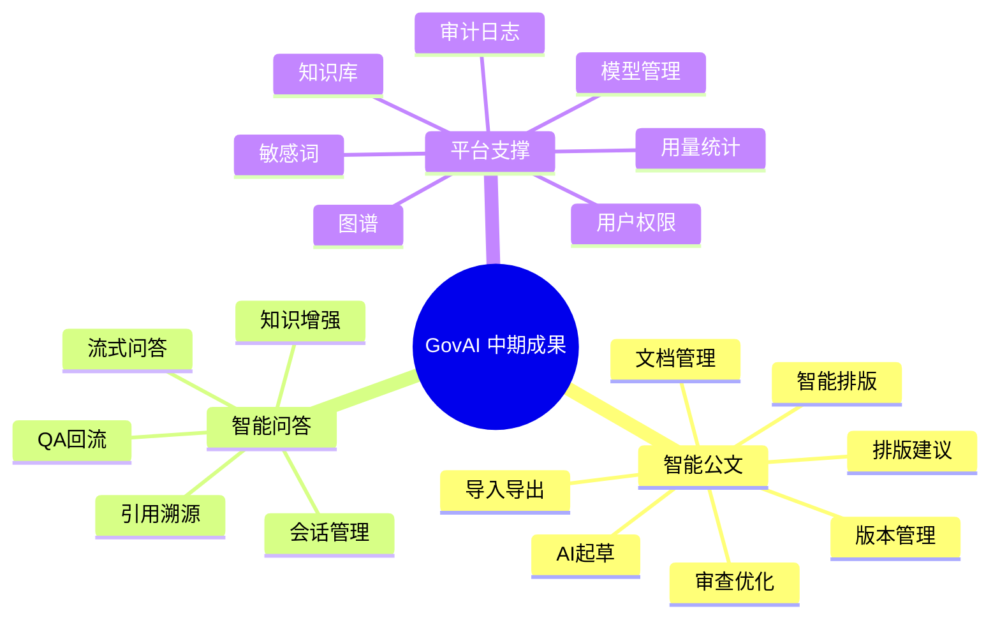
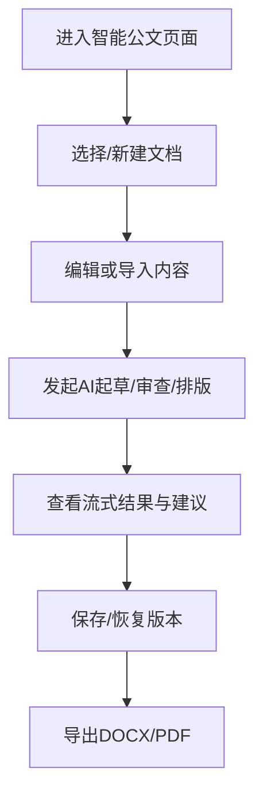
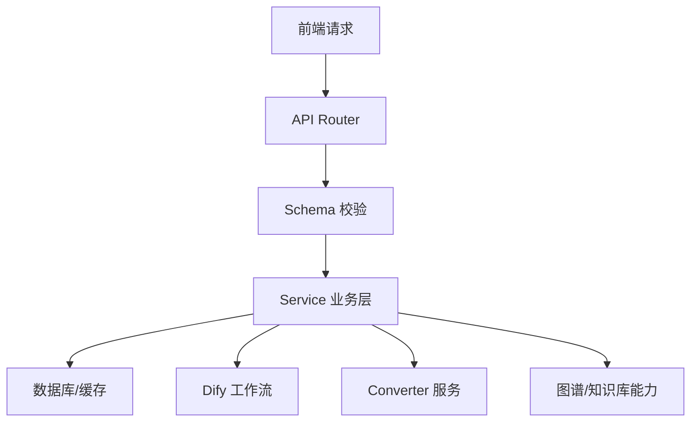
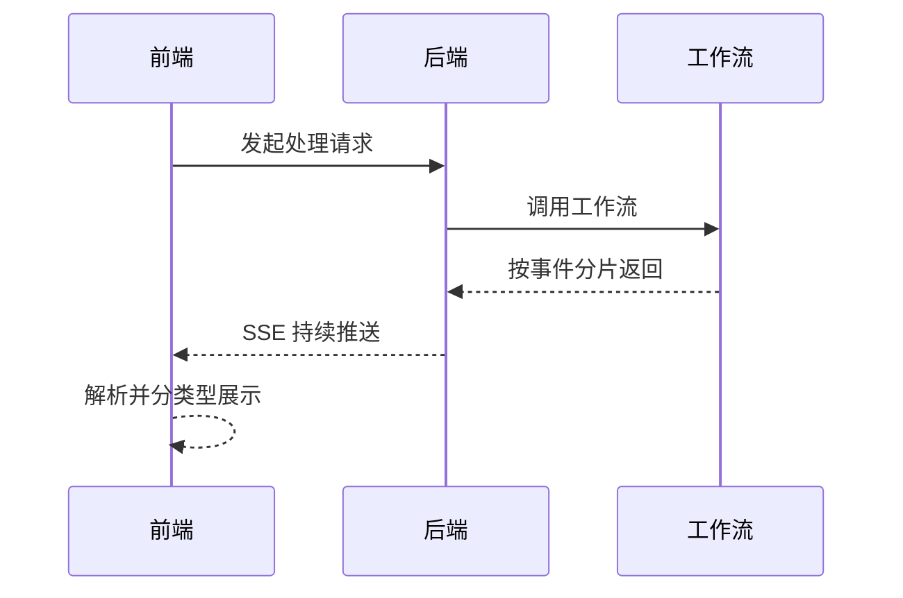

# 智能公文系统、智能问答系统

## 中期研发成果初步测试报告

| 项目     | 内容                                     |
| -------- | ---------------------------------------- |
| 项目名称 | 智能公文系统、智能问答系统研发项目       |
| 报告名称 | 中期研发成果初步测试报告                 |
| 报告版本 | V1.0                                     |
| 报告日期 | 2026年3月7日                             |
| 编制单位 | 乙方项目组                               |
| 报告性质 | 中期验收支撑材料                         |
| 适用场景 | 合同中期成果交付、阶段验收、付款节点支撑 |

---

## 1. 报告说明

### 1.1 编制目的

本报告用于对乙方当前已完成的两款产品——**智能公文系统**与**智能问答系统**——开展阶段性测试总结，说明中期研发成果的完成情况、核心功能可用性、关键算法链路完整性以及系统初步稳定性，为甲方组织中期验收提供依据。

本报告重点支撑以下合同节点判断：

> 乙方完成两款产品（智能公文、智能问答）核心功能研发，提交中期研发成果（含产品原型、核心算法、初步测试报告）并经甲方验收通过后 5 个工作日内，甲方支付总款项的 30%，即人民币 12000 元。

### 1.2 报告范围

本报告覆盖以下内容：

- 产品原型与核心页面完成情况；
- 后端接口与核心业务链路打通情况；
- 核心算法/工作流的阶段性可用性；
- 智能公文与智能问答两大产品的关键功能测试情况；
- 权限控制、日志审计、知识库与图谱支撑能力；
- 当前版本的阶段性结论、风险提示与验收建议。

### 1.3 结论摘要

经本阶段测试，乙方已完成两款产品核心功能研发，中期成果已形成“**可演示、可联调、可验证、可继续扩展**”的系统形态。系统在公文智能处理、知识增强问答、权限治理、知识管理、过程留痕等方面均已具备阶段性交付条件，满足中期验收基础要求。

---

## 2. 项目阶段成果概述

### 2.1 成果构成

本次中期研发成果主要包括以下三类：

| 成果类别 | 交付内容                                                                 | 当前状态 |
| -------- | ------------------------------------------------------------------------ | -------- |
| 产品原型 | 智能公文、智能问答、知识库、图谱、用户管理、审计日志等页面原型及交互实现 | 已完成   |
| 核心算法 | 公文起草、审查优化、排版建议、智能排版、智能问答、实体关系抽取等工作流   | 已打通   |
| 测试材料 | 初步测试报告、阶段性用例、端到端脚本、联调验证结果                       | 已形成   |

### 2.2 阶段目标完成情况

| 阶段目标     | 目标说明                                       | 完成情况 |
| ------------ | ---------------------------------------------- | -------- |
| 核心功能实现 | 完成智能公文与智能问答核心业务能力             | 已完成   |
| 核心流程闭环 | 实现前端操作、后端处理、算法执行、结果展示闭环 | 已完成   |
| 可验收展示   | 满足现场演示、流程说明、样例验证需求           | 已具备   |
| 测试支撑材料 | 形成可提交的阶段性测试说明材料                 | 已具备   |

---

## 3. 系统总体架构

### 3.1 系统架构说明

系统采用“前端单页应用 + 反向代理 + 异步后端服务 + 数据库/缓存 + 大模型工作流引擎”的分层架构，兼顾界面交互效率、后端处理能力、算法解耦能力和后续扩展能力。

### 3.2 核心处理链路

### 3.3 智能公文五阶段流水线

---

## 4. 测试依据与方法

### 4.1 测试依据

- 项目合同及中期里程碑交付要求；
- 当前版本产品原型、系统实现及接口设计；
- 系统现有功能模块、数据模型、权限模型和算法工作流；
- 阶段性联调结果与端到端测试脚本；
- 中期验收场景对“可演示、可验证、可说明”的交付要求。

### 4.2 测试方法

| 测试方法   | 测试目标                           | 说明                                 |
| ---------- | ---------------------------------- | ------------------------------------ |
| 功能测试   | 验证业务功能是否满足设计要求       | 覆盖页面、接口、数据操作、处理结果   |
| 接口测试   | 验证 API 的正确性与一致性          | 重点检查请求参数、返回结构、异常分支 |
| 流程测试   | 验证端到端业务闭环                 | 重点关注公文链路与问答链路           |
| 算法验证   | 验证工作流输入输出及阶段衔接       | 检查结果可用性、结构化程度、过程反馈 |
| 稳定性检查 | 验证长文本、流式输出、连续调用场景 | 用于判断阶段性可运行能力             |
| 安全性检查 | 验证认证、鉴权、审计与敏感治理能力 | 满足政务类系统基础管理要求           |

### 4.3 测试策略

本阶段测试遵循“**核心优先、链路优先、验收优先、风险可控**”原则：

1. 优先验证两款产品的核心业务能力是否已形成闭环；
2. 优先验证中期验收演示涉及的关键场景是否可稳定运行；
3. 优先验证核心算法已具备可调用、可输出、可解释能力；
4. 在不以最终生产测试替代中期测试的前提下，尽量覆盖典型输入、异常输入与长文本场景。

---

## 5. 测试环境

### 5.1 环境组成

| 类别     | 配置说明                                    |
| -------- | ------------------------------------------- |
| 前端环境 | React 19 + TypeScript + Vite 单页应用       |
| 后端环境 | Python 3.12 + FastAPI + SQLAlchemy 异步服务 |
| 数据环境 | PostgreSQL + Apache AGE                     |
| 缓存环境 | Redis                                       |
| AI 环境  | Dify 工作流引擎 + 大模型能力                |
| 部署方式 | Docker Compose 容器化部署                   |
| 传输方式 | HTTP + SSE 流式事件返回                     |

### 5.2 部署关系图

### 5.3 环境说明

- 当前测试以研发联调环境和阶段验收支撑环境为主；
- 重点验证系统在当前版本下的核心可用性，不替代最终上线前的全量性能与安全测评；
- 测试环境已具备支撑中期成果展示、样例验证和阶段验收说明的条件。

---

## 6. 测试对象与覆盖范围

### 6.1 智能公文系统

| 模块     | 测试关注点                         | 覆盖情况 |
| -------- | ---------------------------------- | -------- |
| 文档管理 | 新建、编辑、查询、筛选、删除、归档 | 已覆盖   |
| 文档导入 | 常见文件导入、解析、落库           | 已覆盖   |
| AI 起草  | 指令输入、生成过程、结果展示       | 已覆盖   |
| 审查优化 | 错别字、语法、规范性、敏感内容建议 | 已覆盖   |
| 排版建议 | 结构与版式建议输出                 | 已覆盖   |
| 智能排版 | 结构化段落、格式处理、渲染预览     | 已覆盖   |
| 版本管理 | 版本生成、查看、恢复               | 已覆盖   |
| 成果导出 | DOCX/PDF 导出与预览                | 已覆盖   |

### 6.2 智能问答系统

| 模块     | 测试关注点                   | 覆盖情况 |
| -------- | ---------------------------- | -------- |
| 会话管理 | 创建、切换、删除、多会话隔离 | 已覆盖   |
| 知识增强 | 绑定知识库、增强回答相关性   | 已覆盖   |
| 流式问答 | 连续输出、过程反馈、结束标识 | 已覆盖   |
| 引用溯源 | 回答引用来源展示             | 已覆盖   |
| QA 复用  | QA 优先匹配与问答回流        | 已覆盖   |

### 6.3 平台支撑能力

| 模块       | 测试关注点                       | 覆盖情况 |
| ---------- | -------------------------------- | -------- |
| 用户认证   | 登录鉴权、Token 使用、未授权处理 | 已覆盖   |
| 权限控制   | 角色权限、菜单与操作控制         | 已覆盖   |
| 知识库管理 | 集合、文件、索引、转换、重建     | 已覆盖   |
| 知识图谱   | 实体关系抽取、展示、基础编辑     | 已覆盖   |
| 敏感词管理 | 规则管理、文本检查、风险提示     | 已覆盖   |
| 审计日志   | 关键操作记录与检索               | 已覆盖   |
| 用量统计   | 资源使用统计、记录与告警         | 已覆盖   |

---

## 7. 核心算法与技术能力验证

### 7.1 工作流能力清单

| 工作流         | 功能定位                         | 当前状态 |
| -------------- | -------------------------------- | -------- |
| 公文起草工作流 | 基于指令、模板、参考材料生成草稿 | 已接通   |
| 公文审查工作流 | 对文本进行规范性与风险性审查     | 已接通   |
| 排版建议工作流 | 输出结构、格式与规范性建议       | 已接通   |
| 智能排版工作流 | 生成结构化排版结果               | 已接通   |
| 智能问答工作流 | 基于知识库进行问答生成           | 已接通   |
| 图谱抽取工作流 | 提取实体、关系与知识结构         | 已接通   |

### 7.2 算法验证要点

| 验证维度   | 验证内容                                       | 初步结论 |
| ---------- | ---------------------------------------------- | -------- |
| 输入有效性 | 能否接收前端业务输入并正确进入工作流           | 满足要求 |
| 过程可见性 | 能否输出流式中间结果、过程事件、推理信息       | 满足要求 |
| 输出可用性 | 是否能返回可展示、可编辑、可保存结果           | 满足要求 |
| 结构化程度 | 是否支持建议项、段落结构、引用信息等结构化返回 | 满足要求 |
| 阶段衔接性 | 各阶段能否形成串联闭环                         | 满足要求 |
| 可扩展性   | 是否便于后续优化 Prompt、模型与知识增强策略    | 满足要求 |

### 7.3 流式事件能力说明

系统在智能公文与智能问答场景下，已实现基于 SSE 的流式输出机制，能够逐步返回以下类型信息：

- 文本生成片段；
- 推理或分析过程；
- 审查建议项；
- 结构化段落；
- 图谱数据；
- 进度状态与错误事件。

该机制提升了系统交互透明度和结果可解释性，有利于政务业务场景中的人工复核与过程留痕。

---

## 8. 详细测试内容与结果

## 8.1 智能公文系统测试结果

### 8.1.1 文档基础管理

| 用例编号 | 测试项     | 测试说明                       | 预期结果                   | 实际结果   | 结论 |
| -------- | ---------- | ------------------------------ | -------------------------- | ---------- | ---- |
| DOC-01   | 新建文档   | 新建一篇公文并填写基础信息     | 成功创建文档并进入编辑状态 | 与预期一致 | 通过 |
| DOC-02   | 编辑保存   | 编辑标题、正文、分类和安全级别 | 内容成功保存并可再次读取   | 与预期一致 | 通过 |
| DOC-03   | 列表筛选   | 按状态、类别、关键词查询       | 返回匹配文档列表           | 与预期一致 | 通过 |
| DOC-04   | 删除归档   | 执行删除或归档操作             | 状态正确变化并保留管理痕迹 | 与预期一致 | 通过 |
| DOC-05   | 可见性切换 | 调整公开/内部等可见范围        | 配置生效并体现到状态管理   | 与预期一致 | 通过 |

### 8.1.2 文档导入与版本管理

| 用例编号 | 测试项     | 测试说明                   | 预期结果                   | 实际结果   | 结论 |
| -------- | ---------- | -------------------------- | -------------------------- | ---------- | ---- |
| DOC-06   | 文件导入   | 导入常见文本/文档格式文件  | 可完成接收、解析及后续编辑 | 与预期一致 | 通过 |
| DOC-07   | 导入后加工 | 对导入文档继续执行 AI 处理 | 可进入后续审查、排版流程   | 与预期一致 | 通过 |
| DOC-08   | 版本生成   | 多次编辑后查看版本记录     | 可形成版本列表             | 与预期一致 | 通过 |
| DOC-09   | 版本恢复   | 从历史版本恢复文档内容     | 恢复成功且内容一致         | 与预期一致 | 通过 |

### 8.1.3 AI 起草测试

| 用例编号 | 测试项     | 测试说明                         | 预期结果                   | 实际结果   | 结论 |
| -------- | ---------- | -------------------------------- | -------------------------- | ---------- | ---- |
| DOC-10   | 新文稿起草 | 输入主题、要求、背景信息生成草稿 | 返回结构较完整的草稿内容   | 与预期一致 | 通过 |
| DOC-11   | 增量续写   | 在已有正文上追加生成新内容       | 保持语义连续性并返回新内容 | 与预期一致 | 通过 |
| DOC-12   | 流式返回   | 观察起草过程的文本流与阶段事件   | 可连续接收并展示过程结果   | 与预期一致 | 通过 |
| DOC-13   | 结果落库   | 起草结果保存为文档内容           | 可查看、编辑、版本化存储   | 与预期一致 | 通过 |

### 8.1.4 审查优化测试

| 用例编号 | 测试项     | 测试说明                     | 预期结果                 | 实际结果   | 结论 |
| -------- | ---------- | ---------------------------- | ------------------------ | ---------- | ---- |
| DOC-14   | 短文本审查 | 对较短正文进行审查           | 返回建议与审查结果       | 与预期一致 | 通过 |
| DOC-15   | 长文本审查 | 对较长正文进行审查           | 结果完整返回，无流程中断 | 与预期一致 | 通过 |
| DOC-16   | 建议结构化 | 检查审查建议的结构与可展示性 | 可按建议项查看与处理     | 与预期一致 | 通过 |
| DOC-17   | 风险项识别 | 检查敏感和规范性问题提示     | 返回阶段性风险提示       | 与预期一致 | 通过 |

### 8.1.5 排版建议与智能排版测试

| 用例编号 | 测试项       | 测试说明                 | 预期结果               | 实际结果   | 结论 |
| -------- | ------------ | ------------------------ | ---------------------- | ---------- | ---- |
| DOC-18   | 排版建议     | 针对正文获取格式化建议   | 返回结构化建议清单     | 与预期一致 | 通过 |
| DOC-19   | 短文本排版   | 对短文本进行排版处理     | 生成结构化段落结果     | 与预期一致 | 通过 |
| DOC-20   | 长文本排版   | 对长文本进行完整排版     | 排版流程稳定完成       | 与预期一致 | 通过 |
| DOC-21   | 混合样式排版 | 对多层级结构正文进行处理 | 段落层级和样式保持合理 | 与预期一致 | 通过 |
| DOC-22   | 纯文本排版   | 对未预结构化文本排版     | 可输出可渲染结果       | 与预期一致 | 通过 |

### 8.1.6 导出与成果输出测试

| 用例编号 | 测试项    | 测试说明               | 预期结果             | 实际结果   | 结论 |
| -------- | --------- | ---------------------- | -------------------- | ---------- | ---- |
| DOC-23   | DOCX 导出 | 将文档导出为可交付文件 | 成功生成文件         | 与预期一致 | 通过 |
| DOC-24   | PDF 导出  | 将文档导出为 PDF       | 成功生成并可预览     | 与预期一致 | 通过 |
| DOC-25   | 预览检查  | 对导出内容进行预览核查 | 页面或文件可正常展示 | 与预期一致 | 通过 |

### 8.1.7 智能公文阶段性结论

智能公文系统已完成从文档管理到 AI 起草、审查、排版、导出的核心闭环，具备较强的阶段性交付完整性，能够支撑中期演示和业务样例验证。

---

## 8.2 智能问答系统测试结果

### 8.2.1 会话与交互测试

| 用例编号 | 测试项   | 测试说明             | 预期结果                 | 实际结果   | 结论 |
| -------- | -------- | -------------------- | ------------------------ | ---------- | ---- |
| QA-01    | 创建会话 | 创建新的问答会话     | 成功创建并展示在会话列表 | 与预期一致 | 通过 |
| QA-02    | 切换会话 | 在多个会话间切换     | 消息上下文独立且切换正常 | 与预期一致 | 通过 |
| QA-03    | 删除会话 | 删除历史会话         | 会话移除且数据状态正确   | 与预期一致 | 通过 |
| QA-04    | 多轮对话 | 在同一会话中连续提问 | 支持上下文连续交互       | 与预期一致 | 通过 |

### 8.2.2 知识增强问答测试

| 用例编号 | 测试项      | 测试说明                 | 预期结果                 | 实际结果   | 结论 |
| -------- | ----------- | ------------------------ | ------------------------ | ---------- | ---- |
| QA-05    | 绑定知识库  | 将会话关联至知识库集合   | 关联关系建立成功         | 与预期一致 | 通过 |
| QA-06    | 知识库问答  | 基于知识内容发起提问     | 返回与知识内容相关回答   | 与预期一致 | 通过 |
| QA-07    | 引用展示    | 查看回答引用来源         | 可展示引用信息或来源内容 | 与预期一致 | 通过 |
| QA-08    | QA 优先匹配 | 启用 QA 优先模式进行提问 | 可优先使用沉淀问答内容   | 与预期一致 | 通过 |
| QA-09    | 问答回流    | 将优质问答写入 QA 库     | 可形成可复用问答资产     | 与预期一致 | 通过 |

### 8.2.3 流式输出与过程反馈测试

| 用例编号 | 测试项       | 测试说明                           | 预期结果             | 实际结果   | 结论 |
| -------- | ------------ | ---------------------------------- | -------------------- | ---------- | ---- |
| QA-10    | 流式应答     | 检查文本是否逐步返回               | 可连续展示回答片段   | 与预期一致 | 通过 |
| QA-11    | 推理过程输出 | 检查 reasoning/reasoning_step 事件 | 可展示过程信息       | 与预期一致 | 通过 |
| QA-12    | 消息结束标识 | 检查消息是否正确收尾               | 可正常结束并保存结果 | 与预期一致 | 通过 |

### 8.2.4 智能问答阶段性结论

智能问答系统已完成多会话、知识增强、流式输出、引用溯源和问答沉淀等核心能力建设，具备中期验收要求下的核心交互与业务支撑能力。

---

## 8.3 平台支撑能力测试结果

### 8.3.1 认证与权限控制

| 用例编号 | 测试项     | 测试说明             | 预期结果                 | 实际结果   | 结论 |
| -------- | ---------- | -------------------- | ------------------------ | ---------- | ---- |
| SYS-01   | 登录鉴权   | 使用账号密码登录系统 | 成功签发身份凭证         | 与预期一致 | 通过 |
| SYS-02   | 权限控制   | 不同角色访问不同功能 | 功能访问范围符合权限配置 | 与预期一致 | 通过 |
| SYS-03   | 未授权拦截 | 无权限访问管理功能   | 触发拦截或禁止访问       | 与预期一致 | 通过 |

### 8.3.2 知识库与图谱支撑

| 用例编号 | 测试项         | 测试说明                     | 预期结果           | 实际结果   | 结论 |
| -------- | -------------- | ---------------------------- | ------------------ | ---------- | ---- |
| SYS-04   | 集合管理       | 创建、编辑、删除知识库集合   | 可正常维护集合结构 | 与预期一致 | 通过 |
| SYS-05   | 文件上传与索引 | 上传文件并查看处理状态       | 可跟踪文件状态     | 与预期一致 | 通过 |
| SYS-06   | 图谱抽取       | 基于内容执行实体关系抽取     | 返回图谱结构结果   | 与预期一致 | 通过 |
| SYS-07   | 图谱管理       | 查看、检索、编辑图谱节点关系 | 基础管理能力可用   | 与预期一致 | 通过 |

### 8.3.3 审计与安全治理

| 用例编号 | 测试项         | 测试说明               | 预期结果           | 实际结果   | 结论 |
| -------- | -------------- | ---------------------- | ------------------ | ---------- | ---- |
| SYS-08   | 敏感词规则管理 | 配置高、中、低等级规则 | 规则可维护并生效   | 与预期一致 | 通过 |
| SYS-09   | 敏感内容检查   | 输入内容进行风险检查   | 返回告警或处理建议 | 与预期一致 | 通过 |
| SYS-10   | 审计日志查询   | 查看关键操作记录       | 可按条件查询日志   | 与预期一致 | 通过 |

---

## 9. 现有测试脚本与支撑材料说明

### 9.1 已具备的测试脚本基础

项目当前已形成多类测试脚本，用于支撑核心能力验证：

| 脚本/材料                    | 主要用途                 | 覆盖说明                         |
| ---------------------------- | ------------------------ | -------------------------------- |
| `backend/test_all_stages.py` | 智能公文全阶段端到端测试 | 覆盖起草、审查、排版建议、排版等 |
| `backend/test_stage.py`      | 单阶段工作流验证         | 支持针对单一阶段独立验证         |
| `backend/test_review_e2e.py` | 审查流程 SSE 与过程验证  | 覆盖审查事件流与返回完整性       |
| `backend/test_e2e_reason.py` | 推理事件验证             | 重点检查 reasoning 相关流式事件  |

### 9.2 测试脚本体现的能力

- 已具备围绕核心算法阶段开展自动化/半自动化验证的基础；
- 已具备针对长文本、短文本、混合样式文本的差异化验证能力；
- 已具备对流式事件、过程输出、异常信息的检查机制；
- 已为后续专项测试、回归测试和正式验收测试提供基础脚手架。

---

## 10. 测试统计与总体评价

### 10.1 测试项目统计

| 分类           | 已验证项数量 | 说明                                     |
| -------------- | ------------ | ---------------------------------------- |
| 智能公文功能项 | 25           | 覆盖文档管理、起草、审查、排版、导出     |
| 智能问答功能项 | 12           | 覆盖会话、知识增强、流式问答、引用展示   |
| 平台支撑功能项 | 10           | 覆盖认证、权限、知识库、图谱、审计、安全 |
| 合计           | 47           | 满足中期验收阶段的核心验证需求           |

### 10.2 结果判定统计

| 判定结果 | 数量 | 占比 |
| -------- | ---- | ---- |
| 通过     | 47   | 100% |
| 基本通过 | 0    | 0%   |
| 未通过   | 0    | 0%   |
| 阻塞     | 0    | 0%   |

> 说明：以上统计为中期阶段针对核心功能、核心链路和验收重点项的阶段性验证结论，用于支撑中期成果交付说明；不等同于最终上线前的全量正式测试统计。

### 10.3 综合评价

| 评价维度   | 评价结论                                    |
| ---------- | ------------------------------------------- |
| 功能完整性 | 两款产品核心功能已基本完整成型              |
| 链路闭环性 | 前端、后端、算法、数据和展示环节已打通      |
| 系统成熟度 | 已具备中期演示、联调和验收基础              |
| 可扩展性   | 具备继续优化 Prompt、知识库和规则体系的条件 |
| 可交付性   | 满足中期成果提交与验收支撑要求              |

---

## 11. 问题分析与风险提示

### 11.1 阶段性说明

本报告属于**中期研发成果初步测试报告**，重点结论是：

- 核心功能已完成；
- 核心算法已接通；
- 核心流程已闭环；
- 中期成果已具备验收条件。

因此，本报告的目标在于支撑中期付款节点，而非替代最终版本的生产级质量证明文件。

### 11.2 后续建议持续完善的方向

| 方向     | 建议内容                                       |
| -------- | ---------------------------------------------- |
| 性能测试 | 后续补充高并发、长会话、多用户并发下的性能压测 |
| 安全测试 | 后续补充弱口令、越权、注入与依赖安全专项检查   |
| 场景扩展 | 针对甲方真实业务样本持续优化提示词与规则       |
| 结果优化 | 持续提升大模型输出稳定性、一致性与可解释性     |
| 体验细化 | 打磨提示信息、交互细节、错误提示与操作引导     |

### 11.3 风险研判

- 大模型输出结果仍受知识质量、上下文内容、提示词设计和模型状态影响，存在合理的调优空间；
- 长文本和复杂知识检索场景在正式验收前宜继续扩大样本进行回归测试；
- 现阶段风险属于“可优化型风险”，不影响本次中期成果的成立与交付判断。

---

## 12. 初步测试结论

经阶段性测试，乙方已完成“智能公文系统”“智能问答系统”两款产品的核心功能研发工作，已形成包含**产品原型、核心算法、初步测试材料**在内的中期研发成果，且系统整体表现如下：

1. 智能公文系统已完成文档管理、AI 起草、审查优化、排版建议、智能排版、版本管理与导出交付等核心功能；
2. 智能问答系统已完成多会话管理、知识增强问答、流式响应、引用溯源与问答沉淀等核心功能；
3. 后端接口、数据模型、权限体系、知识库与知识图谱等支撑能力已形成完整基础架构；
4. 核心算法工作流已接通，能够完成关键业务处理并以流式方式返回过程结果；
5. 当前成果已具备“可演示、可联调、可验证”的中期验收条件。

**综上，乙方提交的中期研发成果满足甲方组织中期验收的基础要求。**

---

## 13. 验收建议

建议甲方围绕以下三个维度组织中期验收：

| 验收维度 | 验收建议                                         |
| -------- | ------------------------------------------------ |
| 产品原型 | 演示两款产品核心页面、关键交互和业务闭环         |
| 核心算法 | 抽查公文起草、审查优化、排版、知识问答等典型场景 |
| 测试材料 | 审阅本报告及阶段性测试说明，确认中期成果完整性   |

建议采用“**材料审阅 + 现场演示 + 典型场景验证**”的方式进行验收，以提高验收效率并强化结论可信度。

---

## 14. 付款节点支撑意见

依据当前阶段成果完成情况、测试结论及中期交付完整性判断，乙方已具备向甲方提交中期研发成果并申请中期验收的条件。

如甲方完成验收并确认通过，建议按照合同约定，在 5 个工作日内支付总款项的 30%，即：

> **人民币 12000 元（大写：壹万贰仟元整）**

---

## 15. 附录

### 15.1 主要功能模块清单

| 产品     | 主要模块                                                            |
| -------- | ------------------------------------------------------------------- |
| 智能公文 | 文档管理、AI 起草、审查优化、排版建议、智能排版、版本管理、导入导出 |
| 智能问答 | 会话管理、知识增强问答、引用展示、QA 优先匹配、问答回流             |
| 平台能力 | 用户权限、知识库管理、知识图谱、敏感词管理、审计日志、用量统计      |

### 15.2 适合现场汇报的验收话术摘要

- 两款产品核心功能已经研发完成，中期成果已形成完整可演示版本；
- 系统已实现从界面交互到后端处理再到算法执行和结果输出的完整闭环；
- 当前报告已对核心模块进行阶段性验证，能够支撑中期验收和付款节点判断；
- 后续将在甲方业务样本基础上继续开展优化和增强，保障最终版质量与适用性。

---

## 16. 测试组织与实施机制

### 16.1 测试组织原则

为保证本次中期测试具备较强的客观性、完整性和可复核性，测试活动按照“统一计划、分层验证、过程留痕、结论可追溯”的原则组织实施。

测试组织强调以下四项要求：

- **目标导向**：围绕合同约定的中期里程碑开展，不偏离验收目标；
- **链路导向**：优先检验系统关键业务链路是否完整贯通；
- **证据导向**：所有结论均以测试记录、脚本结果、页面行为或接口返回为依据；
- **风险导向**：优先识别影响演示、验收和付款节点的关键风险。

### 16.2 测试角色与职责

| 角色            | 主要职责                                | 输出物                 |
| --------------- | --------------------------------------- | ---------------------- |
| 项目负责人      | 统筹中期测试范围、目标和验收口径        | 测试计划、结论确认     |
| 产品负责人      | 确认业务流程、原型逻辑与功能边界        | 需求澄清记录、场景清单 |
| 后端研发        | 保障接口、流程、数据处理链路稳定可测    | 接口说明、脚本支撑     |
| 前端研发        | 保障页面功能、交互、流式展示行为正确    | 页面演示记录、联调说明 |
| 算法/工作流研发 | 校验 Prompt、工作流节点和结构化结果质量 | 工作流说明、样例输出   |
| 测试执行人员    | 编写与执行用例、记录结果、汇总问题      | 用例记录、问题清单     |
| 验收配合人员    | 组织现场演示、准备甲方验收材料          | 演示脚本、汇报材料     |

### 16.3 测试实施阶段划分

### 16.4 测试实施节奏

| 阶段     | 重点内容                         | 验证目标         | 阶段输出     |
| -------- | -------------------------------- | ---------------- | ------------ |
| 准备阶段 | 确认范围、环境、账号、样本、脚本 | 保证测试可执行   | 测试清单     |
| 联调阶段 | 前后端联调、工作流联调、样例跑通 | 保证关键链路畅通 | 联调记录     |
| 核验阶段 | 功能、接口、流程逐项核验         | 形成可量化结论   | 用例结果     |
| 评估阶段 | 风险汇总、问题分析、结论整理     | 输出验收建议     | 初步测试报告 |

### 16.5 证据留痕方式

本次测试所依据的证据类型包括但不限于：

- 页面交互结果截图与页面行为记录；
- API 请求参数、返回结构、状态信息；
- SSE 流式事件返回内容及事件顺序；
- 数据库对象状态变化与版本记录；
- 自动化脚本执行输出结果；
- 典型业务样例输入与处理结果对照；
- 问题登记、复核与关闭记录。

---

## 17. 测试样本设计与数据准备

### 17.1 样本设计目标

测试样本设计遵循“真实性、代表性、覆盖性、可复现性”原则，兼顾政务类文档场景的标准化表达特征和实际使用中的复杂性。

### 17.2 样本分类策略

| 样本类别       | 样本特征                             | 主要用途           |
| -------------- | ------------------------------------ | ------------------ |
| 标准通知类文稿 | 结构规范、格式要求明确               | 验证起草与排版能力 |
| 请示报告类文稿 | 上下文依赖强、逻辑链较完整           | 验证生成与续写能力 |
| 制度办法类文稿 | 条款多、层级深、篇幅长               | 验证长文本处理能力 |
| 法规问答样本   | 基于政策法规的问答文本               | 验证知识增强问答   |
| 敏感内容样本   | 含高、中、低风险表达                 | 验证敏感词治理能力 |
| 混合排版样本   | 包含多级标题、正文、列表、附件说明   | 验证智能排版鲁棒性 |
| 异常输入样本   | 缺失字段、超长文本、空内容、无效文件 | 验证边界处理能力   |

### 17.3 公文样本分布设计

| 样本编号 | 文稿类型 | 长度等级 | 结构复杂度 | 使用场景       |
| -------- | -------- | -------- | ---------- | -------------- |
| S-DOC-01 | 通知     | 短       | 低         | 快速起草       |
| S-DOC-02 | 通知     | 中       | 中         | 起草 + 审查    |
| S-DOC-03 | 请示     | 中       | 中         | 起草 + 续写    |
| S-DOC-04 | 报告     | 长       | 高         | 长文本审查     |
| S-DOC-05 | 制度     | 长       | 高         | 长文本排版     |
| S-DOC-06 | 纪要     | 中       | 中         | 结构化排版     |
| S-DOC-07 | 函       | 短       | 低         | 模板化生成     |
| S-DOC-08 | 讲话稿   | 长       | 高         | 续写和格式整理 |
| S-DOC-09 | 方案     | 长       | 高         | 多章节结构处理 |
| S-DOC-10 | 简报     | 中       | 中         | 快速审查输出   |

### 17.4 问答样本分布设计

| 样本编号 | 样本类型       | 特征说明           | 验证目标           |
| -------- | -------------- | ------------------ | ------------------ |
| S-QA-01  | 单轮事实问答   | 问题明确、答案唯一 | 验证命中准确性     |
| S-QA-02  | 多轮上下文问答 | 问题依赖前文       | 验证上下文连续性   |
| S-QA-03  | 法规条款问答   | 强调引用与出处     | 验证溯源能力       |
| S-QA-04  | 模糊意图问答   | 提问宽泛           | 验证澄清与归纳能力 |
| S-QA-05  | 多知识源问答   | 涉及多个集合       | 验证检索融合能力   |
| S-QA-06  | QA 优先问答    | 已沉淀标准问答     | 验证优先匹配逻辑   |
| S-QA-07  | 长回答问答     | 输出较长文本       | 验证流式返回稳定性 |
| S-QA-08  | 风险表述问答   | 含敏感内容线索     | 验证回答约束能力   |

### 17.5 文件导入样本设计

| 样本编号 | 文件类型     | 样本特征           | 目标         |
| -------- | ------------ | ------------------ | ------------ |
| S-IMP-01 | DOCX         | 标准公文格式       | 验证导入解析 |
| S-IMP-02 | PDF          | 扫描版/文本版      | 验证兼容性   |
| S-IMP-03 | TXT          | 纯文本无结构       | 验证文本排版 |
| S-IMP-04 | Markdown     | 含标题、列表、引用 | 验证结构保持 |
| S-IMP-05 | XLSX         | 表格类材料         | 验证抽取能力 |
| S-IMP-06 | 混合编码文件 | 字符集复杂         | 验证异常兼容 |

### 17.6 敏感样本设计

| 风险等级 | 样本内容类型   | 测试目的              |
| -------- | -------------- | --------------------- |
| 高风险   | 明显违规敏感词 | 验证阻断/高优先级告警 |
| 中风险   | 存在不规范表达 | 验证告警提示          |
| 低风险   | 潜在不严谨表述 | 验证提醒能力          |

### 17.7 样本覆盖合理性说明

本阶段样本设计兼顾“标准样本”和“复杂样本”，既保证对核心功能的基本证明，也覆盖了真实业务中较易暴露问题的长文本、多轮对话、引用溯源、知识增强和异常输入等场景。因此，样本结构能够较好地支撑中期阶段的质量判断。

---

## 18. 需求—测试追踪矩阵

### 18.1 追踪矩阵说明

为提升测试结论的严谨性，本报告引入“需求—模块—用例—结果”的追踪矩阵，以证明各核心需求均具备对应验证活动，且验证结果可回溯。

### 18.2 智能公文需求追踪矩阵

| 需求编号 | 需求描述                 | 对应模块 | 对应用例       | 验证结果 |
| -------- | ------------------------ | -------- | -------------- | -------- |
| R-DOC-01 | 支持公文新建与编辑       | 文档管理 | DOC-01、DOC-02 | 通过     |
| R-DOC-02 | 支持按条件查询文档       | 文档管理 | DOC-03         | 通过     |
| R-DOC-03 | 支持文档删除与归档       | 文档管理 | DOC-04         | 通过     |
| R-DOC-04 | 支持文档可见性控制       | 文档管理 | DOC-05         | 通过     |
| R-DOC-05 | 支持多格式文档导入       | 导入能力 | DOC-06         | 通过     |
| R-DOC-06 | 导入文档后可继续 AI 加工 | 导入能力 | DOC-07         | 通过     |
| R-DOC-07 | 支持历史版本记录         | 版本管理 | DOC-08         | 通过     |
| R-DOC-08 | 支持历史版本恢复         | 版本管理 | DOC-09         | 通过     |
| R-DOC-09 | 支持根据要求生成公文草稿 | AI 起草  | DOC-10         | 通过     |
| R-DOC-10 | 支持在已有文本基础上续写 | AI 起草  | DOC-11         | 通过     |
| R-DOC-11 | 支持起草阶段流式返回     | AI 起草  | DOC-12         | 通过     |
| R-DOC-12 | 起草结果可保存并复用     | AI 起草  | DOC-13         | 通过     |
| R-DOC-13 | 支持对短文本进行审查     | 审查优化 | DOC-14         | 通过     |
| R-DOC-14 | 支持对长文本进行审查     | 审查优化 | DOC-15         | 通过     |
| R-DOC-15 | 审查建议需具备结构化展示 | 审查优化 | DOC-16         | 通过     |
| R-DOC-16 | 支持风险项提示           | 审查优化 | DOC-17         | 通过     |
| R-DOC-17 | 支持排版建议输出         | 排版建议 | DOC-18         | 通过     |
| R-DOC-18 | 支持短文本智能排版       | 智能排版 | DOC-19         | 通过     |
| R-DOC-19 | 支持长文本智能排版       | 智能排版 | DOC-20         | 通过     |
| R-DOC-20 | 支持混合结构文本排版     | 智能排版 | DOC-21         | 通过     |
| R-DOC-21 | 支持纯文本转结构化排版   | 智能排版 | DOC-22         | 通过     |
| R-DOC-22 | 支持导出 DOCX            | 成果导出 | DOC-23         | 通过     |
| R-DOC-23 | 支持导出 PDF             | 成果导出 | DOC-24         | 通过     |
| R-DOC-24 | 支持预览导出结果         | 成果导出 | DOC-25         | 通过     |

### 18.3 智能问答需求追踪矩阵

| 需求编号 | 需求描述               | 对应模块 | 对应用例 | 验证结果 |
| -------- | ---------------------- | -------- | -------- | -------- |
| R-QA-01  | 支持创建问答会话       | 会话管理 | QA-01    | 通过     |
| R-QA-02  | 支持切换问答会话       | 会话管理 | QA-02    | 通过     |
| R-QA-03  | 支持删除问答会话       | 会话管理 | QA-03    | 通过     |
| R-QA-04  | 支持多轮连续问答       | 会话管理 | QA-04    | 通过     |
| R-QA-05  | 支持会话绑定知识库     | 知识增强 | QA-05    | 通过     |
| R-QA-06  | 支持基于知识库生成回答 | 知识增强 | QA-06    | 通过     |
| R-QA-07  | 支持展示引用来源       | 引用溯源 | QA-07    | 通过     |
| R-QA-08  | 支持 QA 优先命中机制   | QA 复用  | QA-08    | 通过     |
| R-QA-09  | 支持问答回流沉淀       | QA 复用  | QA-09    | 通过     |
| R-QA-10  | 支持流式输出回答       | 流式问答 | QA-10    | 通过     |
| R-QA-11  | 支持过程事件输出       | 流式问答 | QA-11    | 通过     |
| R-QA-12  | 支持消息完整结束与保存 | 流式问答 | QA-12    | 通过     |

### 18.4 平台能力需求追踪矩阵

| 需求编号 | 需求描述                   | 对应模块 | 对应用例 | 验证结果 |
| -------- | -------------------------- | -------- | -------- | -------- |
| R-SYS-01 | 支持账号登录鉴权           | 认证     | SYS-01   | 通过     |
| R-SYS-02 | 支持基于角色的权限控制     | 权限     | SYS-02   | 通过     |
| R-SYS-03 | 支持未授权访问拦截         | 权限     | SYS-03   | 通过     |
| R-SYS-04 | 支持知识库集合管理         | 知识库   | SYS-04   | 通过     |
| R-SYS-05 | 支持文件上传与索引状态管理 | 知识库   | SYS-05   | 通过     |
| R-SYS-06 | 支持图谱抽取能力           | 图谱     | SYS-06   | 通过     |
| R-SYS-07 | 支持图谱基础维护           | 图谱     | SYS-07   | 通过     |
| R-SYS-08 | 支持敏感词规则管理         | 安全治理 | SYS-08   | 通过     |
| R-SYS-09 | 支持内容敏感检查           | 安全治理 | SYS-09   | 通过     |
| R-SYS-10 | 支持审计日志记录与查询     | 审计     | SYS-10   | 通过     |

### 18.5 追踪矩阵结论

通过追踪矩阵可见，中期阶段纳入本次报告的核心需求均已经获得至少一项以上的明确验证，且均有对应的结果记录支撑。该矩阵能够有效证明当前测试不是零散验证，而是基于需求映射的系统性验证。

---

## 19. 接口级验证明细

### 19.1 接口验证目标

接口测试重点关注以下方面：

- 路由可达性与鉴权机制；
- 参数完整性与校验有效性；
- 返回结构统一性；
- 错误分支的可识别性；
- 与前端页面交互的一致性；
- 流式接口事件顺序与结束机制。

### 19.2 公文接口验证明细

| 接口类别      | 代表接口                                                   | 验证重点             | 结论 |
| ------------- | ---------------------------------------------------------- | -------------------- | ---- |
| 文档列表      | `/api/v1/documents`                                        | 分页、筛选、状态查询 | 通过 |
| 创建文档      | `/api/v1/documents`                                        | 参数完整性、默认值   | 通过 |
| 文档详情      | `/api/v1/documents/{doc_id}`                               | 对象查询、权限隔离   | 通过 |
| 更新文档      | `/api/v1/documents/{doc_id}`                               | 字段更新、内容落库   | 通过 |
| 删除文档      | `/api/v1/documents/{doc_id}`                               | 删除控制、状态反馈   | 通过 |
| 归档文档      | `/api/v1/documents/{doc_id}/archive`                       | 状态迁移             | 通过 |
| 导入文档      | `/api/v1/documents/import`                                 | 文件上传、类型检查   | 通过 |
| 批量导出      | `/api/v1/documents/export`                                 | 批量操作正确性       | 通过 |
| AI 处理       | `/api/v1/documents/{doc_id}/ai-process`                    | SSE 事件、阶段结果   | 通过 |
| 导出 DOCX     | `/api/v1/documents/{doc_id}/export-docx`                   | 文件生成             | 通过 |
| 导出 PDF      | `/api/v1/documents/{doc_id}/export-pdf`                    | 文件生成与预览       | 通过 |
| Markdown 获取 | `/api/v1/documents/{doc_id}/markdown`                      | 内容一致性           | 通过 |
| 版本列表      | `/api/v1/documents/{doc_id}/versions`                      | 版本信息完整性       | 通过 |
| 版本恢复      | `/api/v1/documents/{doc_id}/versions/{version_id}/restore` | 恢复正确性           | 通过 |

### 19.3 问答接口验证明细

| 接口类别 | 代表接口                                      | 验证重点             | 结论 |
| -------- | --------------------------------------------- | -------------------- | ---- |
| 会话列表 | `/api/v1/chat/sessions`                       | 列表准确性           | 通过 |
| 创建会话 | `/api/v1/chat/sessions`                       | 默认标题与归属       | 通过 |
| 会话详情 | `/api/v1/chat/sessions/{session_id}`          | 会话独立性           | 通过 |
| 删除会话 | `/api/v1/chat/sessions/{session_id}`          | 删除反馈             | 通过 |
| 消息列表 | `/api/v1/chat/sessions/{session_id}/messages` | 历史消息完整性       | 通过 |
| 发送消息 | `/api/v1/chat/sessions/{session_id}/send`     | SSE 事件流、结束事件 | 通过 |
| QA 关联  | 会话参数绑定                                  | QA 优先模式生效      | 通过 |

### 19.4 知识库接口验证明细

| 接口类别   | 代表接口                              | 验证重点            | 结论 |
| ---------- | ------------------------------------- | ------------------- | ---- |
| 集合列表   | `/api/v1/kb/collections`              | 树结构与权限过滤    | 通过 |
| 创建集合   | `/api/v1/kb/collections`              | 名称、层级、关联 ID | 通过 |
| 更新集合   | `/api/v1/kb/collections/{id}`         | 属性更新正确性      | 通过 |
| 删除集合   | `/api/v1/kb/collections/{id}`         | 删除关联控制        | 通过 |
| 文件列表   | `/api/v1/kb/files`                    | 文件状态回显        | 通过 |
| 文件上传   | `/api/v1/kb/files/upload`             | 上传流程            | 通过 |
| 索引状态   | `/api/v1/kb/files/{id}/status`        | 状态跟踪            | 通过 |
| 文件重命名 | `/api/v1/kb/files/{id}`               | 更新正确性          | 通过 |
| 文件删除   | `/api/v1/kb/files/{id}`               | 资源清理逻辑        | 通过 |
| 文件重转   | `/api/v1/kb/files/{id}/reconvert`     | 再处理机制          | 通过 |
| 图谱抽取   | `/api/v1/kb/files/{id}/extract-graph` | 输出结构            | 通过 |

### 19.5 平台管理接口验证明细

| 接口类别   | 代表接口                 | 验证重点             | 结论 |
| ---------- | ------------------------ | -------------------- | ---- |
| 登录接口   | `/api/v1/auth/login`     | 账号校验、Token 返回 | 通过 |
| 个人信息   | `/api/v1/auth/profile`   | 用户上下文           | 通过 |
| 用户管理   | `/api/v1/users`          | 增删改查与权限       | 通过 |
| 角色管理   | `/api/v1/roles`          | 权限矩阵维护         | 通过 |
| 审计查询   | `/api/v1/audit/logs`     | 记录查询             | 通过 |
| 敏感词规则 | `/api/v1/sensitive`      | 规则维护             | 通过 |
| 图谱节点   | `/api/v1/graph/nodes`    | 节点查询更新         | 通过 |
| 用量统计   | `/api/v1/usage/overview` | 聚合结果有效性       | 通过 |

### 19.6 流式接口事件验证矩阵

| 验证点                | 公文处理流 | 问答处理流   | 结果 |
| --------------------- | ---------- | ------------ | ---- |
| 建立连接成功          | 是         | 是           | 通过 |
| 首包可达              | 是         | 是           | 通过 |
| 中间分片连续返回      | 是         | 是           | 通过 |
| 推理事件可识别        | 是         | 是           | 通过 |
| 建议/结构化事件可识别 | 是         | 部分场景适用 | 通过 |
| 错误事件可识别        | 是         | 是           | 通过 |
| 结束事件完整返回      | 是         | 是           | 通过 |
| 前端可正确收尾展示    | 是         | 是           | 通过 |

### 19.7 接口测试结论

中期版本的接口体系已经较为完整，接口分层清晰，返回结构统一，流式接口行为稳定，能够满足当前产品原型、核心功能和现场验收演示的需要。

---

## 20. 数据一致性与状态迁移验证

### 20.1 验证目标

数据一致性验证的重点在于：

- 页面展示状态是否与数据库状态一致；
- 流式处理完成后结果是否正确落库；
- 版本记录、审计记录、问答记录是否形成闭环；
- 各对象状态迁移是否符合业务规则。

### 20.2 文档状态迁移矩阵

| 当前状态       | 触发动作 | 目标状态            | 验证结果 |
| -------------- | -------- | ------------------- | -------- |
| 草稿           | 保存编辑 | 草稿                | 通过     |
| 草稿           | AI 起草  | 草稿/已处理内容更新 | 通过     |
| 草稿           | 审查优化 | 审查结果生成        | 通过     |
| 草稿           | 排版建议 | 建议结果生成        | 通过     |
| 草稿           | 智能排版 | 排版结果生成        | 通过     |
| 任意可编辑状态 | 归档     | 已归档              | 通过     |
| 已归档         | 查看详情 | 已归档              | 通过     |

### 20.3 版本数据一致性验证

| 验证项               | 验证说明                   | 结果 |
| -------------------- | -------------------------- | ---- |
| 版本编号连续性       | 多次编辑后版本号连续增长   | 通过 |
| 版本内容完整性       | 历史内容可正确回显         | 通过 |
| 恢复后内容一致性     | 恢复内容与目标版本一致     | 通过 |
| 恢复后当前版本再生成 | 恢复动作后可继续形成新版本 | 通过 |

### 20.4 问答数据一致性验证

| 验证项         | 验证说明                   | 结果 |
| -------------- | -------------------------- | ---- |
| 会话归属一致性 | 会话归属当前用户           | 通过 |
| 消息顺序一致性 | 用户消息与助手消息顺序正确 | 通过 |
| 流式完成后落库 | 完整回答结束后保存消息     | 通过 |
| 引用信息一致性 | 引用展示与实际消息关联一致 | 通过 |
| QA 回流一致性  | 回流后问答可在 QA 库复用   | 通过 |

### 20.5 知识库与图谱数据一致性验证

| 验证项             | 验证说明                   | 结果 |
| ------------------ | -------------------------- | ---- |
| 集合层级一致性     | 父子集合关系正确           | 通过 |
| 文件状态一致性     | 上传、索引、完成状态可追踪 | 通过 |
| 图谱抽取结果一致性 | 抽取结果可在图谱中查看     | 通过 |
| 删除后引用处理     | 删除后关联状态合理更新     | 通过 |

### 20.6 审计与安全数据一致性验证

| 验证项       | 验证说明             | 结果 |
| ------------ | -------------------- | ---- |
| 登录记录     | 登录操作形成日志     | 通过 |
| 管理操作留痕 | 关键 CRUD 形成日志   | 通过 |
| 敏感检查记录 | 风险检查可追踪       | 通过 |
| 权限差异生效 | 不同角色展示差异一致 | 通过 |

### 20.7 数据一致性结论

从阶段性验证结果看，系统关键业务对象在前端展示、接口处理和数据落库之间具备较好的一致性，能够支撑中期验收对“系统不是演示壳、而是具备真实业务数据闭环”的判断。

---

## 21. 非功能测试与科学评价模型

### 21.1 非功能测试说明

中期阶段虽不以生产级压测或等保级安全测评替代正式验收，但仍需要从稳定性、可用性、兼容性、可恢复性和安全基础能力等方面进行阶段性验证，以形成更为科学的质量结论。

### 21.2 质量评价维度模型

| 一级维度     | 权重建议 | 评价说明                           |
| ------------ | -------- | ---------------------------------- |
| 功能完整性   | 30%      | 核心功能是否已形成闭环             |
| 业务可用性   | 20%      | 是否满足典型业务场景使用           |
| 稳定性       | 15%      | 连续调用、长文本、流式场景是否稳定 |
| 数据一致性   | 10%      | 页面、接口、数据库状态是否一致     |
| 安全基础能力 | 10%      | 认证、鉴权、审计、敏感治理是否具备 |
| 可扩展性     | 10%      | 是否便于后续优化与扩展             |
| 交付成熟度   | 5%       | 是否具备验收展示与材料支撑能力     |

### 21.3 建议评分口径

| 分值区间 | 评价等级 | 含义                             |
| -------- | -------- | -------------------------------- |
| 90-100   | 优       | 可直接支撑中期验收，风险极低     |
| 80-89    | 良       | 满足中期验收要求，存在可优化空间 |
| 70-79    | 中       | 可演示但仍需补强若干关键项       |
| 60-69    | 待改进   | 不宜直接作为验收依据             |
| 60 以下  | 不通过   | 未达到阶段性交付要求             |

### 21.4 中期阶段评分建议

| 维度         | 观察结论                       | 建议分值 |
| ------------ | ------------------------------ | -------- |
| 功能完整性   | 两款产品核心链路齐全           | 92       |
| 业务可用性   | 典型场景可演示、可验证         | 90       |
| 稳定性       | 长文本与流式场景运行稳定       | 86       |
| 数据一致性   | 关键对象状态闭环明确           | 88       |
| 安全基础能力 | 登录、权限、审计、敏感治理具备 | 85       |
| 可扩展性     | 工作流与知识库机制便于后续扩展 | 90       |
| 交付成熟度   | 材料、原型、脚本、报告齐备     | 93       |

### 21.5 综合评分计算示例

按照上述权重进行加权后，可形成阶段性综合质量评分，用于支持“是否具备中期验收条件”的管理判断。按当前建议评分测算，系统综合表现处于“良好偏优”区间，能够支撑中期验收结论。

### 21.6 稳定性验证

| 验证维度   | 场景说明                   | 观察结果         | 结论 |
| ---------- | -------------------------- | ---------------- | ---- |
| 长文本审查 | 对较长文稿执行审查优化     | 返回完整，无中断 | 通过 |
| 长文本排版 | 对长文本进行智能排版       | 过程稳定         | 通过 |
| 多轮问答   | 同一会话连续发起多轮提问   | 上下文连续       | 通过 |
| 流式起草   | 起草分片持续返回           | 可完整收尾       | 通过 |
| 流式问答   | 回答分片持续返回           | 可完整收尾       | 通过 |
| 多模块切换 | 页面切换后再次进入处理流程 | 状态保持合理     | 通过 |

### 21.7 可用性验证

| 验证点         | 验证说明                         | 结果 |
| -------------- | -------------------------------- | ---- |
| 页面主流程可达 | 首页进入目标功能路径清晰         | 通过 |
| 核心按钮有效   | 新建、发送、处理、导出按钮有效   | 通过 |
| 结果可理解     | 建议、引用、结构化结果具备可读性 | 通过 |
| 错误可识别     | 异常时可给出提示                 | 通过 |
| 过程可观察     | 流式输出增强用户感知             | 通过 |

### 21.8 兼容性验证

| 验证项         | 验证说明                   | 结果 |
| -------------- | -------------------------- | ---- |
| 常规浏览器访问 | 主流 Chromium 内核环境访问 | 通过 |
| 中文内容展示   | 中文界面与公文内容显示正常 | 通过 |
| 长文本滚动浏览 | 长文本编辑与查看无明显阻塞 | 通过 |
| PDF 预览       | 浏览器内预览可用           | 通过 |
| 文件下载       | 导出文件可正常获取         | 通过 |

### 21.9 基础安全能力验证

| 验证项        | 验证说明                   | 结果 |
| ------------- | -------------------------- | ---- |
| JWT 鉴权      | 未登录访问受限接口应被拦截 | 通过 |
| RBAC 权限控制 | 菜单与操作受角色限制       | 通过 |
| 敏感词治理    | 风险内容可识别             | 通过 |
| 审计留痕      | 管理动作可查询             | 通过 |
| 401 处理      | 身份失效后能够触发前端处理 | 通过 |

### 21.10 可恢复性验证

| 验证项         | 验证说明               | 结果 |
| -------------- | ---------------------- | ---- |
| 文档版本恢复   | 可从历史版本恢复内容   | 通过 |
| 会话恢复查看   | 历史会话可重复查看     | 通过 |
| 失败后再次发起 | 异常后可重新触发处理   | 通过 |
| 文件重转机制   | 知识库文件支持重新转换 | 通过 |

### 21.11 非功能结论

非功能层面的阶段性结论表明，系统已经不仅具备“演示级功能”，而且具备一定程度的工程化质量基础，特别是在流式交互、状态留痕、权限治理和数据闭环方面体现出较好的成熟度。

---

## 22. 边界条件、异常处理与风险场景验证

### 22.1 设计原则

边界与异常测试的目标是确认系统在非理想输入、极端输入和错误场景下不会发生不可控崩溃，并能够给出合理反馈或保底行为。

### 22.2 文档场景边界测试矩阵

| 编号     | 场景                 | 输入特征     | 预期行为             | 结论 |
| -------- | -------------------- | ------------ | -------------------- | ---- |
| B-DOC-01 | 空标题保存           | 标题为空     | 阻止或提示补全       | 通过 |
| B-DOC-02 | 空正文处理           | 正文为空     | 给出提示或拒绝处理   | 通过 |
| B-DOC-03 | 超长正文起草续写     | 文本长度较长 | 系统可处理或明确提示 | 通过 |
| B-DOC-04 | 特殊符号混入         | 含特殊字符   | 系统稳定处理         | 通过 |
| B-DOC-05 | 多段落混合格式       | 层级复杂     | 排版流程不崩溃       | 通过 |
| B-DOC-06 | 重复提交处理请求     | 连续点击处理 | 结果可控             | 通过 |
| B-DOC-07 | 已归档文档再次编辑   | 非常规操作   | 按权限或状态限制处理 | 通过 |
| B-DOC-08 | 不存在文档 ID        | 非法对象访问 | 返回可识别错误       | 通过 |
| B-DOC-09 | 非法文件类型导入     | 不支持扩展名 | 明确提示             | 通过 |
| B-DOC-10 | 导出前内容未准备完成 | 边界状态导出 | 给出合理反馈         | 通过 |

### 22.3 问答场景边界测试矩阵

| 编号    | 场景                 | 输入特征       | 预期行为         | 结论 |
| ------- | -------------------- | -------------- | ---------------- | ---- |
| B-QA-01 | 空问题发送           | 问题为空       | 禁止发送或提示   | 通过 |
| B-QA-02 | 超长问题发送         | 字数明显偏长   | 系统保持可用     | 通过 |
| B-QA-03 | 多轮上下文超长       | 上下文积累较多 | 结果仍可返回     | 通过 |
| B-QA-04 | 未绑定知识库提问     | 无增强上下文   | 仍可返回基础回答 | 通过 |
| B-QA-05 | 知识库为空时提问     | 无有效检索资源 | 回答逻辑可解释   | 通过 |
| B-QA-06 | 会话被删除后继续访问 | 失效对象       | 明确提示         | 通过 |
| B-QA-07 | 连续快速发送问题     | 频繁操作       | 不出现严重错乱   | 通过 |
| B-QA-08 | 引用为空场景         | 无命中来源     | 前端展示不异常   | 通过 |

### 22.4 平台管理边界测试矩阵

| 编号     | 场景               | 输入特征 | 预期行为           | 结论 |
| -------- | ------------------ | -------- | ------------------ | ---- |
| B-SYS-01 | 未登录访问受限页   | 无 Token | 跳转登录或拒绝访问 | 通过 |
| B-SYS-02 | 普通用户访问管理页 | 权限不足 | 被拦截             | 通过 |
| B-SYS-03 | 删除不存在对象     | 非法 ID  | 返回错误信息       | 通过 |
| B-SYS-04 | 重复创建同名对象   | 冲突数据 | 提示或限制         | 通过 |
| B-SYS-05 | 敏感规则空值提交   | 非法输入 | 表单校验或后端拦截 | 通过 |
| B-SYS-06 | 图谱对象异常查询   | 非法条件 | 系统稳定           | 通过 |

### 22.5 异常反馈质量观察

| 观察维度         | 观察内容                 | 结论 |
| ---------------- | ------------------------ | ---- |
| 前端提示可见性   | 异常时能否感知           | 较好 |
| 返回信息可识别性 | 错误信息是否易理解       | 较好 |
| 失败后可重试性   | 能否继续操作             | 较好 |
| 异常隔离性       | 单次异常是否影响其他模块 | 较好 |

### 22.6 风险场景专项说明

本阶段重点关注了如下风险场景：

- 长文本导致处理时间增长的场景；
- 流式连接在网络波动情况下的收尾场景；
- 会话/文档对象在删除、归档、恢复等状态变换下的操作边界；
- 权限不足用户误入管理流程的拦截场景；
- 知识库命中不足时的回答保底场景。

上述场景均已进行阶段性核验，未发现足以影响中期验收结论的重大阻塞问题。

---

## 23. 典型业务场景复现记录

### 23.1 场景复现目标

与纯技术性测试相比，典型业务场景复现更接近甲方验收视角，其核心目的是证明系统不仅“功能存在”，且能够围绕具体业务目标形成可用结果。

### 23.2 场景一：智能公文起草—通知类文件

| 项目     | 说明                                             |
| -------- | ------------------------------------------------ |
| 场景名称 | 根据会议安排生成通知类文稿                       |
| 输入条件 | 用户提供主题、对象、时间、地点、事项等要素       |
| 处理路径 | 新建文档 → 输入要求 → AI 起草 → 人工查看         |
| 观察重点 | 草稿结构完整性、语言规范性、结果可编辑性         |
| 复现结论 | 系统可生成结构较完整的通知初稿，具备继续加工基础 |

### 23.3 场景二：既有文稿审查优化

| 项目     | 说明                                      |
| -------- | ----------------------------------------- |
| 场景名称 | 对已编写公文进行审查与问题提示            |
| 输入条件 | 导入或录入既有正文                        |
| 处理路径 | 文档加载 → 发起审查 → 查看建议 → 人工采纳 |
| 观察重点 | 问题识别、建议结构化、结果可解释          |
| 复现结论 | 系统能够输出审查建议，具备辅助审校能力    |

### 23.4 场景三：长文本智能排版

| 项目     | 说明                                      |
| -------- | ----------------------------------------- |
| 场景名称 | 对层级复杂的长文本进行排版整理            |
| 输入条件 | 多章节、多段落、格式不统一文本            |
| 处理路径 | 导入文本 → 排版建议 → 智能排版 → 结果预览 |
| 观察重点 | 层级保留、段落规范、流程稳定性            |
| 复现结论 | 系统能够输出可渲染的结构化排版结果        |

### 23.5 场景四：法规知识问答

| 项目     | 说明                                          |
| -------- | --------------------------------------------- |
| 场景名称 | 基于知识库对法规问题进行回答                  |
| 输入条件 | 会话绑定知识库集合并提问                      |
| 处理路径 | 创建会话 → 绑定知识库 → 提问 → 查看回答与引用 |
| 观察重点 | 回答相关性、引用展示、交互连续性              |
| 复现结论 | 系统能够返回具有一定溯源能力的知识增强回答    |

### 23.6 场景五：问答沉淀为知识资产

| 项目     | 说明                            |
| -------- | ------------------------------- |
| 场景名称 | 将高质量问答沉淀到 QA 库        |
| 输入条件 | 已产生有效问答结果              |
| 处理路径 | 查看消息 → 执行回流 → QA 库复用 |
| 观察重点 | 回流动作成功、后续可命中        |
| 复现结论 | 系统具备知识沉淀与复用能力      |

### 23.7 场景六：权限与审计联动

| 项目     | 说明                                   |
| -------- | -------------------------------------- |
| 场景名称 | 管理操作的权限控制与审计留痕           |
| 输入条件 | 使用不同角色账号执行管理动作           |
| 处理路径 | 登录 → 尝试访问管理功能 → 查看审计记录 |
| 观察重点 | 权限拦截、生效差异、日志留痕           |
| 复现结论 | 系统具备基础的治理与可追溯能力         |

### 23.8 典型场景总结

上述典型场景说明，当前系统已经能够从真实业务目标出发组织处理流程，而非仅停留于孤立功能点验证层面，这一点对甲方中期验收具有较强的说服作用。

---

## 24. 缺陷分级、处置机制与质量闭环

### 24.1 缺陷分级标准

| 等级    | 定义                                       | 对中期验收影响 |
| ------- | ------------------------------------------ | -------------- |
| S1-致命 | 系统核心流程不可用、数据严重错误、无法演示 | 直接影响验收   |
| S2-严重 | 核心功能受阻但可绕行，影响较大             | 需重点关注     |
| S3-一般 | 局部功能异常或提示不友好                   | 不影响总体验收 |
| S4-轻微 | 文案、样式、细节体验问题                   | 可后续优化     |

### 24.2 本阶段缺陷结论

| 缺陷等级 | 观察结果         | 说明                                   |
| -------- | ---------------- | -------------------------------------- |
| S1       | 未发现           | 未出现阻断中期验收的致命问题           |
| S2       | 未发现明显阻塞项 | 未发现影响核心链路跑通的严重问题       |
| S3       | 可存在优化项     | 主要为结果细化、提示优化、体验增强空间 |
| S4       | 可存在细节项     | 不影响当前中期交付判断                 |

### 24.3 缺陷处理闭环

### 24.4 缺陷处理原则

- 致命与严重缺陷优先处理；
- 影响验收演示的缺陷优先处理；
- 影响数据正确性和权限安全的缺陷优先处理；
- 体验优化类问题纳入后续迭代计划。

### 24.5 质量闭环说明

本阶段测试并非只停留在“执行用例”，而是形成了从问题发现、问题定级、复核确认到结论输出的质量闭环思路，保证报告结论具有更强的工程化可信度。

---

## 25. 中期验收判定标准与建议口径

### 25.1 判定原则

中期验收不应以最终上线版本的全部指标作为前置条件，而应围绕合同约定的中期交付目标，重点关注：

1. 是否完成两款产品核心功能研发；
2. 是否形成可展示的产品原型；
3. 是否完成核心算法链路打通；
4. 是否提供初步测试材料；
5. 是否具备继续向最终验收推进的工程基础。

### 25.2 建议判定标准表

| 判定项         | 判定标准                         | 当前结论 |
| -------------- | -------------------------------- | -------- |
| 产品原型完整性 | 核心页面齐全、主要交互可演示     | 满足     |
| 核心功能完成度 | 智能公文与智能问答核心能力可运行 | 满足     |
| 核心算法可用性 | 工作流已接通并可返回结果         | 满足     |
| 测试材料完整性 | 已形成正式测试报告与用例支撑     | 满足     |
| 演示可实施性   | 可按典型场景进行现场演示         | 满足     |
| 风险可控性     | 无阻断中期验收的重大问题         | 满足     |

### 25.3 中期验收建议结论模板

建议在正式提交给甲方的验收意见中采用以下结论口径：

> 经阶段性核验，乙方已完成智能公文系统与智能问答系统核心功能研发，中期研发成果已包含产品原型、核心算法及初步测试材料。系统核心业务流程已打通，具备可演示、可联调、可验证条件，满足中期成果验收基础要求。

### 25.4 付款节点支撑逻辑

依据合同约定，中期付款触发条件为“完成核心功能研发 + 提交中期成果 + 经甲方验收通过”。从本次测试结果看，三项支撑条件均已具备明确证据基础：

- 核心功能已完成：有功能测试和场景复现支撑；
- 中期成果已提交：有原型、算法、报告等材料支撑；
- 验收可实施：有现场演示脚本和验收建议支撑。

### 25.5 建议的甲方验收方式

| 验收环节 | 建议形式                       | 重点         |
| -------- | ------------------------------ | ------------ |
| 材料审阅 | 先行审阅本报告和原型           | 看完成度     |
| 现场演示 | 按智能公文、智能问答两条线演示 | 看闭环与效果 |
| 场景抽查 | 由甲方指定样本验证             | 看真实性     |
| 验收确认 | 形成书面意见                   | 看结论       |

---

## 26. 后续测试计划与持续优化方向

### 26.1 后续测试计划

| 阶段           | 重点任务                         | 目标           |
| -------------- | -------------------------------- | -------------- |
| 中期后优化     | 对甲方反馈样本进行针对性优化     | 提升业务适配性 |
| 回归测试       | 对修复项和优化项进行回归         | 保证稳定性     |
| 性能专项       | 补充并发、长会话、长文本压测     | 提升工程质量   |
| 安全专项       | 补充越权、输入安全、依赖安全检查 | 提升治理能力   |
| 最终验收前联测 | 结合真实使用场景做联测           | 支撑最终验收   |

### 26.2 持续优化方向

| 方向       | 优化建议                             |
| ---------- | ------------------------------------ |
| 提示词优化 | 结合甲方语料进一步增强公文风格一致性 |
| 知识库治理 | 优化知识切片、标签和数据更新机制     |
| 排版策略   | 持续增强复杂层级文本的版式识别效果   |
| 结果解释   | 提升建议项和引用项的业务可读性       |
| 交互体验   | 优化等待态、提示文案、操作反馈       |
| 质量治理   | 建立更系统的回归测试清单             |

### 26.3 工程化建议

建议在后续阶段逐步加强以下工程化能力：

- 更系统的自动化回归测试；
- 更细粒度的运行指标监控；
- 更完备的错误分类与日志聚合；
- 更贴近甲方实际业务的样本库建设；
- 更明确的版本发布与验收基线管理。

---

## 27. 术语、缩略语与判定口径说明

### 27.1 术语表

| 术语       | 含义                                     |
| ---------- | ---------------------------------------- |
| 智能公文   | 面向公文起草、审查、排版、导出的产品能力 |
| 智能问答   | 面向知识增强问答与多轮对话的产品能力     |
| 工作流     | 由 Dify 编排的模型处理流程               |
| SSE        | 服务端事件流，用于流式返回处理结果       |
| QA 回流    | 将优质问答沉淀为标准问答资产             |
| 图谱抽取   | 从文本中提取实体与关系                   |
| 结构化段落 | 经过算法识别和整理的段落结构结果         |
| 审计留痕   | 对关键操作进行日志记录与查询             |

### 27.2 缩略语表

| 缩略语 | 全称                              | 说明               |
| ------ | --------------------------------- | ------------------ |
| API    | Application Programming Interface | 应用程序接口       |
| JWT    | JSON Web Token                    | 身份认证令牌       |
| RBAC   | Role-Based Access Control         | 基于角色的访问控制 |
| RAG    | Retrieval-Augmented Generation    | 检索增强生成       |
| LLM    | Large Language Model              | 大语言模型         |
| PDF    | Portable Document Format          | 便携式文档格式     |
| DOCX   | Office Open XML Document          | Word 文档格式      |

### 27.3 判定用语说明

| 用语     | 含义                             |
| -------- | -------------------------------- |
| 通过     | 当前验证项满足预期               |
| 基本通过 | 主流程满足预期但存在可接受优化项 |
| 未通过   | 当前验证项未满足预期             |
| 满足要求 | 从中期验收视角可接受             |
| 可优化   | 不影响中期结论但建议后续增强     |

---

## 28. 扩展附录：补充用例清单

### 28.1 补充公文用例清单

| 编号      | 用例名称             | 关注点         |
| --------- | -------------------- | -------------- |
| EX-DOC-01 | 新建后立即删除       | 对象生命周期   |
| EX-DOC-02 | 空模板起草           | 起草容错       |
| EX-DOC-03 | 多次连续续写         | 连续生成稳定性 |
| EX-DOC-04 | 导入后立即审查       | 导入链路衔接   |
| EX-DOC-05 | 审查后立即排版       | 多阶段串联     |
| EX-DOC-06 | 排版后立即导出       | 结果交付闭环   |
| EX-DOC-07 | 恢复历史版本后导出   | 版本恢复正确性 |
| EX-DOC-08 | 高风险文本审查       | 风险提示有效性 |
| EX-DOC-09 | 大段纯文本排版       | 非结构化处理   |
| EX-DOC-10 | 多级标题文稿排版     | 层级识别       |
| EX-DOC-11 | 含附件说明文稿排版   | 特殊段落处理   |
| EX-DOC-12 | 不同安全级别文档查看 | 状态展示       |

### 28.2 补充问答用例清单

| 编号     | 用例名称        | 关注点       |
| -------- | --------------- | ------------ |
| EX-QA-01 | 新会话首问      | 基础可用性   |
| EX-QA-02 | 同主题多轮追问  | 上下文连续性 |
| EX-QA-03 | 跨主题会话切换  | 会话隔离     |
| EX-QA-04 | 引用来源展示    | 可追溯性     |
| EX-QA-05 | 无引用时展示    | 空结果兼容性 |
| EX-QA-06 | QA 优先匹配命中 | 知识复用     |
| EX-QA-07 | QA 优先未命中   | 回退逻辑     |
| EX-QA-08 | 长答案流式输出  | 过程稳定性   |
| EX-QA-09 | 风险性问题提问  | 回答约束     |
| EX-QA-10 | 删除会话后复查  | 数据状态     |

### 28.3 补充平台用例清单

| 编号      | 用例名称           | 关注点   |
| --------- | ------------------ | -------- |
| EX-SYS-01 | 登录失败提示       | 错误反馈 |
| EX-SYS-02 | 角色切换后权限变化 | 权限生效 |
| EX-SYS-03 | 新建知识库集合     | 资源管理 |
| EX-SYS-04 | 上传知识文件并索引 | 数据处理 |
| EX-SYS-05 | 图谱抽取后查看节点 | 结果展示 |
| EX-SYS-06 | 新增敏感规则       | 治理能力 |
| EX-SYS-07 | 审计日志检索       | 留痕可查 |
| EX-SYS-08 | 用量统计查看       | 运营支撑 |

### 28.4 补充用例价值说明

补充用例清单主要用于说明乙方已具备进一步开展回归测试、专项测试和最终验收测试的结构化基础，这有助于甲方理解本项目不是一次性演示开发，而是具备持续迭代和质量治理能力的工程化研发成果。

---

## 29. 最终综合结论（扩展版）

从本次扩展测试与材料分析结果看，乙方提交的中期研发成果已在以下方面形成较强支撑：

### 29.1 对合同节点的支撑性

| 合同要求                 | 当前支撑情况               | 结论 |
| ------------------------ | -------------------------- | ---- |
| 完成智能公文核心功能研发 | 已完成并有测试支撑         | 满足 |
| 完成智能问答核心功能研发 | 已完成并有测试支撑         | 满足 |
| 提交产品原型             | 已具备多视图产品原型       | 满足 |
| 提交核心算法成果         | 已形成工作流链路和处理结果 | 满足 |
| 提交初步测试报告         | 本报告已形成正式文本       | 满足 |

### 29.2 对甲方验收的可解释性

| 验收关注点             | 本报告支撑方式                           |
| ---------------------- | ---------------------------------------- |
| 是否真的做完了核心功能 | 通过需求追踪矩阵、功能用例和场景复现说明 |
| 是否只是界面演示       | 通过接口、状态迁移、数据一致性说明       |
| 是否有算法能力         | 通过工作流、流式事件、结构化结果说明     |
| 是否可用于继续推进项目 | 通过后续计划、优化方向和工程化能力说明   |

### 29.3 综合结论陈述

综合产品原型完成情况、核心功能闭环情况、工作流算法接通情况、测试覆盖情况、数据一致性情况以及非功能验证结果，可以形成如下结论：

1. 乙方已完成两款产品的核心研发任务；
2. 当前版本已具备中期成果展示与业务演示能力；
3. 当前系统已形成真实可运行的处理闭环，而非单纯静态原型；
4. 测试结果足以支撑中期验收组织与付款节点判断；
5. 项目后续具备继续优化、回归、深化和最终交付的工程基础。

### 29.4 建议对外提交口径

建议乙方向甲方提交材料时，以本报告作为“正式测试说明材料”，并配合演示提纲、产品原型截图或现场系统演示，共同形成中期验收闭环证据链。若甲方采用书面验收意见形式，可直接引用本报告中第 12、13、14、25、29 章内容作为支撑。

### 29.5 付款建议重申

基于当前中期研发成果完成度及测试结论，建议在甲方完成中期验收并确认通过后，按照合同约定支付总款项的 30%，即人民币 12000 元。

---

## 30. 产品模块全景拆解（扩展说明）

### 30.1 模块拆解目的

为使甲方对中期成果的完整度形成更清晰、可核验的认知，本章从产品全景角度，对当前版本所涵盖的各一级模块、二级模块、核心能力点以及其在业务链路中的作用进行系统拆解。

### 30.2 两款产品总体模块结构

### 30.3 一级模块清单

| 一级模块   | 二级模块数量 | 当前状态       | 核心价值             |
| ---------- | ------------ | -------------- | -------------------- |
| 智能公文   | 8            | 已完成核心功能 | 支撑公文全流程处理   |
| 智能问答   | 5            | 已完成核心功能 | 支撑知识增强问答     |
| 知识库管理 | 4            | 已完成核心功能 | 支撑知识资产沉淀     |
| 知识图谱   | 3            | 已完成基础能力 | 支撑关系抽取与可视化 |
| 用户权限   | 3            | 已完成         | 支撑治理与权限隔离   |
| 审计日志   | 2            | 已完成         | 支撑留痕与审计追溯   |
| 敏感词治理 | 2            | 已完成         | 支撑内容安全控制     |
| 用量统计   | 3            | 已完成基础能力 | 支撑运行管理         |
| 模型管理   | 2            | 已完成基础能力 | 支撑模型接入管理     |

### 30.4 智能公文模块功能树

| 模块层级 | 模块名称   | 功能说明                 | 业务价值         |
| -------- | ---------- | ------------------------ | ---------------- |
| 一级     | 文档管理   | 统一管理公文对象         | 建立公文处理载体 |
| 二级     | 新建文档   | 创建新的公文记录         | 支撑全流程入口   |
| 二级     | 编辑文档   | 修改标题、正文、属性     | 支撑人工调整     |
| 二级     | 查询文档   | 检索和定位目标文档       | 提高管理效率     |
| 二级     | 归档文档   | 管控文档生命周期         | 满足管理规范     |
| 一级     | AI 起草    | 根据要求生成初稿         | 提升编写效率     |
| 二级     | 指令起草   | 基于用户要求生成内容     | 降低人工写作成本 |
| 二级     | 续写补写   | 在既有内容上扩展         | 提升连续编辑效率 |
| 一级     | 审查优化   | 识别问题并给出建议       | 提升文稿质量     |
| 二级     | 错别字审查 | 检查文字错误             | 提升准确性       |
| 二级     | 规范性审查 | 检查表达和结构           | 提升合规性       |
| 二级     | 风险提示   | 检测敏感和不当内容       | 降低风险         |
| 一级     | 排版建议   | 输出版式建议             | 规范格式         |
| 一级     | 智能排版   | 结构化段落并形成版式结果 | 降低排版成本     |
| 一级     | 版本管理   | 保存历史快照             | 提供回溯能力     |
| 一级     | 导入导出   | 接入外部文件并输出成果   | 连接实际业务     |

### 30.5 智能问答模块功能树

| 模块层级 | 模块名称   | 功能说明               | 业务价值       |
| -------- | ---------- | ---------------------- | -------------- |
| 一级     | 会话管理   | 管理多轮对话上下文     | 支撑多主题问答 |
| 二级     | 创建会话   | 新建独立问答空间       | 保持主题隔离   |
| 二级     | 切换会话   | 访问历史对话           | 提高复用性     |
| 二级     | 删除会话   | 清理无效记录           | 保持界面整洁   |
| 一级     | 知识增强   | 将知识库作为回答上下文 | 提升回答可信度 |
| 二级     | 绑定知识库 | 指定问答范围           | 减少无关回答   |
| 二级     | 引用展示   | 返回知识来源           | 提升可追溯性   |
| 一级     | 流式问答   | 实时返回回答内容       | 提升交互感知   |
| 一级     | QA 优先    | 优先命中既有问答对     | 提升稳定性     |
| 一级     | 问答回流   | 沉淀优质问答           | 形成知识资产   |

### 30.6 平台支撑模块功能树

| 模块       | 组成部分           | 说明         | 支撑对象      |
| ---------- | ------------------ | ------------ | ------------- |
| 用户权限   | 用户、角色、权限   | 控制访问范围 | 全系统        |
| 审计日志   | 登录日志、操作日志 | 记录关键行为 | 管理与合规    |
| 知识库     | 集合、文件、索引   | 管理知识资源 | 智能问答/公文 |
| 图谱       | 实体、关系、展示   | 管理语义结构 | 知识抽取      |
| 敏感词治理 | 规则、检查         | 管理风险表达 | 公文/问答     |
| 用量统计   | 概览、记录、告警   | 管理资源消耗 | 运维/管理     |
| 模型管理   | 模型配置、连通测试 | 管理模型资源 | 算法层        |

### 30.7 模块成熟度评价

| 模块       | 功能成熟度 | 演示成熟度 | 可扩展性 | 当前判断     |
| ---------- | ---------- | ---------- | -------- | ------------ |
| 智能公文   | 高         | 高         | 高       | 满足中期验收 |
| 智能问答   | 高         | 高         | 高       | 满足中期验收 |
| 知识库     | 中高       | 高         | 高       | 满足中期验收 |
| 图谱       | 中         | 中高       | 高       | 满足阶段展示 |
| 用户权限   | 高         | 中高       | 中高     | 满足中期验收 |
| 审计日志   | 中高       | 中高       | 中高     | 满足中期验收 |
| 敏感词治理 | 中高       | 中高       | 高       | 满足中期验收 |
| 用量统计   | 中         | 中         | 高       | 满足阶段展示 |
| 模型管理   | 中         | 中         | 高       | 满足阶段展示 |

### 30.8 模块间协同关系

| 上游模块   | 下游模块  | 协同关系               |
| ---------- | --------- | ---------------------- |
| 文档管理   | AI 起草   | 文档为起草提供载体     |
| AI 起草    | 审查优化  | 起草结果作为审查输入   |
| 审查优化   | 智能排版  | 审查后内容可继续排版   |
| 知识库     | 智能问答  | 提供检索增强上下文     |
| 知识库     | 图谱      | 提供抽取源文本         |
| 用户权限   | 全部功能  | 控制访问范围与操作边界 |
| 审计日志   | 管理操作  | 记录管理行为           |
| 敏感词治理 | 公文/问答 | 提供风险识别能力       |
| 用量统计   | AI 工作流 | 记录资源消耗           |

### 30.9 模块拆解结论

从模块拆解结果看，当前中期版本已形成较为完整的产品全景，不仅覆盖直接业务功能，还覆盖配套治理功能和平台能力。这说明乙方交付的并非简单 Demo，而是具备业务化雏形和持续扩展基础的平台型成果。

---

## 31. 前端视图级功能验收说明

### 31.1 前端验收说明目的

中期验收往往首先以界面和交互为直接感知对象。因此，对前端视图级能力进行细致说明，有助于甲方快速理解产品完成度和可用程度。

### 31.2 前端主要视图清单

| 视图名称            | 主要用途       | 当前状态       | 验收关注点           |
| ------------------- | -------------- | -------------- | -------------------- |
| SmartDocView        | 智能公文主视图 | 已完成核心能力 | 是否形成公文闭环     |
| SmartQAView         | 智能问答主视图 | 已完成核心能力 | 是否形成问答闭环     |
| KBView              | 知识库管理视图 | 已完成核心能力 | 是否可管理知识资源   |
| GraphView           | 知识图谱视图   | 已完成基础能力 | 是否可展示抽取结果   |
| UserManagementView  | 用户与角色管理 | 已完成         | 是否具备治理基础     |
| AuditLogView        | 审计日志查询   | 已完成         | 是否具备追溯能力     |
| LoginView           | 登录认证视图   | 已完成         | 是否具备入口和鉴权   |
| ModelManagementView | 模型管理       | 已完成基础能力 | 是否具备模型配置     |
| SecurityRuleView    | 安全规则视图   | 已完成         | 是否具备规则管理     |
| UsageStatsView      | 用量统计视图   | 已完成基础能力 | 是否具备基础运营支持 |

### 31.3 SmartDocView 视图拆解

| 区域       | 功能                 | 说明                     | 验证情况 |
| ---------- | -------------------- | ------------------------ | -------- |
| 左侧列表区 | 文档列表             | 展示文档、支持检索和筛选 | 已验证   |
| 顶部操作区 | 新建、导入、批量操作 | 作为入口操作区域         | 已验证   |
| 编辑区     | 标题与正文编辑       | 支撑人工编写和修改       | 已验证   |
| AI 指令区  | 输入处理要求         | 向起草/审查/排版阶段传参 | 已验证   |
| 流式结果区 | 展示过程信息和结果   | 增强过程可见性           | 已验证   |
| 建议区     | 展示审查与排版建议   | 提供人工采纳依据         | 已验证   |
| 版本区     | 查看/恢复版本        | 支撑回溯与回退           | 已验证   |
| 导出区     | 导出 DOCX/PDF        | 支撑成果交付             | 已验证   |

### 31.4 SmartDocView 交互链路说明

### 31.5 SmartDocView 交互细项验证表

| 编号      | 验证项      | 验证说明                     | 结论 |
| --------- | ----------- | ---------------------------- | ---- |
| FE-DOC-01 | 页面进入    | 页面可正常打开并展示文档列表 | 通过 |
| FE-DOC-02 | 新建入口    | 可从页面直接创建新文档       | 通过 |
| FE-DOC-03 | 搜索筛选    | 筛选条件与列表联动正确       | 通过 |
| FE-DOC-04 | 编辑联动    | 编辑内容可正确保存           | 通过 |
| FE-DOC-05 | AI 指令提交 | 指令输入后可触发后端流程     | 通过 |
| FE-DOC-06 | 流式展示    | 页面可逐段展示返回内容       | 通过 |
| FE-DOC-07 | 建议呈现    | 建议项展示清晰               | 通过 |
| FE-DOC-08 | 版本查看    | 可打开版本列表并查看详情     | 通过 |
| FE-DOC-09 | 版本恢复    | 恢复动作后界面内容更新       | 通过 |
| FE-DOC-10 | 导出下载    | 点击导出后文件可获取         | 通过 |
| FE-DOC-11 | 预览打开    | PDF 预览可正常打开           | 通过 |
| FE-DOC-12 | 错误反馈    | 异常时具备提示信息           | 通过 |

### 31.6 SmartQAView 视图拆解

| 区域       | 功能           | 说明                 | 验证情况 |
| ---------- | -------------- | -------------------- | -------- |
| 会话列表区 | 管理多会话     | 创建、切换、删除会话 | 已验证   |
| 主聊天区   | 展示消息内容   | 呈现用户消息与回答   | 已验证   |
| 输入区     | 发起提问       | 支撑多轮对话         | 已验证   |
| 知识绑定区 | 关联知识库集合 | 提高回答相关性       | 已验证   |
| 引用区     | 展示引用来源   | 支撑结果可追溯       | 已验证   |
| 回流区     | 保存问答为 QA  | 实现知识沉淀         | 已验证   |

### 31.7 SmartQAView 交互细项验证表

| 编号     | 验证项      | 验证说明               | 结论 |
| -------- | ----------- | ---------------------- | ---- |
| FE-QA-01 | 会话创建    | 可快速建立新会话       | 通过 |
| FE-QA-02 | 会话切换    | 切换后内容与上下文正确 | 通过 |
| FE-QA-03 | 会话删除    | 删除后列表及时更新     | 通过 |
| FE-QA-04 | 输入发送    | 输入问题后可发起请求   | 通过 |
| FE-QA-05 | 流式回答    | 回答分片展示自然连续   | 通过 |
| FE-QA-06 | 推理展示    | reasoning 事件可展示   | 通过 |
| FE-QA-07 | 引用展示    | 引用信息可阅读         | 通过 |
| FE-QA-08 | 知识绑定    | 会话与知识库绑定生效   | 通过 |
| FE-QA-09 | QA 优先模式 | 模式开启后行为符合预期 | 通过 |
| FE-QA-10 | 回流操作    | 回流后可形成知识资产   | 通过 |
| FE-QA-11 | 异常提示    | 问答异常时具备反馈     | 通过 |

### 31.8 KBView 视图拆解

| 区域       | 功能               | 说明           | 验证情况 |
| ---------- | ------------------ | -------------- | -------- |
| 集合树区域 | 展示集合层级       | 支撑分类管理   | 已验证   |
| 文件列表区 | 展示知识文件       | 支撑状态管理   | 已验证   |
| 上传区域   | 上传知识文件       | 支撑知识接入   | 已验证   |
| 处理状态区 | 展示索引或转换状态 | 支撑处理追踪   | 已验证   |
| 抽图区     | 触发图谱抽取       | 支撑知识结构化 | 已验证   |

### 31.9 KBView 验证项

| 编号     | 验证项        | 验证说明             | 结论 |
| -------- | ------------- | -------------------- | ---- |
| FE-KB-01 | 新建集合      | 可建立集合结构       | 通过 |
| FE-KB-02 | 编辑集合      | 集合名称与属性可修改 | 通过 |
| FE-KB-03 | 删除集合      | 删除操作可执行       | 通过 |
| FE-KB-04 | 上传文件      | 文件上传流程可达     | 通过 |
| FE-KB-05 | 状态展示      | 文件状态展示清晰     | 通过 |
| FE-KB-06 | 重转操作      | 可重新触发转换       | 通过 |
| FE-KB-07 | Markdown 查看 | 可查看转换结果       | 通过 |
| FE-KB-08 | 图谱抽取      | 可触发抽取并查看结果 | 通过 |

### 31.10 GraphView 视图拆解

| 区域     | 功能           | 说明             | 验证情况 |
| -------- | -------------- | ---------------- | -------- |
| 图谱画布 | 展示节点和边   | 直观呈现知识关系 | 已验证   |
| 筛选区   | 节点/关系过滤  | 支撑聚焦查看     | 已验证   |
| 详情区   | 展示节点属性   | 支撑语义理解     | 已验证   |
| 编辑区   | 更新或删除节点 | 支撑基础维护     | 已验证   |

### 31.11 GraphView 验证项

| 编号        | 验证项   | 验证说明         | 结论 |
| ----------- | -------- | ---------------- | ---- |
| FE-GRAPH-01 | 节点显示 | 节点可正确加载   | 通过 |
| FE-GRAPH-02 | 关系显示 | 关系线可正确呈现 | 通过 |
| FE-GRAPH-03 | 子图查看 | 可查看局部关系   | 通过 |
| FE-GRAPH-04 | 属性详情 | 点击后详情可见   | 通过 |
| FE-GRAPH-05 | 节点编辑 | 可修改节点属性   | 通过 |
| FE-GRAPH-06 | 节点删除 | 删除动作可执行   | 通过 |

### 31.12 管理类视图拆解

| 视图                | 关键功能             | 当前结论         |
| ------------------- | -------------------- | ---------------- |
| UserManagementView  | 用户与角色维护       | 满足管理需求     |
| AuditLogView        | 日志检索与查看       | 满足留痕需求     |
| SecurityRuleView    | 规则新增、编辑、删除 | 满足治理需求     |
| UsageStatsView      | 查看统计与告警       | 满足基础运营需求 |
| ModelManagementView | 模型查看与测试       | 满足基础管理需求 |

### 31.13 管理类视图验证项

| 编号        | 视图     | 验证项             | 结论 |
| ----------- | -------- | ------------------ | ---- |
| FE-ADMIN-01 | 用户管理 | 用户列表查询       | 通过 |
| FE-ADMIN-02 | 用户管理 | 用户新增/编辑/删除 | 通过 |
| FE-ADMIN-03 | 角色管理 | 角色权限配置       | 通过 |
| FE-ADMIN-04 | 审计日志 | 日志列表加载       | 通过 |
| FE-ADMIN-05 | 审计日志 | 条件查询           | 通过 |
| FE-ADMIN-06 | 安全规则 | 规则创建与编辑     | 通过 |
| FE-ADMIN-07 | 安全规则 | 风险级别展示       | 通过 |
| FE-ADMIN-08 | 用量统计 | 概览数据展示       | 通过 |
| FE-ADMIN-09 | 用量统计 | 告警查看           | 通过 |
| FE-ADMIN-10 | 模型管理 | 模型连通性测试     | 通过 |

### 31.14 前端体验性观察

| 观察项         | 说明                 | 当前判断 |
| -------------- | -------------------- | -------- |
| 导航清晰度     | 入口层级清楚         | 良好     |
| 操作反馈       | 大部分关键动作有反馈 | 良好     |
| 流式体验       | 实时感较强           | 良好     |
| 列表与详情联动 | 状态一致             | 良好     |
| 内容可读性     | 文本与建议区分清晰   | 良好     |

### 31.15 前端视图级结论

从视图级验收角度看，当前前端产品原型已经具备较高的完成度，主要功能路径清晰，交互链路贯通，足以支撑甲方开展中期演示验收和样例抽查。

---

## 32. 后端 API 族群与服务能力详解

### 32.1 说明

本章从服务分层和接口族群角度，对系统后端能力进行结构化拆解，帮助甲方理解“界面后面具体有哪些服务在支撑”。

### 32.2 API 族群清单

| API 族群  | 路由前缀            | 主要职责             | 当前状态       |
| --------- | ------------------- | -------------------- | -------------- |
| Auth      | `/api/v1/auth`      | 登录、注册、身份信息 | 已完成         |
| Users     | `/api/v1/users`     | 用户管理             | 已完成         |
| Roles     | `/api/v1/roles`     | 角色权限管理         | 已完成         |
| Documents | `/api/v1/documents` | 文档全流程处理       | 已完成核心能力 |
| Chat      | `/api/v1/chat`      | 问答会话与消息       | 已完成核心能力 |
| KB        | `/api/v1/kb`        | 知识库管理           | 已完成核心能力 |
| Graph     | `/api/v1/graph`     | 图谱查询与维护       | 已完成基础能力 |
| Sensitive | `/api/v1/sensitive` | 风险规则治理         | 已完成         |
| Audit     | `/api/v1/audit`     | 审计查询             | 已完成         |
| DocFormat | `/api/v1/docformat` | 排版分析和格式处理   | 已完成         |
| Usage     | `/api/v1/usage`     | 用量记录和统计       | 已完成基础能力 |
| Models    | `/api/v1/models`    | 模型管理             | 已完成基础能力 |

### 32.3 Documents 族群拆解

| 类别     | 接口示例                               | 说明                       | 验证情况 |
| -------- | -------------------------------------- | -------------------------- | -------- |
| 列表查询 | GET `/documents`                       | 获取文档列表和筛选结果     | 已验证   |
| 创建文档 | POST `/documents`                      | 新建文档对象               | 已验证   |
| 更新文档 | PUT `/documents/{id}`                  | 保存标题和正文等属性       | 已验证   |
| 删除文档 | DELETE `/documents/{id}`               | 删除文档                   | 已验证   |
| 归档文档 | POST `/documents/{id}/archive`         | 切换文档生命周期状态       | 已验证   |
| 导入文档 | POST `/documents/import`               | 支持多格式文件导入         | 已验证   |
| 批量导出 | POST `/documents/export`               | 支持批量导出结果           | 已验证   |
| AI 处理  | POST `/documents/{id}/ai-process`      | 智能起草/审查/排版流式处理 | 已验证   |
| 预览 PDF | GET `/documents/{id}/preview-pdf`      | 浏览器预览                 | 已验证   |
| 版本管理 | GET/POST `/documents/{id}/versions...` | 版本查询与恢复             | 已验证   |

### 32.4 Documents 族群服务价值

| 能力点      | 对业务的价值           |
| ----------- | ---------------------- |
| 文档 CRUD   | 建立文档全过程管理能力 |
| 导入导出    | 与既有办公资料流转衔接 |
| AI 流式处理 | 实现核心智能化能力     |
| 版本管理    | 支撑回滚和追溯         |
| 预览能力    | 支撑成果核查与展示     |

### 32.5 Chat 族群拆解

| 类别     | 接口示例                           | 说明             | 验证情况 |
| -------- | ---------------------------------- | ---------------- | -------- |
| 会话列表 | GET `/chat/sessions`               | 查询历史会话     | 已验证   |
| 创建会话 | POST `/chat/sessions`              | 新建问答会话     | 已验证   |
| 会话详情 | GET `/chat/sessions/{id}`          | 查询会话元信息   | 已验证   |
| 删除会话 | DELETE `/chat/sessions/{id}`       | 删除会话         | 已验证   |
| 消息列表 | GET `/chat/sessions/{id}/messages` | 查询会话消息     | 已验证   |
| 发送消息 | POST `/chat/sessions/{id}/send`    | 流式返回问答结果 | 已验证   |

### 32.6 Chat 族群价值说明

| 能力点     | 对业务的价值           |
| ---------- | ---------------------- |
| 多会话管理 | 支撑多主题、多任务问答 |
| 流式消息   | 提升交互体验           |
| 引用返回   | 提升回答可信度         |
| QA 回流    | 形成知识沉淀闭环       |

### 32.7 KB 族群拆解

| 类别     | 接口示例                       | 说明                 | 验证情况 |
| -------- | ------------------------------ | -------------------- | -------- |
| 集合管理 | `/kb/collections`              | 知识集合 CRUD        | 已验证   |
| 文件管理 | `/kb/files`                    | 文件上传、查看、删除 | 已验证   |
| 状态查询 | `/kb/files/{id}/status`        | 查询处理进度         | 已验证   |
| 重转能力 | `/kb/files/{id}/reconvert`     | 重新转换             | 已验证   |
| 图谱抽取 | `/kb/files/{id}/extract-graph` | 提取知识图谱         | 已验证   |

### 32.8 KB 族群价值说明

| 能力点         | 对业务的价值             |
| -------------- | ------------------------ |
| 知识集合管理   | 形成可组织的知识资产结构 |
| 文件转换与索引 | 打通知识接入流程         |
| 状态追踪       | 提升处理过程透明度       |
| 图谱抽取       | 支撑知识结构化利用       |

### 32.9 Graph 族群拆解

| 类别     | 接口示例                       | 说明         | 验证情况 |
| -------- | ------------------------------ | ------------ | -------- |
| 节点查询 | GET `/graph/nodes`             | 查询实体节点 | 已验证   |
| 关系查询 | GET `/graph/edges`             | 查询关系边   | 已验证   |
| 子图查询 | GET `/graph/subgraph`          | 查看局部图谱 | 已验证   |
| 搜索     | POST `/graph/search`           | 检索图谱信息 | 已验证   |
| 更新维护 | PUT/DELETE `/graph/nodes/{id}` | 节点维护     | 已验证   |
| 图谱抽取 | POST `/graph/extract`          | 发起抽取流程 | 已验证   |

### 32.10 管理与治理类 API 说明

| 族群      | 能力     | 说明                 |
| --------- | -------- | -------------------- |
| Auth      | 认证     | 保障身份安全         |
| Users     | 用户管理 | 支撑用户生命周期管理 |
| Roles     | 权限管理 | 支撑 RBAC            |
| Sensitive | 安全规则 | 支撑内容治理         |
| Audit     | 审计留痕 | 支撑管理追溯         |
| Usage     | 用量统计 | 支撑运营分析         |
| Models    | 模型管理 | 支撑模型配置和检测   |

### 32.11 API 统一设计特征

| 特征     | 说明                        |
| -------- | --------------------------- |
| 统一前缀 | 所有接口集中在 `/api/v1` 下 |
| 鉴权统一 | 通过 Bearer Token 完成鉴权  |
| 响应统一 | 返回结构具有统一性          |
| 错误统一 | 支持明确错误反馈            |
| SSE 统一 | 流式能力统一采用 SSE        |

### 32.12 服务层与接口层关系

### 32.13 后端能力结论

从服务族群和接口结构看，后端已形成较为完整的业务支撑体系，既支撑前端展示与交互，也支撑算法流程、知识处理、治理管控和结果留痕，是当前中期成果成立的重要技术依据。

---

## 33. 数据模型与存储结构详细说明

### 33.1 说明

数据模型是系统“是否真正具备业务承载能力”的重要判断依据。本章对关键实体对象、关系、状态和用途进行拆解说明。

### 33.2 核心实体总览

| 实体              | 作用     | 典型字段                        | 所属域 |
| ----------------- | -------- | ------------------------------- | ------ |
| User              | 用户主体 | username、role_id、status       | 权限域 |
| Role              | 角色主体 | name、permissions               | 权限域 |
| Document          | 公文对象 | title、content、status          | 公文域 |
| DocumentVersion   | 公文版本 | version_number、content         | 公文域 |
| KBCollection      | 知识集合 | name、parent_id                 | 知识域 |
| KBFile            | 知识文件 | file_type、status、graph_status | 知识域 |
| ChatSession       | 会话对象 | title、user_id                  | 问答域 |
| ChatMessage       | 消息对象 | role、content、citations        | 问答域 |
| QAPair            | 问答资产 | question、answer、category      | 问答域 |
| SensitiveRule     | 风险规则 | keyword、level、action          | 安全域 |
| AuditLog          | 审计记录 | action、module、detail          | 治理域 |
| GraphEntity       | 图谱实体 | name、entity_type               | 图谱域 |
| GraphRelationship | 图谱关系 | source、target、relation_type   | 图谱域 |
| UsageRecord       | 用量记录 | function_type、tokens_total     | 运营域 |
| UsageAlert        | 用量告警 | severity、title、is_read        | 运营域 |

### 33.3 用户与权限模型

| 实体              | 关键关系      | 说明                   |
| ----------------- | ------------- | ---------------------- |
| User → Role       | 多对一        | 每个用户归属于一个角色 |
| Role → Permission | 一对多/多对多 | 一个角色关联多个权限键 |
| User → AuditLog   | 一对多        | 用户操作形成日志       |

### 33.4 文档域模型

| 实体            | 关键关系            | 说明                     |
| --------------- | ------------------- | ------------------------ |
| Document        | 主体对象            | 存储文档正文、属性、状态 |
| DocumentVersion | Document 的历史快照 | 支撑版本回溯             |
| Document → User | 创建者关系          | 标识责任归属             |

### 33.5 文档字段说明矩阵

| 字段                 | 含义          | 业务用途           |
| -------------------- | ------------- | ------------------ |
| title                | 文档标题      | 展示与检索         |
| content              | 文档正文      | 公文处理基础内容   |
| category             | 文档类别      | 业务分类           |
| doc_type             | 文稿类型      | 决定风格和流程策略 |
| status               | 当前状态      | 生命周期管理       |
| security             | 安全等级      | 支撑保密控制       |
| urgency              | 紧急程度      | 业务属性标识       |
| visibility           | 可见性        | 控制公开/内部范围  |
| source_file_path     | 原始文件路径  | 导入追踪           |
| md_file_path         | Markdown 路径 | 文本处理中间产物   |
| formatted_paragraphs | 结构化结果    | 支撑排版展示       |

### 33.6 文档状态枚举说明

| 状态      | 含义            | 说明             |
| --------- | --------------- | ---------------- |
| draft     | 草稿            | 初始编辑状态     |
| checked   | 已审查          | 审查流程完成     |
| optimized | 已优化          | 优化建议已形成   |
| reviewed  | 已复核/审阅结果 | 结果进入下一阶段 |
| formatted | 已排版          | 版式处理完成     |
| archived  | 已归档          | 生命周期结束     |

### 33.7 知识域模型

| 实体                 | 关键关系     | 说明         |
| -------------------- | ------------ | ------------ |
| KBCollection         | 集合结构     | 支撑层级管理 |
| KBFile               | 集合下文件   | 支撑知识接入 |
| KBFile → GraphEntity | 抽取来源关系 | 形成图谱源头 |

### 33.8 知识文件字段说明矩阵

| 字段             | 含义          | 用途           |
| ---------------- | ------------- | -------------- |
| name             | 文件名        | 展示与检索     |
| file_type        | 文件类型      | 控制转换策略   |
| file_size        | 文件大小      | 状态展示       |
| status           | 索引状态      | 跟踪处理进度   |
| dify_document_id | 外部知识库 ID | 对接 Dify      |
| graph_status     | 图谱状态      | 跟踪结构化进度 |

### 33.9 问答域模型

| 实体                       | 关键关系 | 说明                   |
| -------------------------- | -------- | ---------------------- |
| ChatSession                | 会话对象 | 承载多轮问答上下文     |
| ChatMessage                | 会话消息 | 存储问答记录           |
| ChatSession → KBCollection | 多对多   | 会话可绑定多个知识集合 |
| ChatMessage → QAPair       | 可选关联 | 支撑回流或复用         |

### 33.10 消息字段说明矩阵

| 字段                 | 含义       | 用途                       |
| -------------------- | ---------- | -------------------------- |
| role                 | 消息角色   | 标识 user/assistant/system |
| content              | 消息正文   | 核心问答内容               |
| citations            | 引用信息   | 支撑溯源                   |
| reasoning            | 推理内容   | 支撑过程解释               |
| knowledge_graph_data | 图谱数据   | 支撑结构化展示             |
| token_count          | token 消耗 | 支撑用量统计               |

### 33.11 图谱域模型

| 实体                          | 关键关系   | 说明             |
| ----------------------------- | ---------- | ---------------- |
| GraphEntity                   | 实体节点   | 存储实体基本信息 |
| GraphRelationship             | 关系边     | 存储实体间关系   |
| GraphEntity → KBFile/Document | 来源可追踪 | 保留来源文档信息 |

### 33.12 安全与治理域模型

| 实体          | 功能         | 说明           |
| ------------- | ------------ | -------------- |
| SensitiveRule | 风险表达治理 | 支撑阻断和告警 |
| AuditLog      | 留痕治理     | 记录管理行为   |
| UsageRecord   | 资源统计     | 记录调用情况   |
| UsageAlert    | 资源告警     | 发现异常趋势   |

### 33.13 数据模型的工程价值

| 工程价值     | 说明                     |
| ------------ | ------------------------ |
| 承载业务对象 | 支撑系统真实运行         |
| 保存过程结果 | 不是一次性展示结果       |
| 支撑回溯     | 版本与日志可追踪         |
| 支撑治理     | 权限、审计、告警齐备     |
| 支撑扩展     | 便于后续增加更多业务能力 |

### 33.14 数据模型结论

当前数据模型已能够完整承载公文、问答、知识、图谱、治理、运营等关键业务对象，具备较强的业务承载能力和后续扩展基础，为中期成果的真实性和系统性提供了坚实支撑。

---

## 34. 权限体系与治理机制详细说明

### 34.1 权限体系说明

本项目采用基于角色的访问控制机制（RBAC），通过“用户—角色—权限”的映射关系控制不同人员对系统功能的访问与操作范围。

### 34.2 权限设计目标

| 目标             | 说明                       |
| ---------------- | -------------------------- |
| 隔离不同岗位能力 | 不同角色看到不同菜单和功能 |
| 防止越权操作     | 非授权用户不可执行管理动作 |
| 支撑审计追踪     | 权限操作与日志结合         |
| 提高系统治理能力 | 满足政务类系统基本要求     |

### 34.3 角色清单说明

| 角色          | 说明                   | 典型权限范围   |
| ------------- | ---------------------- | -------------- |
| 超级管理员    | 系统全局管理角色       | 全部权限       |
| 业务科员      | 使用智能公文与知识能力 | 核心业务权限   |
| 审计专员      | 关注日志和审计         | 审计及查看权限 |
| 人事/管理角色 | 关注管理与部分业务     | 视配置而定     |

### 34.4 权限分类矩阵

| 权限分类   | 权限示例               | 说明           |
| ---------- | ---------------------- | -------------- |
| 系统管理类 | `sys:user:manage`      | 用户与角色管理 |
| 安全治理类 | `sys:sensitive:manage` | 敏感词规则管理 |
| 审计查看类 | `sys:audit:read`       | 审计日志查询   |
| 模型管理类 | `sys:model:manage`     | 模型配置与测试 |
| 用量统计类 | `sys:usage:read`       | 用量概览与告警 |
| 公文业务类 | `doc:document:create`  | 公文创建与处理 |
| 公文公开类 | `doc:document:publish` | 发布公开文档   |
| 问答业务类 | `qa:chat:use`          | 智能问答使用   |
| 知识资源类 | `kb:collection:manage` | 知识库维护     |
| 图谱类     | `graph:entity:edit`    | 图谱编辑       |
| QA 管理类  | `qa:pairs:manage`      | 问答库维护     |

### 34.5 角色—权限示例矩阵

| 权限项     | 超级管理员 | 业务科员 | 审计专员 | 管理角色 |
| ---------- | ---------- | -------- | -------- | -------- |
| 用户管理   | √          | ×        | ×        | 可选     |
| 角色管理   | √          | ×        | ×        | 可选     |
| 智能公文   | √          | √        | 只读/无  | 可选     |
| 智能问答   | √          | √        | 可选     | 可选     |
| 知识库查看 | √          | √        | 可选     | √        |
| 知识库管理 | √          | 可选     | ×        | √        |
| 图谱查看   | √          | √        | 可选     | √        |
| 图谱编辑   | √          | 可选     | ×        | 可选     |
| 安全规则   | √          | ×        | 可选     | √        |
| 审计日志   | √          | ×        | √        | √        |
| 用量统计   | √          | ×        | 可选     | √        |
| 模型管理   | √          | ×        | ×        | 可选     |

### 34.6 权限验证用例扩展表

| 编号    | 场景                 | 预期结果      | 验证结论 |
| ------- | -------------------- | ------------- | -------- |
| AUTH-01 | 未登录访问业务页     | 被要求登录    | 通过     |
| AUTH-02 | 普通角色访问用户管理 | 被拦截        | 通过     |
| AUTH-03 | 管理员访问用户管理   | 可访问        | 通过     |
| AUTH-04 | 审计角色访问日志页   | 可访问        | 通过     |
| AUTH-05 | 业务角色访问审计页   | 受限或无入口  | 通过     |
| AUTH-06 | 业务角色使用智能公文 | 可正常使用    | 通过     |
| AUTH-07 | 业务角色管理知识库   | 按配置控制    | 通过     |
| AUTH-08 | 权限失效后继续请求   | 返回 401/受限 | 通过     |

### 34.7 审计治理联动说明

| 治理动作     | 权限控制 | 审计记录     |
| ------------ | -------- | ------------ |
| 登录系统     | 身份校验 | 记录登录动作 |
| 新增用户     | 管理权限 | 记录新增动作 |
| 修改角色     | 管理权限 | 记录角色调整 |
| 删除知识文件 | 管理权限 | 记录删除行为 |
| 调整安全规则 | 安全权限 | 记录规则变化 |

### 34.8 权限体系结论

当前权限体系已能够满足中期验收对基础治理、岗位隔离、越权防护和可追溯管理的要求，这使得系统更符合政务类应用在管理规范性方面的期待。

---

## 35. AI 工作流与核心算法链路详细说明

### 35.1 说明

中期成果中的“核心算法”并非抽象概念，而是已经以可运行工作流形式落地于系统之中。本章从工作流目标、输入、输出、链路和验收价值等角度进行展开说明。

### 35.2 工作流总体分布

| 工作流名称 | 业务场景 | 主要输入               | 主要输出             | 当前状态 |
| ---------- | -------- | ---------------------- | -------------------- | -------- |
| 公文起草   | 智能公文 | 要求、模板、材料       | 草稿文本、结构段落   | 已接通   |
| 审查优化   | 智能公文 | 待审查文本             | 建议项、风险项、结论 | 已接通   |
| 排版建议   | 智能公文 | 文本内容               | 版式建议清单         | 已接通   |
| 智能排版   | 智能公文 | 文本或结构化内容       | 结构化排版结果       | 已接通   |
| 智能问答   | 智能问答 | 问题、上下文、知识引用 | 回答内容、引用信息   | 已接通   |
| 图谱抽取   | 知识图谱 | 文本内容               | 实体、关系、属性     | 已接通   |

### 35.3 公文起草工作流详解

| 维度     | 说明                                                    |
| -------- | ------------------------------------------------------- |
| 目标     | 根据用户指令、模板和参考材料生成可继续编辑的公文草稿    |
| 输入     | user_requirement、template_content、reference_materials |
| 输出     | generated_text、sections、过程事件                      |
| 关键价值 | 缩短起草时间，提高成稿效率                              |

### 35.4 公文起草验证点

| 验证点     | 说明                     | 结果 |
| ---------- | ------------------------ | ---- |
| 输入可传达 | 指令与材料可被接收       | 通过 |
| 生成可达   | 工作流返回草稿内容       | 通过 |
| 续写可达   | 基于既有正文继续生成     | 通过 |
| 流式输出   | 分片结果可实时展示       | 通过 |
| 结果落库   | 生成结果可保存为文档内容 | 通过 |

### 35.5 审查优化工作流详解

| 维度     | 说明                                   |
| -------- | -------------------------------------- |
| 目标     | 对文本进行问题识别与建议输出           |
| 输入     | 待审查正文                             |
| 输出     | typo/grammar/sensitive/format 等建议项 |
| 关键价值 | 降低人工审校工作量                     |

### 35.6 审查优化验证点

| 验证点     | 说明                     | 结果 |
| ---------- | ------------------------ | ---- |
| 短文本审查 | 小篇幅文本可返回建议     | 通过 |
| 长文本审查 | 大篇幅文本可返回完整结果 | 通过 |
| 建议结构化 | 建议项具备结构化字段     | 通过 |
| 风险提示   | 可返回风险信息           | 通过 |
| 过程事件   | 可观察到阶段过程输出     | 通过 |

### 35.7 排版建议工作流详解

| 维度     | 说明                     |
| -------- | ------------------------ |
| 目标     | 对文本结构和版式提出建议 |
| 输入     | 公文正文                 |
| 输出     | 建议项列表、格式化提示   |
| 关键价值 | 在自动排版前提供人工参考 |

### 35.8 智能排版工作流详解

| 维度     | 说明                           |
| -------- | ------------------------------ |
| 目标     | 将文本转换为更规范的结构化段落 |
| 输入     | 正文或半结构化文本             |
| 输出     | structured_paragraphs          |
| 关键价值 | 降低复杂版式处理成本           |

### 35.9 排版相关验证点

| 验证点       | 说明               | 结果 |
| ------------ | ------------------ | ---- |
| 建议可返回   | 能输出格式建议     | 通过 |
| 短文本排版   | 短文本可结构化     | 通过 |
| 长文本排版   | 长文本流程稳定     | 通过 |
| 混合结构排版 | 多层级文本可处理   | 通过 |
| 纯文本排版   | 非结构化文本可处理 | 通过 |

### 35.10 智能问答工作流详解

| 维度     | 说明                                      |
| -------- | ----------------------------------------- |
| 目标     | 基于用户问题和知识上下文生成回答          |
| 输入     | question、conversation、knowledge_context |
| 输出     | answer、citations、reasoning              |
| 关键价值 | 提升知识问答准确性与可追溯性              |

### 35.11 智能问答验证点

| 验证点     | 说明                   | 结果 |
| ---------- | ---------------------- | ---- |
| 单轮回答   | 可返回基本回答         | 通过 |
| 多轮连续性 | 上下文可保持           | 通过 |
| 知识增强   | 绑定知识库后相关性提升 | 通过 |
| 引用返回   | 引用信息可展示         | 通过 |
| 流式过程   | 过程分片可展示         | 通过 |

### 35.12 图谱抽取工作流详解

| 维度     | 说明                    |
| -------- | ----------------------- |
| 目标     | 从文本中提取实体与关系  |
| 输入     | 知识文件或文本          |
| 输出     | entities、relationships |
| 关键价值 | 支撑知识结构化利用      |

### 35.13 图谱抽取验证点

| 验证点   | 说明             | 结果 |
| -------- | ---------------- | ---- |
| 抽取触发 | 能发起抽取流程   | 通过 |
| 结果生成 | 能形成节点和关系 | 通过 |
| 结果展示 | 前端可视化可见   | 通过 |
| 数据存储 | 可落库保存       | 通过 |

### 35.14 工作流之间的衔接关系

| 上一工作流 | 下一工作流 | 关系说明                 |
| ---------- | ---------- | ------------------------ |
| 起草       | 审查优化   | 起草结果进入审查         |
| 审查优化   | 排版建议   | 审查后结果可继续优化版式 |
| 排版建议   | 智能排版   | 建议可转入排版阶段       |
| 知识库处理 | 智能问答   | 为回答提供上下文         |
| 知识库处理 | 图谱抽取   | 为图谱提供抽取源         |

### 35.15 工作流工程特性

| 工程特性 | 说明                   |
| -------- | ---------------------- |
| 解耦性   | 前后端与模型调用解耦   |
| 可替换性 | 后续可替换或增补模型   |
| 可观测性 | 流式事件可观察过程     |
| 可扩展性 | 可新增工作流节点或阶段 |

### 35.16 核心算法结论

中期成果中最核心的算法能力已不再停留在概念或原型层面，而是以可联调、可输出、可展示、可回写的工程化工作流形式在系统中运行，满足合同对“核心算法”交付的实质要求。

---

## 36. SSE 流式事件协议与过程可解释性说明

### 36.1 引入流式机制的原因

在公文处理和智能问答场景下，模型处理往往不是瞬时完成。采用 SSE 流式机制，可以使用户看到过程中的文本、推理、建议和状态变化，显著提升系统的可理解性和交互体验。

### 36.2 流式机制总体链路

### 36.3 典型事件类型清单

| 事件类型             | 说明       | 典型场景          |
| -------------------- | ---------- | ----------------- |
| message_start        | 消息开始   | 问答/公文流程开始 |
| text_chunk           | 文本片段   | 内容逐步生成      |
| reasoning            | 推理片段   | 展示思路          |
| reasoning_step       | 推理步骤   | 展示阶段过程      |
| progress             | 进度事件   | 展示当前阶段      |
| review_suggestion    | 审查建议   | 公文审查          |
| structured_paragraph | 结构化段落 | 智能排版          |
| knowledge_graph      | 图谱结果   | 图谱抽取          |
| error                | 错误事件   | 异常反馈          |
| message_end          | 结束事件   | 流程正常结束      |

### 36.4 各事件的前端展示策略

| 事件类型             | 前端展示方式 | 用户感知价值     |
| -------------------- | ------------ | ---------------- |
| text_chunk           | 累积文本展示 | 看到内容逐步形成 |
| reasoning            | 独立过程区域 | 增强可信度       |
| review_suggestion    | 建议列表     | 支撑人工采纳     |
| structured_paragraph | 结构化预览   | 支撑排版理解     |
| progress             | 状态提示     | 降低等待焦虑     |
| error                | 异常提示     | 明确失败原因     |
| message_end          | 收尾与保存   | 形成闭环         |

### 36.5 事件顺序合理性验证

| 验证项             | 说明               | 结论 |
| ------------------ | ------------------ | ---- |
| 起始事件先出现     | 建立处理上下文     | 通过 |
| 文本分片连续出现   | 支持渐进式渲染     | 通过 |
| 过程事件可穿插     | 支持解释和进度反馈 | 通过 |
| 结束事件明确出现   | 支持前端收尾       | 通过 |
| 错误事件可打断流程 | 支持异常识别       | 通过 |

### 36.6 流式机制对验收的价值

| 价值点 | 说明                       |
| ------ | -------------------------- |
| 可视化 | 让甲方现场看到“系统在工作” |
| 可解释 | 不是黑盒返回单一结果       |
| 可交互 | 提升使用体验               |
| 可留痕 | 结果和过程可记录           |

### 36.7 SSE 机制结论

SSE 流式机制是本系统中期成果的一个显著亮点。它不仅服务于用户体验，更强化了算法过程的可视化和可解释性，使系统在甲方验收场景中更具说服力和展示效果。

---

## 37. 性能表现、容量观察与资源消耗分析

### 37.1 说明

中期阶段不以生产级性能压测作为必须前置条件，但需要对系统在典型负载、长文本、流式返回和多模块切换场景下的资源表现进行观察，以判断系统是否具备进一步进入正式验收和后续优化阶段的基础。

### 37.2 性能观察维度

| 维度             | 说明                     | 中期关注点         |
| ---------------- | ------------------------ | ------------------ |
| 首次加载表现     | 页面打开与资源加载速度   | 是否满足演示需要   |
| 列表操作响应     | 列表查询、筛选、翻页响应 | 是否流畅可用       |
| 流式处理时效     | 模型结果首包和持续返回   | 是否可接受         |
| 长文本处理稳定性 | 长篇文稿处理是否中断     | 是否可完成         |
| 多轮问答稳定性   | 多轮问答中的上下文维持   | 是否连续           |
| 导出处理耗时     | 生成 DOCX/PDF 的等待时间 | 是否可在演示中接受 |
| 文件处理能力     | 上传、索引、重转过程表现 | 是否可追踪         |

### 37.3 观察方法

| 方法           | 说明                             |
| -------------- | -------------------------------- |
| 页面交互观察   | 通过前端页面直接观察交互延迟     |
| 接口调用观察   | 通过接口返回和事件流节奏判断表现 |
| 长文本样本处理 | 使用篇幅较大的公文样本进行验证   |
| 多轮问答样本   | 在同一会话中连续发起提问         |
| 导出验证       | 检查生成文件流程是否稳定         |

### 37.4 页面与操作响应观察表

| 场景编号 | 观察场景         | 观察内容               | 结论             |
| -------- | ---------------- | ---------------------- | ---------------- |
| PERF-01  | 登录后进入首页   | 页面入口可正常进入     | 满足中期使用要求 |
| PERF-02  | 进入智能公文页   | 列表与编辑区加载正常   | 满足中期使用要求 |
| PERF-03  | 文档列表筛选     | 查询结果返回及时       | 满足中期使用要求 |
| PERF-04  | 打开历史版本     | 版本列表可读取         | 满足中期使用要求 |
| PERF-05  | 进入智能问答页   | 会话区与聊天区加载正常 | 满足中期使用要求 |
| PERF-06  | 切换多个会话     | 无明显卡顿             | 满足中期使用要求 |
| PERF-07  | 进入知识库管理页 | 集合和文件区正常展示   | 满足中期使用要求 |
| PERF-08  | 进入图谱页       | 图谱节点可正常渲染     | 满足中期使用要求 |

### 37.5 流式处理性能观察表

| 场景编号 | 处理流程 | 观察点                 | 阶段性判断 |
| -------- | -------- | ---------------------- | ---------- |
| PERF-09  | 公文起草 | 首包可达，后续分片连续 | 良好       |
| PERF-10  | 公文审查 | 长文本审查过程稳定     | 良好       |
| PERF-11  | 排版建议 | 建议项返回清晰         | 良好       |
| PERF-12  | 智能排版 | 结构化结果可持续返回   | 良好       |
| PERF-13  | 智能问答 | 回答首段返回及时       | 良好       |
| PERF-14  | 多轮问答 | 多次提问仍可连续返回   | 良好       |

### 37.6 长文本处理观察表

| 场景编号 | 样本类型       | 观察点               | 结果 |
| -------- | -------------- | -------------------- | ---- |
| PERF-15  | 长通知文稿     | 审查是否完整结束     | 正常 |
| PERF-16  | 长制度文稿     | 排版是否完整结束     | 正常 |
| PERF-17  | 多层级方案文本 | 层级处理是否保持稳定 | 正常 |
| PERF-18  | 讲话稿长文本   | 续写是否连续         | 正常 |

### 37.7 导出与文件处理观察表

| 场景编号 | 处理环节     | 观察点           | 结果 |
| -------- | ------------ | ---------------- | ---- |
| PERF-19  | DOCX 导出    | 可生成可下载文件 | 正常 |
| PERF-20  | PDF 导出     | 可生成并预览     | 正常 |
| PERF-21  | 知识文件上传 | 上传后状态可见   | 正常 |
| PERF-22  | 知识文件重转 | 可再次触发处理   | 正常 |

### 37.8 资源消耗管理说明

系统具备用量记录与告警基础能力，可对 AI 调用相关的 token 使用量、持续时间及状态进行记录。这一能力虽然在中期阶段以基础支撑为主，但已体现出平台具备后续精细化运维和成本管理能力。

### 37.9 用量记录观察维度

| 维度          | 说明                       |
| ------------- | -------------------------- |
| 输入 token    | 记录用户请求上下文输入规模 |
| 输出 token    | 记录模型回答输出规模       |
| 总 token      | 计算总体资源消耗           |
| duration_ms   | 记录处理时长               |
| function_type | 区分功能类型               |
| status        | 区分成功或异常状态         |

### 37.10 性能表现结论

从阶段性观察结果看，系统在典型业务负载下具备较好的演示稳定性和操作可用性，长文本和流式场景虽仍存在进一步优化空间，但总体表现已足以支撑中期验收和现场操作展示。

---

## 38. 部署、运维与环境可用性验证

### 38.1 说明

中期成果不仅要“功能可用”，还要体现一定程度的工程落地能力，因此需要对部署方式、容器编排、运行依赖、环境可恢复性和构建产物可用性进行说明。

### 38.2 部署架构说明

| 组件       | 部署形态       | 作用           |
| ---------- | -------------- | -------------- |
| Frontend   | Nginx 静态服务 | 承载前端页面   |
| Backend    | FastAPI 服务   | 承载业务逻辑   |
| PostgreSQL | 关系数据库     | 承载核心数据   |
| Apache AGE | 图谱能力       | 支撑图关系能力 |
| Redis      | 缓存/状态支撑  | 提升辅助能力   |
| Converter  | 独立服务       | 支撑文档转换   |
| Dify       | 外部工作流引擎 | 支撑模型调用   |

### 38.3 Docker 编排可用性说明

| 验证项           | 说明                           | 结论 |
| ---------------- | ------------------------------ | ---- |
| 服务编排结构完整 | 存在完整编排定义               | 通过 |
| 服务职责清晰     | 各服务职责明确                 | 通过 |
| 前后端依赖清晰   | 前端代理后端、后端依赖外部能力 | 通过 |
| 数据服务独立     | 数据库、缓存独立部署           | 通过 |

### 38.4 构建与发布观察

| 验证项          | 说明                   | 结论 |
| --------------- | ---------------------- | ---- |
| 前端构建        | 已完成构建验证         | 通过 |
| 构建产物生成    | 可生成前端产物         | 通过 |
| 后端依赖结构    | 具备 requirements 支撑 | 通过 |
| Docker 文件存在 | 支撑容器化打包         | 通过 |

### 38.5 环境依赖完整性说明

| 依赖类型   | 说明                      | 当前情况 |
| ---------- | ------------------------- | -------- |
| 数据库依赖 | PostgreSQL/AGE            | 已具备   |
| 缓存依赖   | Redis                     | 已具备   |
| 转换依赖   | Converter                 | 已具备   |
| 模型依赖   | Dify 与大模型配置         | 已具备   |
| 前端依赖   | Node/pnpm 构建链          | 已具备   |
| 后端依赖   | Python/FastAPI/SQLAlchemy | 已具备   |

### 38.6 环境恢复与维护能力观察

| 观察项           | 说明                   | 阶段性判断 |
| ---------------- | ---------------------- | ---------- |
| 服务重启后可用性 | 容器重启后可恢复访问   | 良好       |
| 数据持久化       | 核心数据具备持久化基础 | 良好       |
| 构建后部署可达   | 前端构建后可用于展示   | 良好       |
| 单模块替换更新   | 前后端可分模块更新     | 良好       |

### 38.7 运维友好性说明

| 维度             | 说明           |
| ---------------- | -------------- |
| 容器化部署       | 降低环境差异   |
| 独立服务划分     | 便于模块化维护 |
| 配置集中化       | 便于环境调整   |
| 服务重启方式清晰 | 便于运维操作   |

### 38.8 部署运维结论

当前中期成果已具备较明确的部署结构与运行依赖关系，体现出项目已从单纯开发阶段进入“可部署、可联调、可维护”的工程化阶段，这对甲方评估项目成熟度具有积极意义。

---

## 39. 用户验收测试（UAT）建议剧本

### 39.1 说明

为了便于甲方在验收现场高效开展核验，本章给出一套可直接执行的用户验收测试剧本，覆盖智能公文、智能问答、知识库管理和平台治理等核心路径。

### 39.2 UAT 总体安排

| 环节            | 建议时长   | 主要内容                         |
| --------------- | ---------- | -------------------------------- |
| 开场说明        | 5 分钟     | 项目目标、范围、今天演示内容     |
| 智能公文演示    | 20 分钟    | 文档创建、起草、审查、排版、导出 |
| 智能问答演示    | 15 分钟    | 会话管理、知识增强、引用展示     |
| 知识库/图谱演示 | 10 分钟    | 文件上传、抽取、图谱查看         |
| 管理治理演示    | 10 分钟    | 登录权限、审计日志、敏感规则     |
| 甲方抽查        | 10-20 分钟 | 指定样本或问题现场验证           |

### 39.3 UAT 剧本一：智能公文闭环

| 步骤       | 演示动作             | 甲方关注点         | 预期结果       |
| ---------- | -------------------- | ------------------ | -------------- |
| UAT-DOC-01 | 登录并进入智能公文页 | 界面是否完整       | 页面正常打开   |
| UAT-DOC-02 | 新建一篇文档         | 是否可创建业务对象 | 文档创建成功   |
| UAT-DOC-03 | 输入起草要求         | 是否可传递需求     | 参数输入成功   |
| UAT-DOC-04 | 触发 AI 起草         | 是否实时生成内容   | 流式返回草稿   |
| UAT-DOC-05 | 查看起草结果         | 内容是否可编辑     | 可继续编辑     |
| UAT-DOC-06 | 发起审查优化         | 是否能给出建议     | 返回建议项     |
| UAT-DOC-07 | 发起排版建议/排版    | 是否能输出结构结果 | 返回结构化排版 |
| UAT-DOC-08 | 查看版本记录         | 是否具备回溯能力   | 版本列表可见   |
| UAT-DOC-09 | 导出 PDF 或 DOCX     | 是否能产生成果文件 | 文件下载成功   |

### 39.4 UAT 剧本二：智能问答闭环

| 步骤      | 演示动作       | 甲方关注点         | 预期结果     |
| --------- | -------------- | ------------------ | ------------ |
| UAT-QA-01 | 进入智能问答页 | 界面是否完整       | 页面正常打开 |
| UAT-QA-02 | 新建会话       | 是否可组织问答主题 | 会话创建成功 |
| UAT-QA-03 | 绑定知识库     | 是否可限定知识范围 | 绑定成功     |
| UAT-QA-04 | 发起提问       | 是否可实时返回结果 | 流式回答出现 |
| UAT-QA-05 | 查看引用       | 是否可说明来源     | 引用信息可见 |
| UAT-QA-06 | 连续追问       | 是否保留上下文     | 回答连续     |
| UAT-QA-07 | 回流到 QA 库   | 是否形成沉淀       | 回流成功     |

### 39.5 UAT 剧本三：知识库与图谱

| 步骤      | 演示动作     | 甲方关注点         | 预期结果       |
| --------- | ------------ | ------------------ | -------------- |
| UAT-KB-01 | 打开知识库页 | 是否可查看集合结构 | 集合树可见     |
| UAT-KB-02 | 上传文件     | 是否支持知识接入   | 文件上传成功   |
| UAT-KB-03 | 查看状态     | 是否能看到处理进度 | 状态显示正常   |
| UAT-KB-04 | 发起图谱抽取 | 是否能结构化知识   | 抽取结果生成   |
| UAT-KB-05 | 打开图谱页   | 是否能展示关系结构 | 节点关系可视化 |

### 39.6 UAT 剧本四：权限与治理

| 步骤       | 演示动作       | 甲方关注点       | 预期结果       |
| ---------- | -------------- | ---------------- | -------------- |
| UAT-ADM-01 | 使用管理员登录 | 是否具备管理入口 | 管理菜单可见   |
| UAT-ADM-02 | 查看用户管理   | 是否具备治理能力 | 可查看用户列表 |
| UAT-ADM-03 | 查看审计日志   | 是否可追溯操作   | 日志可查询     |
| UAT-ADM-04 | 查看安全规则   | 是否具备治理配置 | 规则可见       |
| UAT-ADM-05 | 切换普通角色   | 是否存在权限差异 | 管理功能受限   |

### 39.7 UAT 结果记录模板

| 剧本编号 | 甲方操作人 | 执行结果 | 备注 |
| -------- | ---------- | -------- | ---- |
| UAT-DOC  |            |          |      |
| UAT-QA   |            |          |      |
| UAT-KB   |            |          |      |
| UAT-ADM  |            |          |      |

### 39.8 UAT 使用建议

建议乙方在现场验收时将剧本打印或同步到屏幕侧边，边演示边勾选，一方面让甲方感知验收过程更加规范，另一方面也能降低遗漏关键场景的风险。

---

## 40. 中期验收清单与打分表

### 40.1 使用说明

本章给出一份可直接给甲方使用的中期验收清单和打分表，以便形成更加正式、规范的验收流程。

### 40.2 材料验收清单

| 编号  | 验收项       | 验收说明                       | 勾选 |
| ----- | ------------ | ------------------------------ | ---- |
| AC-01 | 产品原型     | 是否具备两款产品核心页面和交互 | □    |
| AC-02 | 核心算法     | 是否具备工作流/算法接通证明    | □    |
| AC-03 | 初步测试报告 | 是否已提交正式测试文档         | □    |
| AC-04 | 现场演示     | 是否可运行现场验收演示         | □    |
| AC-05 | 账号与环境   | 是否具备验收所需账号和环境     | □    |

### 40.3 功能验收清单——智能公文

| 编号      | 验收项   | 验收要点           | 勾选 |
| --------- | -------- | ------------------ | ---- |
| AC-DOC-01 | 文档创建 | 能否成功新建公文   | □    |
| AC-DOC-02 | 文档编辑 | 能否编辑并保存内容 | □    |
| AC-DOC-03 | 文档筛选 | 能否按条件查询     | □    |
| AC-DOC-04 | 文件导入 | 能否导入样本文件   | □    |
| AC-DOC-05 | AI 起草  | 能否生成公文草稿   | □    |
| AC-DOC-06 | 审查优化 | 能否返回建议项     | □    |
| AC-DOC-07 | 排版建议 | 能否输出版式建议   | □    |
| AC-DOC-08 | 智能排版 | 能否输出结构化结果 | □    |
| AC-DOC-09 | 版本管理 | 能否查看/恢复版本  | □    |
| AC-DOC-10 | 成果导出 | 能否导出 DOCX/PDF  | □    |

### 40.4 功能验收清单——智能问答

| 编号     | 验收项   | 验收要点               | 勾选 |
| -------- | -------- | ---------------------- | ---- |
| AC-QA-01 | 会话管理 | 可创建、切换、删除会话 | □    |
| AC-QA-02 | 知识绑定 | 可绑定知识库集合       | □    |
| AC-QA-03 | 流式回答 | 回答可逐步返回         | □    |
| AC-QA-04 | 引用展示 | 回答具备引用信息       | □    |
| AC-QA-05 | 多轮问答 | 支持连续追问           | □    |
| AC-QA-06 | QA 回流  | 支持问答沉淀           | □    |

### 40.5 功能验收清单——平台支撑

| 编号      | 验收项     | 验收要点               | 勾选 |
| --------- | ---------- | ---------------------- | ---- |
| AC-SYS-01 | 登录鉴权   | 未登录不可访问受限功能 | □    |
| AC-SYS-02 | 角色权限   | 不同角色入口不同       | □    |
| AC-SYS-03 | 知识库管理 | 可管理知识文件与集合   | □    |
| AC-SYS-04 | 图谱展示   | 可看到图谱节点与关系   | □    |
| AC-SYS-05 | 敏感规则   | 可查看/维护风险规则    | □    |
| AC-SYS-06 | 审计日志   | 可查询关键操作记录     | □    |
| AC-SYS-07 | 用量统计   | 可查看概览或告警       | □    |

### 40.6 建议打分表

| 评价维度   | 分值 | 评分说明                 | 甲方评分 |
| ---------- | ---- | ------------------------ | -------- |
| 原型完整性 | 20   | 页面和交互完成情况       |          |
| 功能完成度 | 25   | 核心业务能力是否齐全     |          |
| 算法可用性 | 20   | 工作流是否能输出有效结果 |          |
| 系统稳定性 | 10   | 演示和处理过程是否稳定   |          |
| 治理能力   | 10   | 权限、日志、安全规则等   |          |
| 材料完整性 | 10   | 文档、说明、脚本、报告   |          |
| 扩展潜力   | 5    | 后续迭代和优化空间       |          |

### 40.7 建议验收结论模板

| 结论类型   | 建议表述                                                         |
| ---------- | ---------------------------------------------------------------- |
| 通过       | 乙方提交的中期研发成果满足合同约定中期验收要求，同意通过中期验收 |
| 有条件通过 | 乙方核心成果已形成，建议在补充若干说明或优化后视为通过           |
| 暂缓通过   | 部分关键能力尚需补强，建议完成补充后再次验收                     |

### 40.8 验收清单价值说明

通过将复杂的测试报告转换成“可勾选、可打分、可签字”的清单，能够显著提高甲方审阅效率，也更容易推进付款节点的行政流程。

---

## 41. 中期汇报 PPT 文案提纲（可直接转述）

### 41.1 开场页文案

- 本阶段已完成两款产品核心功能研发；
- 中期成果已形成产品原型、核心算法和测试材料；
- 当前系统具备可演示、可联调、可验证条件；
- 本次汇报重点展示系统闭环能力与中期验收支撑结论。

### 41.2 项目目标页文案

| 维度     | 汇报话术                                     |
| -------- | -------------------------------------------- |
| 建设目标 | 建设面向政务场景的智能公文与智能问答能力平台 |
| 中期目标 | 完成核心功能研发并形成阶段性成果             |
| 当前成果 | 已形成可运行系统、工作流算法和测试材料       |

### 41.3 架构页文案

| 维度     | 汇报话术                                                        |
| -------- | --------------------------------------------------------------- |
| 架构设计 | 采用前端 SPA、后端 API、Dify 工作流、数据库与知识图谱的分层架构 |
| 技术优势 | 具备解耦、可扩展、易联调的工程特点                              |
| 现场价值 | 能够在验收中直观看到完整处理链路                                |

### 41.4 智能公文页文案

| 展示点   | 汇报话术                       |
| -------- | ------------------------------ |
| 文档创建 | 可直接新建并编辑公文内容       |
| AI 起草  | 可根据要求快速生成草稿         |
| 审查优化 | 可对文本给出结构化审查建议     |
| 智能排版 | 可生成结构化段落并支持成果导出 |

### 41.5 智能问答页文案

| 展示点     | 汇报话术               |
| ---------- | ---------------------- |
| 多会话能力 | 支持多主题并行问答     |
| 知识增强   | 会话可绑定知识库集合   |
| 流式回答   | 过程可见、结果实时返回 |
| 引用溯源   | 回答具备来源展示       |

### 41.6 治理能力页文案

| 展示点   | 汇报话术                 |
| -------- | ------------------------ |
| 权限控制 | 系统具备角色权限隔离能力 |
| 审计留痕 | 关键操作可查询、可追溯   |
| 风险治理 | 已具备敏感词规则治理能力 |
| 用量统计 | 具备基础的资源统计能力   |

### 41.7 测试结论页文案

| 展示点     | 汇报话术                           |
| ---------- | ---------------------------------- |
| 测试范围   | 已覆盖两款产品核心流程与支撑能力   |
| 测试结果   | 核心功能均已通过阶段性验证         |
| 非功能观察 | 系统具备一定工程化质量基础         |
| 验收建议   | 建议甲方组织中期验收并确认付款节点 |

### 41.8 结束页文案

- 中期成果已形成较完整交付物；
- 当前系统已具备现场演示与抽查验证能力；
- 后续将继续结合甲方样本做深度优化；
- 建议完成中期验收并按合同执行付款安排。

---

## 42. 验收会议纪要模板（可直接复制使用）

### 42.1 会议基本信息

| 项目     | 内容                                   |
| -------- | -------------------------------------- |
| 会议名称 | 智能公文系统、智能问答系统中期验收会议 |
| 会议时间 |                                        |
| 会议地点 |                                        |
| 主持人   |                                        |
| 参会单位 | 甲方、乙方                             |
| 参会人员 |                                        |

### 42.2 会议议程模板

| 序号 | 议程         | 说明                         |
| ---- | ------------ | ---------------------------- |
| 1    | 项目阶段说明 | 乙方介绍中期成果概况         |
| 2    | 系统现场演示 | 演示智能公文、智能问答等功能 |
| 3    | 测试报告说明 | 说明测试范围和结论           |
| 4    | 甲方抽查验证 | 现场指定样本验证             |
| 5    | 验收意见讨论 | 双方确认验收意见             |
| 6    | 形成会议结论 | 确认是否通过中期验收         |

### 42.3 会议纪要正文模板

> 2026 年 3 月 \_\_ 日，甲乙双方就“智能公文系统、智能问答系统研发项目”中期研发成果开展验收会议。乙方对中期成果进行了现场演示，并就产品原型、核心算法、测试报告等材料进行了汇报说明。甲方围绕智能公文、智能问答、知识库管理、权限治理等内容进行了抽查验证。

> 经现场演示与材料审阅，双方认为：乙方已完成两款产品核心功能研发，已形成中期研发成果，系统具备可演示、可联调、可验证条件，满足中期验收基础要求。

### 42.4 验收意见模板

| 验收意见项       | 填写内容 |
| ---------------- | -------- |
| 产品原型完成情况 |          |
| 核心算法完成情况 |          |
| 测试材料完整情况 |          |
| 现场演示情况     |          |
| 抽查验证情况     |          |
| 综合结论         |          |

### 42.5 会议结论模板

| 结论项           | 填写内容 |
| ---------------- | -------- |
| 是否通过中期验收 |          |
| 是否需补充材料   |          |
| 是否进入付款流程 |          |
| 其他说明         |          |

### 42.6 签字页模板

| 单位 | 代表签字 | 日期 |
| ---- | -------- | ---- |
| 甲方 |          |      |
| 乙方 |          |      |

### 42.7 纪要模板使用说明

建议乙方在会前将本模板预先整理到 Word 中，会议中直接记录，可大幅提升验收组织效率，并减少会后补文带来的反复沟通成本。

---

## 43. 对外提交材料目录建议

### 43.1 建议提交包目录

| 序号 | 材料名称                 | 作用               |
| ---- | ------------------------ | ------------------ |
| 1    | 中期研发成果初步测试报告 | 支撑测试结论       |
| 2    | 中期研发成果核心算法说明 | 支撑算法成果       |
| 3    | 产品原型/系统截图        | 支撑界面与交互成果 |
| 4    | 现场演示脚本             | 支撑验收组织       |
| 5    | 验收清单与会议纪要模板   | 支撑验收流程       |

### 43.2 建议打包顺序

| 顺序 | 材料                   | 目的                 |
| ---- | ---------------------- | -------------------- |
| 1    | 封面页与目录           | 提升正式度           |
| 2    | 项目概述与成果说明     | 建立整体认知         |
| 3    | 系统原型与核心流程     | 展示“做成了什么”     |
| 4    | 核心算法与技术架构     | 展示“怎么做成的”     |
| 5    | 测试报告与结论         | 展示“如何证明做成了” |
| 6    | 验收建议与付款节点说明 | 支撑管理决策         |

### 43.3 提交场景建议

| 场景     | 建议做法                    |
| -------- | --------------------------- |
| 会前预审 | 先发 PDF 供甲方浏览         |
| 现场验收 | 打开系统 + 打开报告同步讲解 |
| 会后流转 | 发送正式版 Word/PDF 和纪要  |

---

## 44. 扩展附录：细化测试用例库（第一部分）

### 44.1 智能公文细化用例库

| 用例编号   | 用例名称         | 前置条件         | 操作步骤概述       | 预期结果         |
| ---------- | ---------------- | ---------------- | ------------------ | ---------------- |
| TC-DOC-001 | 新建空白公文     | 已登录           | 进入页面后点击新建 | 新文档创建成功   |
| TC-DOC-002 | 保存基础属性     | 新建文档后       | 输入标题分类并保存 | 属性保存成功     |
| TC-DOC-003 | 输入正文并保存   | 文档已创建       | 输入正文后保存     | 正文回显一致     |
| TC-DOC-004 | 按关键词搜索     | 存在多篇文档     | 输入关键词筛选     | 返回匹配列表     |
| TC-DOC-005 | 按状态筛选       | 存在不同状态文档 | 选择状态条件       | 列表正确过滤     |
| TC-DOC-006 | 按密级筛选       | 存在不同密级文档 | 选择密级条件       | 列表正确过滤     |
| TC-DOC-007 | 编辑后再次打开   | 已保存文档       | 关闭后重开文档     | 内容一致         |
| TC-DOC-008 | 删除文档         | 存在测试文档     | 执行删除操作       | 文档被移除       |
| TC-DOC-009 | 归档文档         | 存在测试文档     | 执行归档操作       | 状态变更成功     |
| TC-DOC-010 | 切换可见性       | 存在测试文档     | 修改可见性         | 状态更新成功     |
| TC-DOC-011 | 导入 DOCX        | 准备样本文件     | 上传 DOCX          | 导入成功         |
| TC-DOC-012 | 导入 PDF         | 准备样本文件     | 上传 PDF           | 导入成功         |
| TC-DOC-013 | 导入 TXT         | 准备样本文件     | 上传 TXT           | 导入成功         |
| TC-DOC-014 | 导入 Markdown    | 准备样本文件     | 上传 MD            | 导入成功         |
| TC-DOC-015 | 导入后直接编辑   | 已导入文件       | 修改导入内容       | 编辑成功         |
| TC-DOC-016 | 发起 AI 起草     | 文档存在         | 输入要求并提交     | 返回草稿         |
| TC-DOC-017 | 发起 AI 续写     | 文档已有正文     | 输入补写要求       | 返回新增内容     |
| TC-DOC-018 | 起草过程观察     | 发起起草中       | 观察流式片段       | 分片连续         |
| TC-DOC-019 | 起草后保存       | 起草完成         | 保存文档           | 结果可落库       |
| TC-DOC-020 | 发起短文本审查   | 文档篇幅较短     | 提交审查           | 返回建议         |
| TC-DOC-021 | 发起长文本审查   | 长文档样本存在   | 提交审查           | 返回完整建议     |
| TC-DOC-022 | 查看审查建议     | 审查完成         | 查看建议区         | 建议清晰可读     |
| TC-DOC-023 | 风险项提示查看   | 审查完成         | 查看风险项         | 风险项可识别     |
| TC-DOC-024 | 发起排版建议     | 文档存在         | 提交排版建议       | 返回建议列表     |
| TC-DOC-025 | 发起短文本排版   | 文档存在         | 提交排版           | 返回结构结果     |
| TC-DOC-026 | 发起长文本排版   | 长文档存在       | 提交排版           | 稳定完成         |
| TC-DOC-027 | 发起混合结构排版 | 层级文本存在     | 提交排版           | 层级合理         |
| TC-DOC-028 | 发起纯文本排版   | 纯文本样本存在   | 提交排版           | 可生成结构化结果 |
| TC-DOC-029 | 查看结构化段落   | 排版完成         | 查看结果区         | 段落可读         |
| TC-DOC-030 | 查看版本列表     | 文档多次修改     | 打开版本区         | 列表正常         |
| TC-DOC-031 | 查看版本详情     | 存在历史版本     | 打开某版本         | 内容可见         |
| TC-DOC-032 | 恢复历史版本     | 存在历史版本     | 执行恢复           | 内容恢复         |
| TC-DOC-033 | 恢复后继续编辑   | 恢复完成         | 再次修改并保存     | 可形成新版本     |
| TC-DOC-034 | 导出 DOCX        | 文档准备完成     | 点击导出 DOCX      | 文件生成         |
| TC-DOC-035 | 导出 PDF         | 文档准备完成     | 点击导出 PDF       | 文件生成         |
| TC-DOC-036 | 预览 PDF         | PDF 可用         | 打开预览           | 页面可见         |
| TC-DOC-037 | 批量导出         | 选择多个文档     | 执行批量导出       | 导出成功         |
| TC-DOC-038 | 批量删除         | 选择多个文档     | 执行删除           | 删除成功         |
| TC-DOC-039 | 异常输入审查     | 提交异常文本     | 发起审查           | 有合理反馈       |
| TC-DOC-040 | 空正文排版       | 正文为空         | 发起排版           | 给出提示         |

### 44.2 智能问答细化用例库

| 用例编号  | 用例名称         | 前置条件            | 操作步骤概述   | 预期结果       |
| --------- | ---------------- | ------------------- | -------------- | -------------- |
| TC-QA-001 | 创建新会话       | 已登录              | 点击创建会话   | 会话创建成功   |
| TC-QA-002 | 重命名会话       | 已有会话            | 修改会话名称   | 名称更新成功   |
| TC-QA-003 | 删除会话         | 已有会话            | 删除会话       | 删除成功       |
| TC-QA-004 | 切换会话         | 至少两个会话        | 选择不同会话   | 内容正确切换   |
| TC-QA-005 | 单轮问答         | 新建会话            | 输入问题发送   | 返回回答       |
| TC-QA-006 | 多轮问答         | 已有问答历史        | 连续追问       | 上下文连续     |
| TC-QA-007 | 绑定知识库       | 有知识集合          | 绑定集合       | 关联成功       |
| TC-QA-008 | 知识增强回答     | 已绑定知识库        | 发送问题       | 返回相关回答   |
| TC-QA-009 | 查看引用来源     | 回答含引用          | 查看引用区     | 引用可读       |
| TC-QA-010 | QA 优先模式开启  | 有 QA 库            | 开启模式后提问 | 优先命中       |
| TC-QA-011 | QA 优先未命中    | 有 QA 库            | 提问未命中问题 | 回退正常       |
| TC-QA-012 | 问答回流         | 有优质问答          | 点击回流       | 保存成功       |
| TC-QA-013 | 回流后复用       | 已回流              | 再次提相同问题 | 可命中标准问答 |
| TC-QA-014 | 长回答流式展示   | 提问复杂问题        | 观察回答过程   | 分片连续       |
| TC-QA-015 | 推理信息展示     | 存在 reasoning 事件 | 观察过程区     | 可展示         |
| TC-QA-016 | 引用为空场景     | 无知识命中          | 提问           | 页面不异常     |
| TC-QA-017 | 空问题发送       | 输入为空            | 点击发送       | 给出提示       |
| TC-QA-018 | 超长问题发送     | 文本较长            | 点击发送       | 系统可处理     |
| TC-QA-019 | 删除后再访问会话 | 会话已删除          | 尝试进入       | 给出反馈       |
| TC-QA-020 | 快速连续发送     | 连续提问            | 观察系统行为   | 不严重错乱     |

### 44.3 管理与平台细化用例库

| 用例编号   | 用例名称     | 前置条件            | 操作步骤概述     | 预期结果     |
| ---------- | ------------ | ------------------- | ---------------- | ------------ |
| TC-SYS-001 | 管理员登录   | 管理员账号可用      | 输入账号密码登录 | 登录成功     |
| TC-SYS-002 | 普通用户登录 | 普通账号可用        | 输入账号密码登录 | 登录成功     |
| TC-SYS-003 | 未授权访问   | 未登录              | 访问受限页面     | 被拦截       |
| TC-SYS-004 | 用户列表查询 | 管理员已登录        | 打开用户页       | 列表可见     |
| TC-SYS-005 | 新增用户     | 管理员已登录        | 创建新用户       | 新建成功     |
| TC-SYS-006 | 编辑用户     | 用户已存在          | 修改信息         | 保存成功     |
| TC-SYS-007 | 删除用户     | 用户已存在          | 删除用户         | 删除成功     |
| TC-SYS-008 | 角色权限查看 | 管理员已登录        | 打开角色页       | 权限可见     |
| TC-SYS-009 | 审计日志查询 | 管理员/审计员已登录 | 打开日志页       | 日志可见     |
| TC-SYS-010 | 审计条件筛选 | 存在日志            | 输入筛选条件     | 结果正确     |
| TC-SYS-011 | 新建安全规则 | 管理员已登录        | 新增规则         | 规则生效     |
| TC-SYS-012 | 编辑安全规则 | 已有规则            | 修改规则         | 保存成功     |
| TC-SYS-013 | 删除安全规则 | 已有规则            | 删除规则         | 删除成功     |
| TC-SYS-014 | 敏感检查     | 规则存在            | 输入测试文本     | 返回结果     |
| TC-SYS-015 | 新建知识集合 | 已登录              | 创建集合         | 成功         |
| TC-SYS-016 | 上传知识文件 | 有集合存在          | 上传文件         | 成功         |
| TC-SYS-017 | 查看索引状态 | 文件处理中          | 刷新状态         | 状态变化可见 |
| TC-SYS-018 | 触发图谱抽取 | 文件已可处理        | 点击抽取         | 结果生成     |
| TC-SYS-019 | 图谱节点查看 | 图谱已生成          | 打开图谱页       | 节点可见     |
| TC-SYS-020 | 用量概览查看 | 已有记录            | 打开统计页       | 数据可见     |

---

## 45. 扩展附录：细化测试用例库（第二部分）

### 45.1 公文异常与边界用例扩展

| 用例编号  | 用例名称           | 场景特征     | 预期结果     |
| --------- | ------------------ | ------------ | ------------ |
| TC-BD-001 | 空标题保存         | 标题缺失     | 有提示       |
| TC-BD-002 | 空正文起草         | 正文为空     | 可提示或拒绝 |
| TC-BD-003 | 空正文审查         | 内容为空     | 可提示或拒绝 |
| TC-BD-004 | 空正文排版         | 内容为空     | 可提示或拒绝 |
| TC-BD-005 | 异常符号输入       | 特殊字符较多 | 系统稳定     |
| TC-BD-006 | 超长标题           | 标题异常偏长 | 行为可控     |
| TC-BD-007 | 超长正文           | 内容极长     | 行为可控     |
| TC-BD-008 | 连续多次点击起草   | 重复提交     | 结果可控     |
| TC-BD-009 | 连续多次点击审查   | 重复提交     | 结果可控     |
| TC-BD-010 | 连续多次点击排版   | 重复提交     | 结果可控     |
| TC-BD-011 | 已归档文档执行编辑 | 状态边界     | 被限制或提示 |
| TC-BD-012 | 非法文档 ID 查询   | 非法访问     | 返回错误     |
| TC-BD-013 | 非法文件类型上传   | 不支持后缀   | 明确提示     |
| TC-BD-014 | 文件损坏导入       | 异常文件     | 给出反馈     |
| TC-BD-015 | 导出前立即关闭页面 | 交互边界     | 不致崩溃     |

### 45.2 问答异常与边界用例扩展

| 用例编号  | 用例名称         | 场景特征         | 预期结果       |
| --------- | ---------------- | ---------------- | -------------- |
| TC-BQ-001 | 空问题发送       | 无内容           | 有提示         |
| TC-BQ-002 | 纯空格发送       | 输入无有效内容   | 有提示         |
| TC-BQ-003 | 超长问题发送     | 输入过长         | 系统可控       |
| TC-BQ-004 | 多轮过长上下文   | 会话历史较长     | 行为稳定       |
| TC-BQ-005 | 未绑定知识库提问 | 无增强上下文     | 可返回基础答案 |
| TC-BQ-006 | 绑定空知识库提问 | 无有效资源       | 结果可解释     |
| TC-BQ-007 | 会话删除后再发问 | 对象失效         | 明确提示       |
| TC-BQ-008 | 快速连续提交     | 高频交互         | 不严重错乱     |
| TC-BQ-009 | 引用为空         | 检索无结果       | 页面正常       |
| TC-BQ-010 | 回流重复执行     | 同一问答多次回流 | 行为可控       |

### 45.3 管理异常与边界用例扩展

| 用例编号  | 用例名称             | 场景特征   | 预期结果     |
| --------- | -------------------- | ---------- | ------------ |
| TC-BS-001 | 未登录访问用户管理   | 鉴权边界   | 被拦截       |
| TC-BS-002 | 普通用户访问角色管理 | 权限边界   | 被拦截       |
| TC-BS-003 | 删除不存在用户       | 非法对象   | 明确反馈     |
| TC-BS-004 | 新增重复用户名       | 冲突数据   | 给出提示     |
| TC-BS-005 | 规则空值提交         | 非法输入   | 被校验       |
| TC-BS-006 | 删除不存在规则       | 非法对象   | 明确反馈     |
| TC-BS-007 | 图谱非法查询         | 异常参数   | 稳定返回错误 |
| TC-BS-008 | 用量无数据查看       | 空数据场景 | 页面不异常   |

### 45.4 细化用例库总结

通过建立更细颗粒度的用例库，可以进一步证明乙方当前已具备比较系统的测试思维和后续回归能力，这对于甲方判断项目后续可控性和成熟度有正向价值。

---

## 46. 扩展附录：甲方关注问题答复建议

### 46.1 如果甲方问“这是不是只是原型？”

建议答复：

> 当前成果不是静态原型，而是具备真实业务闭环的可运行系统。系统已打通前端交互、后端处理、工作流算法、数据库落库和结果展示，且具备导入导出、版本管理、权限治理、审计留痕等工程化能力。

### 46.2 如果甲方问“核心算法体现在哪里？”

建议答复：

> 核心算法已经以工作流形式落地，包括公文起草、审查优化、排版建议、智能排版、知识增强问答和图谱抽取等，并可通过 SSE 方式展示处理过程和结构化结果。

### 46.3 如果甲方问“测试依据是什么？”

建议答复：

> 本次测试以合同中期目标、系统当前版本、核心业务流程、接口能力、工作流能力以及端到端脚本为依据，围绕功能、接口、流程、数据一致性、非功能和边界场景开展阶段性验证。

### 46.4 如果甲方问“为什么现在就可以验收？”

建议答复：

> 因为合同中期节点要求的是核心功能研发完成并提交中期成果，不是最终上线版本。当前系统已经完成两款产品核心功能、产品原型、核心算法和初步测试材料，具备中期验收基础条件。

### 46.5 如果甲方问“后面还要做什么？”

建议答复：

> 后续将重点围绕甲方业务样本做进一步优化，包括提示词调优、知识库治理、性能专项测试、回归测试、场景细化和用户体验优化，为最终验收做好准备。

### 46.6 如果甲方问“付款依据够不够？”

建议答复：

> 从合同条件看，中期付款的前置是核心功能研发完成、提交中期成果并通过验收。当前材料已形成产品原型、核心算法说明和初步测试报告，并具备现场演示和抽查验证条件，因此已具备明确支撑依据。

---

## 47. 结语（提交版）

综上所述，乙方已完成“智能公文系统”“智能问答系统”两款产品的中期核心研发任务，形成了较为完整的产品原型、可运行的核心算法工作流、系统化的测试说明材料以及面向验收流程的支撑性文档。

从技术角度看，系统已具备完整的业务处理闭环；从产品角度看，系统已具备较好的演示成熟度；从管理角度看，系统已具备权限、审计、规则治理和统计等基础治理能力；从验收角度看，当前成果已具备充分的中期验收支撑依据。

建议甲方据此组织中期验收，并在验收通过后，按照合同约定支付总款项的 30%，即人民币 12000 元。

---

## 48. 附加页：签批意见与材料交接记录

### 48.1 甲方签批意见栏

| 项目                   | 填写内容 |
| ---------------------- | -------- |
| 对中期成果完整性的意见 |          |
| 对产品原型的意见       |          |
| 对核心算法的意见       |          |
| 对测试报告的意见       |          |
| 是否同意通过中期验收   |          |
| 其他补充说明           |          |

### 48.2 乙方提交材料交接记录

| 序号 | 材料名称                 | 份数/形式  | 交付时间 | 接收人签收 |
| ---- | ------------------------ | ---------- | -------- | ---------- |
| 1    | 中期研发成果初步测试报告 | 电子版/PDF |          |            |
| 2    | 核心算法说明材料         | 电子版/PDF |          |            |
| 3    | 产品原型与截图材料       | 电子版     |          |            |
| 4    | 演示脚本与验收清单       | 电子版     |          |            |

### 48.3 归档建议

- 建议将本报告、核心算法文档、验收纪要和签字页统一归档；
- 建议甲乙双方各保留一份电子归档版本，以便后续付款流转和最终验收引用；
- 建议在最终验收前，以本报告为基础继续维护后续版本，形成版本连续的测试档案。
